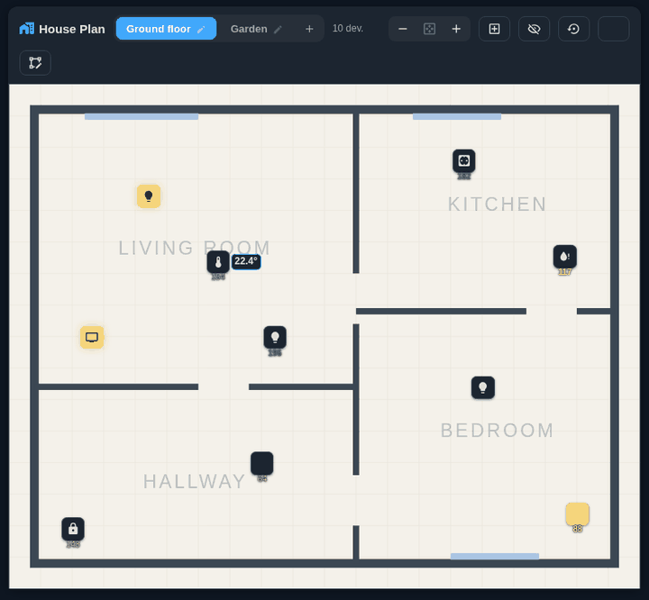

# 🏠 House Plan — an interactive house plan for Home Assistant

**A live map of your home right inside Home Assistant: floors, rooms and devices on a real floor plan — with live states, temperature and signal strength. Everything is configured with the mouse, without a single line of YAML.**



🇷🇺 [Документация на русском](README.ru.md)

---

## What it is and why

House Plan shows your smart home the way it actually looks — on a floor plan. Instead of long lists of entities, you see rooms and devices in their real places: where the leak is, what the temperature is in the kids' room, whether the light is on in the hallway, whether the gate is open.

This is convenient when:

- you have many devices and lists are awkward to use;
- you need to grasp the state of the house "at a glance";
- you want to give access to family members — anyone can figure out a picture;
- you want a beautiful overview screen for a wall-mounted tablet.

The integration consists of two parts that are installed together:

- **the Lovelace card** `houseplan-card` — the interactive plan itself;
- **the server-side component** — stores the room markup and icon positions in Home Assistant, so the plan is identical in all browsers and on all devices.

---

## How it differs from alternatives

A house plan in Home Assistant is usually built with `picture-elements`, `ha-floorplan` and similar solutions. There you have to write YAML by hand, calculate the coordinates of every icon, and edit the config again after every change. House Plan works differently:

| | House Plan | Typical solutions (picture-elements / ha-floorplan) |
|---|---|---|
| **Setup** | Entirely through the UI, with the mouse | Manual YAML and code editing |
| **Adding devices** | Automatic, by room | You type in every entity by hand |
| **Icon coordinates** | Drag with the mouse | You count pixels and write them into the config |
| **Room markup** | Built-in outline editor | You draw in an external SVG editor |
| **Storage** | On the HA server (shared by all devices) | In the dashboard YAML |
| **Zoom** | Smooth zoom, everything stays crisp (vector) | Usually a fixed image |

Key advantages in short:

- **No code at all.** Everything — spaces, rooms, devices — is configured with clicks.
- **Automatic device placement.** Outline a room and bind it to a Home Assistant area — the devices of that area appear on the plan by themselves.
- **Manual additions of your own.** Any device, group or even a "virtual" point can be placed on the plan manually, with a name, icon, model, link and an attached PDF manual.
- **Live states.** Temperature, Zigbee signal strength, on/off, open/closed — everything updates in real time.
- **Crisp zoom.** Zooming in does not "blur" the picture: the plan, labels and icons remain vector-sharp at any scale.

---

## Installation

One click if you already run HACS:

[](https://my.home-assistant.io/redirect/hacs_repository/?owner=Matysh&repository=houseplan-card&category=integration)


### Via HACS (recommended)

1. Open **HACS → menu (⋮) → Custom repositories**.
2. Paste the URL of this repository, set the category to **Integration**, and click **Add**.
3. Find **House Plan** in the list, install it and **restart Home Assistant**.
4. Go to **Settings → Devices & Services → Add integration** and select **House Plan**.

The card is registered automatically — no need to add a Lovelace resource manually.

> **Card doesn't load (`Custom element doesn't exist: houseplan-card`) or you manage Lovelace
> resources in YAML?** Add the resource manually pointing at the URL the integration *serves*:
>
> ```yaml
> resources:
>   - url: /houseplan_files/houseplan-card.js
>     type: module
> ```
>
> Do **not** use `/custom_components/houseplan/frontend/houseplan-card.js` — that is the file
> on disk, which Home Assistant does not serve over HTTP (you'll get a `text/plain` MIME error
> and the element never registers). The correct, integration-served URL is
> `/houseplan_files/houseplan-card.js`. Both cards (`houseplan-card` and
> `houseplan-space-card`) ship in that one file — no separate resource is needed.

### Manually

1. Copy the `custom_components/houseplan` folder into the `config/custom_components` directory of your Home Assistant.
2. Restart Home Assistant.
3. Add the integration: **Settings → Devices & Services → Add integration → House Plan**.

### Adding a plan screen

Create a new dashboard tab (a "Panel" view works best) and add the card:

```yaml
type: custom:houseplan-card
title: House plan
```

Nothing else needs to be specified — everything else is configured right on the screen.

---

## How to use

### Step 1. Add a space (floor)

On first open the plan is still empty — House Plan immediately offers to create the first space.
If your Home Assistant already has **floors** configured, a wizard offers to create a space
for each floor (names prefilled, a plan image is asked for one by one; any floor can be skipped).


In the dialog, set a **name** (for example, "1st floor") and **upload a background** — a floor-plan image in SVG, PNG or JPG format. Both fields are required: without a plan the "Save" button stays disabled.


> 💡 You can draw the background in any floor planner (for example, REMPLANNER) or photograph a paper plan. SVG works best — it stays crisp when zoomed in.

Later you can add as many spaces as you like (floors, yard, garage) with the **＋** button next to the tabs.

### Step 2. Outline the rooms

After the first space is added, the card switches to the **Plan** tab by itself. The card has three mode tabs in the header — **View** (default: display and device control only, nothing can be moved or edited), **Plan** (rooms, openings, labels, space settings) and **Devices** (placing and configuring markers); the edit tabs are shown to administrators. In Plan, click grid points, connecting them with lines, and close the room outline by clicking the first point.

As soon as the outline is closed, the room-save dialog appears. Here you need to **bind the room to a Home Assistant area** — this is exactly what enables the automation. For utility rooms with no devices (hall, sauna) there is a **"No area"** button.


While drawing, a ruler follows the cursor showing the current segment's real length (metres, or feet + inches on an imperial Home Assistant). The scale is set per space — the **"Scale (grid cell size)"** field in the space dialog says how many centimetres one grid cell represents (default 5 cm).

Rooms may not overlap: a click strictly inside an existing room, or an outline that would swallow one, is refused. Two more tools help you reshape the plan later:

- **Merge** — click a room, then a neighbour that shares a wall; they fuse into one. A dialog picks which name and area survive.
- **Split** — click a room, then two points on its walls; the chord cuts it in two. The bigger part stays the room it was (name, area, devices); the smaller one asks for a new name and area.


### Doors, windows and locks

In markup mode the **"Opening"** tool places doors and windows: click next to a wall and the
opening snaps onto it. Pick the type, the **length in real centimetres** (defaults: door 90 cm,
window 120 cm), an open/close sensor and — for doors — a **lock entity**.

With a sensor bound, the plan comes alive: the door leaf swings on its hinge and the swing arc
draws itself in as the real door opens; a window opens its two casements. While open, the moving
parts take an accent colour. A door with a lock shows a padlock badge next to it — green when
locked, orange when unlocked. For safety the lock can **not** be toggled from the plan; a click
on the opening shows a status card with both states instead.

Openings are easy to adjust later: hovering one highlights it, you can **drag it along the
walls** (it slides around corners too), and a **double click opens its properties**.

### Step 3. Devices appear by themselves

As soon as you save a room bound to an area, **the devices of that area are automatically laid out inside the outline**. These are the same devices shown on the **Settings → Devices → (filtered by the room)** page — only the meaningful ones, without service records, bridges and duplicates.

By default only meaningful devices make it onto the plan — service records, bridges and duplicates are filtered out. If you need to see **absolutely all** devices of the area, enable the **👁 "Show all devices"** button in the header.

From here on you can just use the plan: clicking an icon opens the device card with the model, link and a button to jump into Home Assistant.


### Step 4. Zoom

The mouse wheel or the **－ / ⊹ / ＋** buttons zoom the plan in and out; on a touch screen the two-finger pinch works. Zoomed out you see the whole plan, zoomed in you see the details, and everything stays crisp. The zoom level is remembered separately for each space.


### Step 5. Put the icons in their places

Switch to the **Devices** tab to arrange icons: drag them with the mouse, click one to open its editor. In **View** mode nothing can be moved — panning the map never displaces a sensor (a top user request). Positions are saved on the server and are identical in all browsers and devices. The **↺** button restores the automatic layout.


### Tap actions: control devices from the plan

By default a tap on an icon opens its info card. In the card settings you can switch
**Tap on a device** to *Toggle* — a tap then switches lights, sockets, fans and
humidifiers directly on the plan (wall-tablet style). For safety, a card-wide toggle
never affects locks, alarms, covers or valves; you can consciously enable toggle for a
specific device (except locks and alarms — those never toggle from the plan) in its
edit dialog. A **long press** always opens the info card.

### Icon rules

Which MDI icon a device gets is decided by **icon rules** — editable right in the card
(the ⬡ button in the header): an ordered list of “name pattern → icon” regexes with a
live test field, bilingual defaults (EN/RU) and a one-click reset. When no rule
matches, the entity *device class* decides (thermometer for temperature sensors, etc.).

### Step 6. Adding your own devices manually

You can also place a **single entity** (not just a whole device): start typing in the binding search and individual entities appear next to devices — handy when one device exposes several values (e.g. temperature and humidity) and you want each as its own icon.


Not everything has to be left to the automation. With the **＋** button in the header you can place any device, group or a **virtual point** on the plan (for example, an "Inlet valve" that does not exist as a device). Set a name, icon, model, link, description and, if you wish, attach a **PDF manual**.

The same dialog controls how the device looks on the plan. **Display** switches between the
icon badge, an animated **presence ripple** (pulsing rings while the entity is active, a faint
dot when idle — great for motion sensors) or both, with a per-device ring colour and size. The
**icon size** (×0.5–3) and **rotation** are also per-device, so a wall valve can be small and
turned the way it is mounted.


---

## Uninstalling

1. Remove the card (or the tab with the plan) from the dashboard.
2. **Settings → Devices & Services → House Plan → Delete** the integration entry.
3. Remove the integration from **HACS** (or delete the `custom_components/houseplan` folder if installed manually) and restart Home Assistant.
4. Optionally delete the saved plan data: the `config/houseplan/` files (backgrounds and attachments) and the `houseplan.config` / `houseplan.layout` entries in the `config/.storage` directory.

---

## Frequently asked questions

**Do I need to write anything in YAML?** No. The only line is adding the card to the dashboard; everything else is done with the mouse.

**My devices did not appear on the plan.** A device appears only if its Home Assistant area is bound to a drawn room. Check that the device has a room assigned (Settings → Devices) and that the room is outlined and bound to that area. If the device exists but is hidden by curation (bridges, service records, duplicates) — enable the **👁 "Show all devices"** button in the header.

**Can I hide an unwanted device or rename it?** Yes — click the device on the plan and press "Edit" in its card: there you can change the name, icon, model or hide the icon.

**Is the data stored in the cloud?** No. Everything is stored locally in your Home Assistant.

---

<p align="center"><sub>Screenshots were taken on a real Home Assistant configuration.</sub></p>
