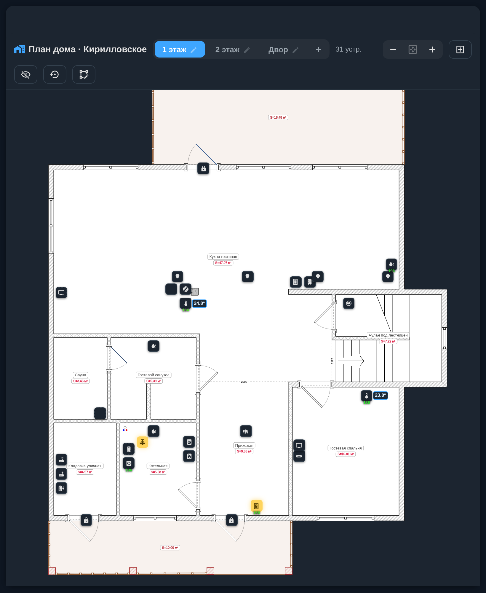
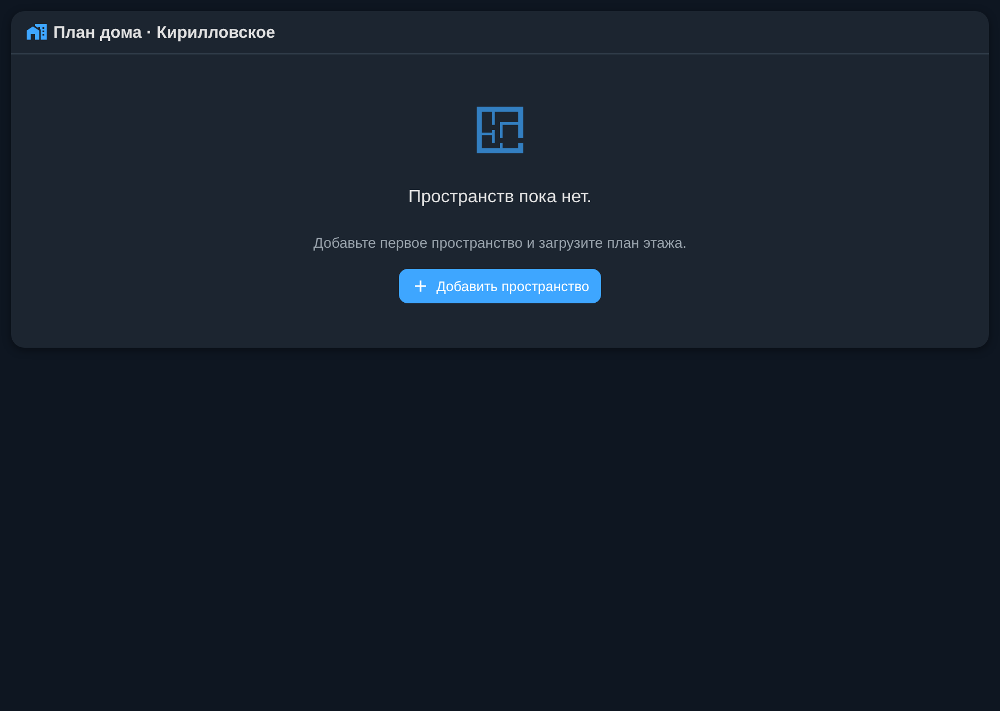
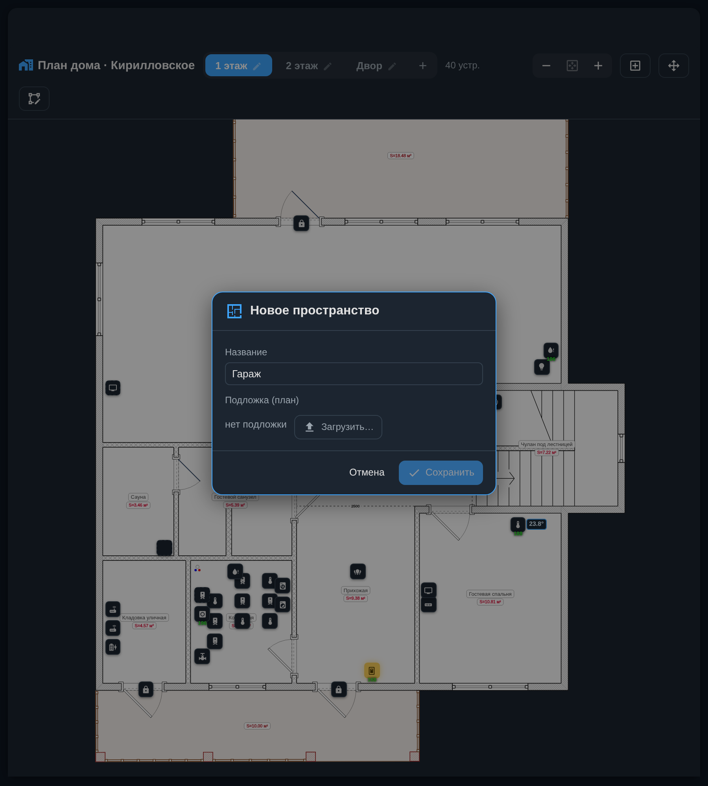
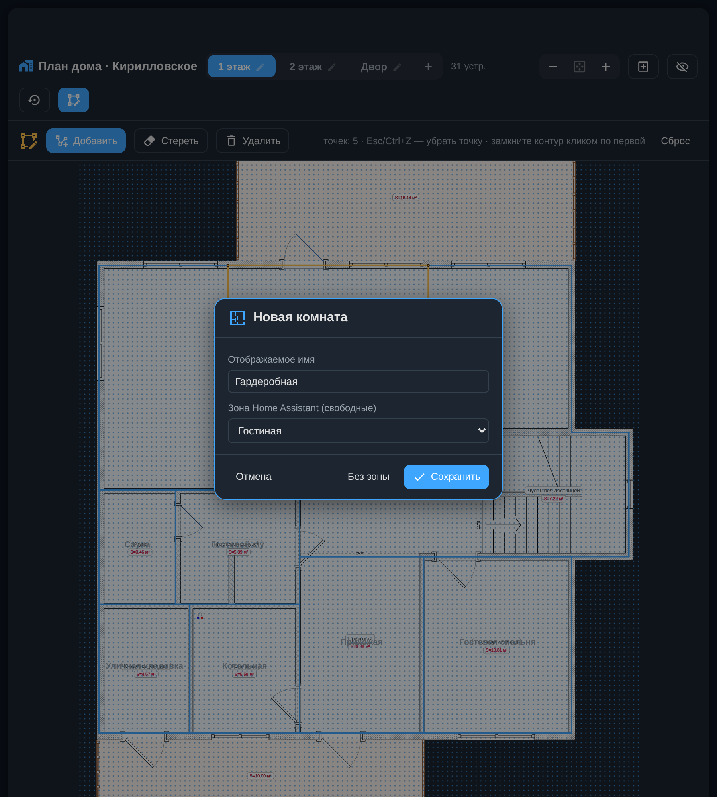
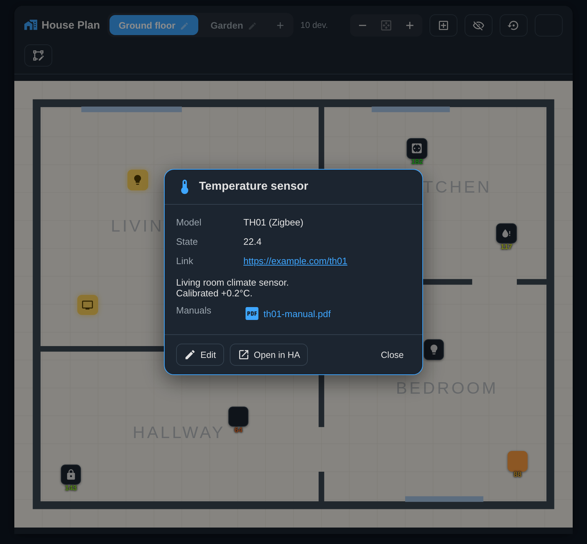
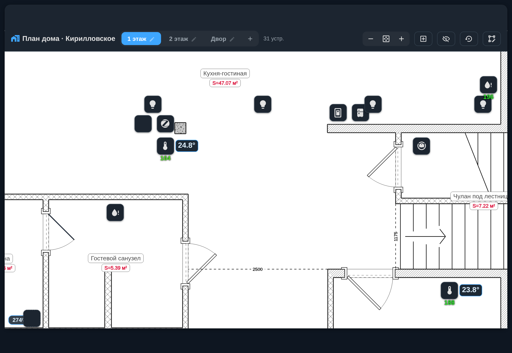
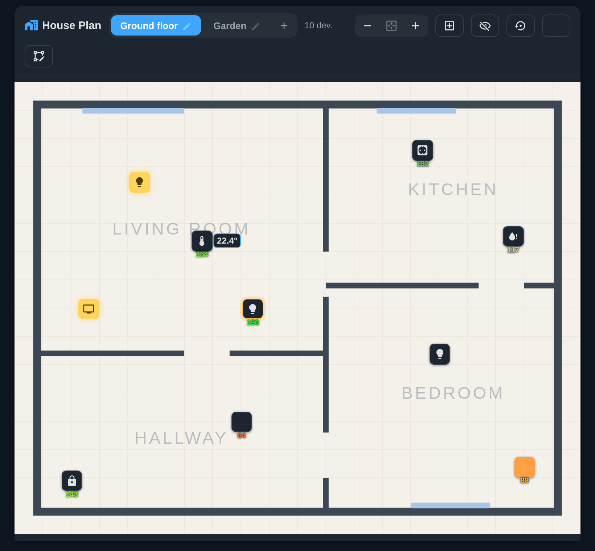
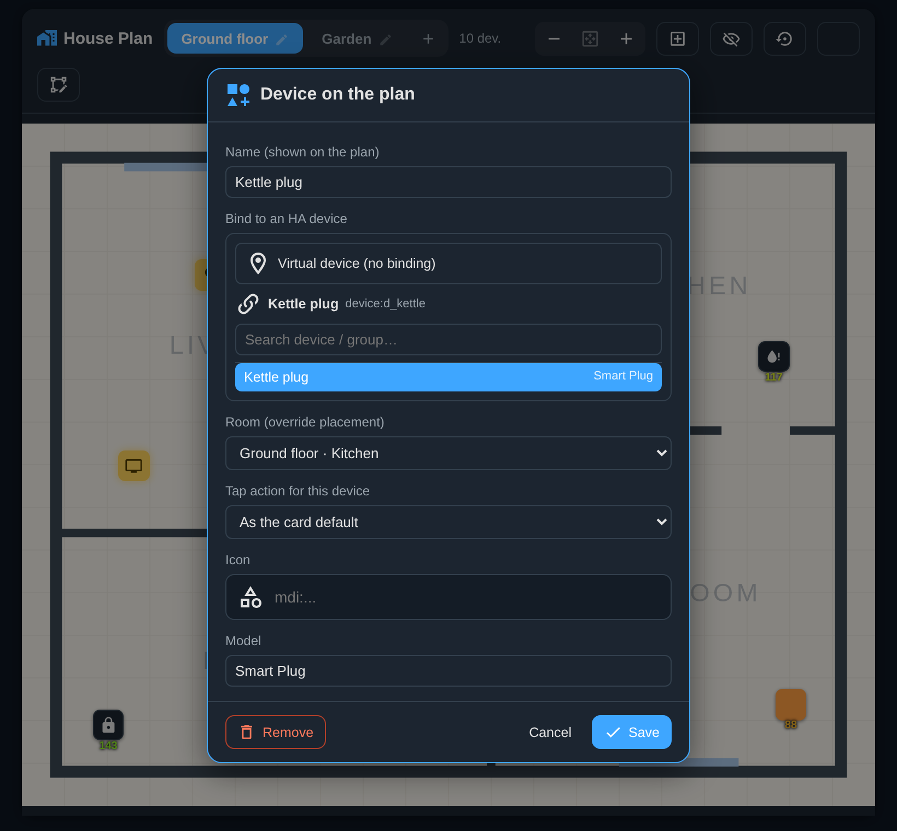

# 🏠 House Plan — интерактивный план дома для Home Assistant

**Живая карта вашего дома прямо в Home Assistant: этажи, комнаты и устройства на настоящем плане — с реальными состояниями, температурой и уровнем сигнала. Всё настраивается мышкой, без единой строчки YAML.**



🇬🇧 [English documentation](README.md)

---

## Что это и зачем

House Plan показывает ваш умный дом так, как он выглядит на самом деле — на плане этажей. Вместо длинных списков сущностей вы видите комнаты и устройства на своих местах: где протечка, какая температура в детской, включён ли свет в прихожей, открыты ли ворота.

Это удобно, когда:

- устройств много, и списками пользоваться неудобно;
- нужно быстро понять состояние дома «одним взглядом»;
- хочется отдать доступ близким — по картинке разберётся любой;
- вы хотите красивый обзорный экран для настенного планшета.

Интеграция состоит из двух частей, которые ставятся вместе:

- **карточка Lovelace** `houseplan-card` — сам интерактивный план;
- **серверный компонент** — хранит разметку комнат и позиции иконок в Home Assistant, поэтому план одинаков во всех браузерах и на всех устройствах.

---

## Чем отличается от аналогов

Обычно план дома в Home Assistant делают через `picture-elements`, `ha-floorplan` и подобные решения. Там приходится вручную писать YAML, вычислять координаты каждой иконки и заново править конфиг при каждом изменении. House Plan устроен иначе:

| | House Plan | Обычные решения (picture-elements / ha-floorplan) |
|---|---|---|
| **Настройка** | Полностью через интерфейс, мышкой | Ручной YAML и правка кода |
| **Добавление устройств** | Автоматически по комнатам | Каждую сущность вписываете руками |
| **Координаты иконок** | Перетаскиваете мышью | Считаете пиксели и пишете в конфиг |
| **Разметка комнат** | Встроенный редактор контуров | Рисуете в стороннем редакторе SVG |
| **Хранение** | На сервере HA (общее для всех устройств) | В YAML дашборда |
| **Масштаб** | Плавный зум, всё остаётся чётким (вектор) | Обычно фиксированная картинка |

Ключевые преимущества коротко:

- **Никакого кода.** Всё — пространства, комнаты, устройства — настраивается кликами.
- **Автоматическое добавление устройств.** Обвели комнату и привязали её к зоне Home Assistant — устройства этой зоны сами появляются на плане.
- **Ручное добавление своих.** Любое устройство, группу или даже «виртуальную» точку можно поставить на план вручную, задать имя, иконку, модель, ссылку и приложить PDF-инструкцию.
- **Живые состояния.** Температура, уровень сигнала Zigbee, вкл/выкл, открыто/закрыто — всё обновляется в реальном времени.
- **Чёткий зум.** Приближение не «мылит» картинку: план, подписи и иконки остаются векторно-чёткими на любом масштабе.

---

## Установка

### Через HACS (рекомендуется)

1. Откройте **HACS → меню (⋮) → Custom repositories**.
2. Вставьте URL этого репозитория, категория — **Integration**, и нажмите **Add**.
3. Найдите в списке **House Plan**, установите и **перезапустите Home Assistant**.
4. Перейдите в **Настройки → Устройства и службы → Добавить интеграцию** и выберите **House Plan**.

Карточка подключается автоматически — добавлять ресурс Lovelace вручную не нужно.

### Вручную

1. Скопируйте папку `custom_components/houseplan` в каталог `config/custom_components` вашего Home Assistant.
2. Перезапустите Home Assistant.
3. Добавьте интеграцию: **Настройки → Устройства и службы → Добавить интеграцию → House Plan**.

### Добавление экрана с планом

Создайте новую вкладку дашборда (удобнее всего — в режиме «Панель»/Panel) и добавьте карточку:

```yaml
type: custom:houseplan-card
title: План дома
```

Больше ничего указывать не нужно — всё остальное настраивается прямо на экране.

---

## Как пользоваться

### Шаг 1. Добавьте пространство (этаж)

При первом открытии план ещё пуст — House Plan сразу предложит создать первое пространство.



В диалоге задайте **название** (например, «1 этаж») и **загрузите подложку** — картинку плана этажа в формате SVG, PNG или JPG. Оба поля обязательны: без плана кнопка «Сохранить» неактивна.



> 💡 Подложку можно нарисовать в любом планировщике (например, РЕМПЛАННЕР) или сфотографировать бумажный план. Лучше всего SVG — он остаётся чётким при увеличении.

Позже можно добавить сколько угодно пространств (этажи, двор, гараж) кнопкой **＋** рядом со вкладками.

### Шаг 2. Обведите комнаты

После добавления первого пространства карточка сама переходит в режим разметки. Кликайте по точкам сетки, соединяя их линиями, и замкните контур комнаты кликом по первой точке.

Как только контур замкнётся, появится окно сохранения комнаты. Здесь нужно **привязать комнату к зоне Home Assistant** — именно это включает автоматику. Для служебных помещений без устройств (холл, сауна) есть кнопка **«Без зоны»**.



### Шаг 3. Устройства появляются сами

Как только вы сохранили комнату с привязкой к зоне, **устройства этой зоны автоматически расставляются внутри контура**. Берутся те же устройства, что показаны на странице **Настройки → Устройства → (фильтр по нужной комнате)** — только осмысленные, без служебных записей, мостов и дубликатов.

По умолчанию на план попадают только осмысленные устройства — служебные записи, мосты и дубликаты отфильтрованы. Если нужно видеть **вообще все** устройства зоны, включите в шапке кнопку **👁 «Показать все устройства»**.

Дальше можно просто пользоваться планом: клик по иконке открывает карточку устройства с моделью, ссылкой и кнопкой перехода в Home Assistant.



### Шаг 4. Масштаб

Колесо мыши или кнопки **－ / ⊹ / ＋** приближают и отдаляют план; на сенсорном экране работает «щипок» двумя пальцами. При отдалении виден весь план целиком, при приближении — детали, и всё остаётся чётким. Масштаб запоминается отдельно для каждого пространства.



### Шаг 5. Расставьте значки по местам

Значки устройств можно **перетаскивать мышью в любой момент** — отдельный «режим правки» включать не нужно. Позиции сохраняются на сервере и одинаковы во всех браузерах и устройствах. Кнопка **↺** в шапке возвращает автоматическую раскладку.



### Шаг 6. Добавление своих устройств вручную

Не всё нужно оставлять на автоматику. Кнопкой **＋** в шапке можно поставить на план любое устройство, группу или **виртуальную точку** (например, «Вентиль на вводе», которого нет как устройства). Задайте имя, иконку, модель, ссылку, описание и при желании приложите **PDF-инструкцию**.



---

## Удаление

1. Уберите карточку (или вкладку с планом) из дашборда.
2. **Настройки → Устройства и службы → House Plan → Удалить** запись интеграции.
3. Удалите интеграцию из **HACS** (или папку `custom_components/houseplan` при ручной установке) и перезапустите Home Assistant.
4. При желании удалите сохранённые данные плана: файлы `config/houseplan/` (подложки и вложения) и записи `houseplan.config` / `houseplan.layout` в каталоге `config/.storage`.

---

## Часто задаваемые вопросы

**Нужно ли что-то писать в YAML?** Нет. Единственная строчка — это добавление карточки на дашборд; всё остальное делается мышкой.

**Мои устройства не появились на плане.** Устройство появляется, только если его зона в Home Assistant привязана к нарисованной комнате. Проверьте, что у устройства задана комната (Настройки → Устройства), а комната обведена и привязана к этой зоне. Если устройство есть, но скрыто курированием (мосты, служебные, дубликаты) — включите в шапке кнопку **👁 «Показать все устройства»**.

**Можно ли скрыть лишнее устройство или переименовать его?** Да — кликните по устройству на плане и в его карточке нажмите «Редактировать»: там можно сменить имя, иконку, модель или скрыть значок.

**Данные хранятся в облаке?** Нет. Всё хранится локально в вашем Home Assistant.

---

<p align="center"><sub>Скриншоты сделаны на реальной конфигурации Home Assistant.</sub></p>
