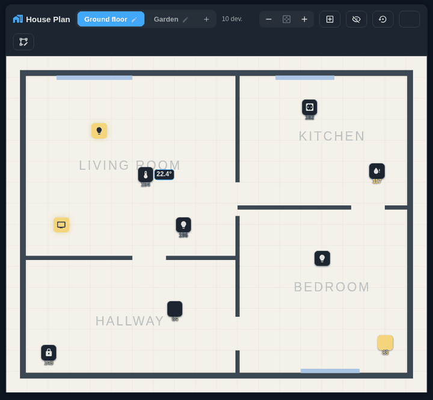
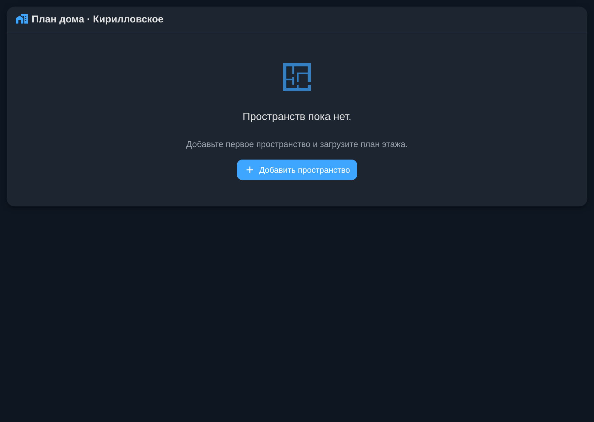
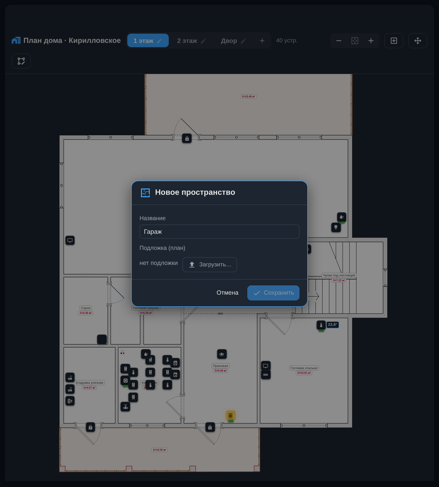
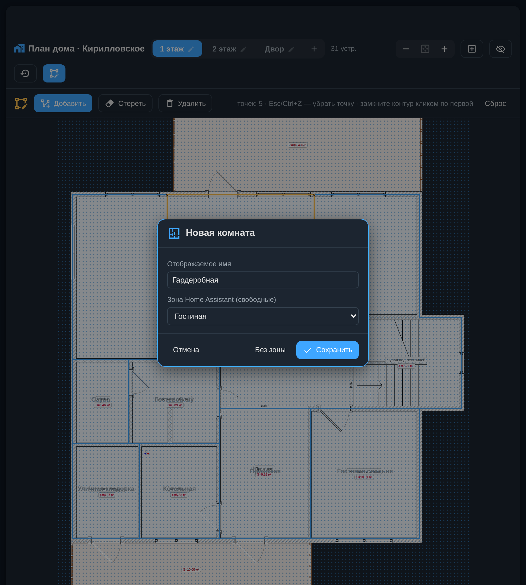
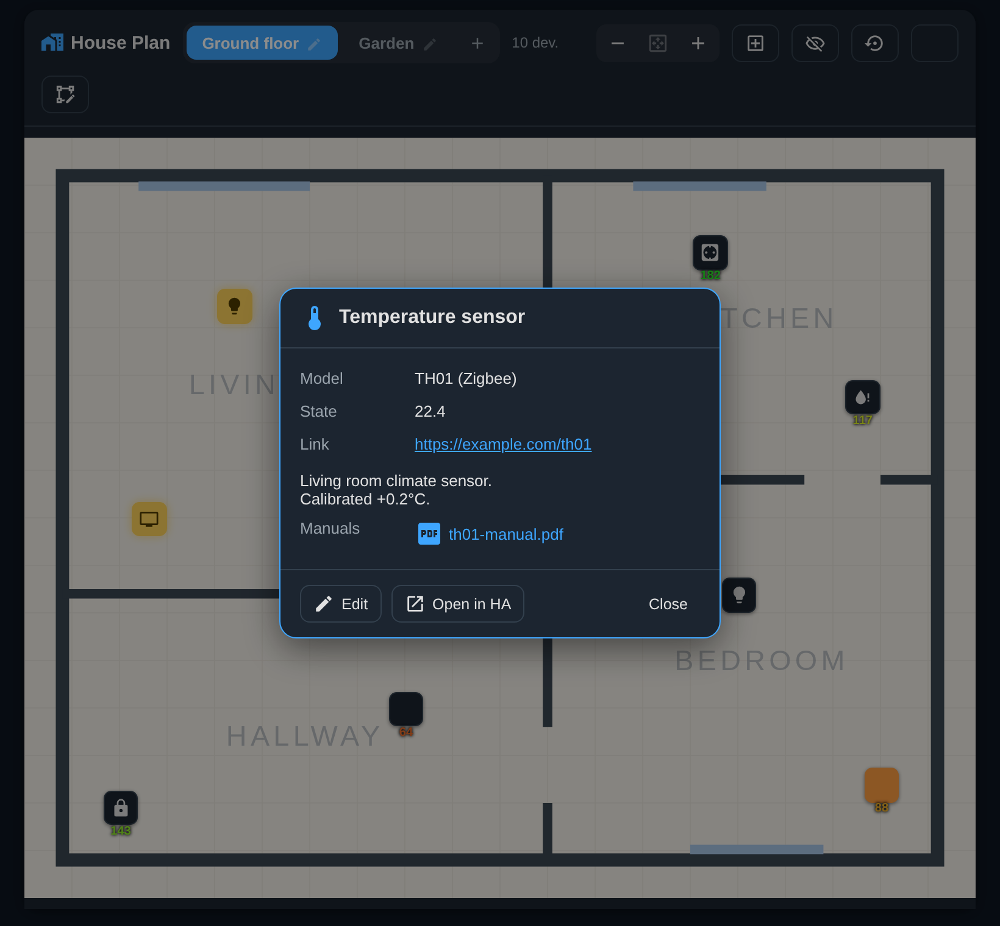
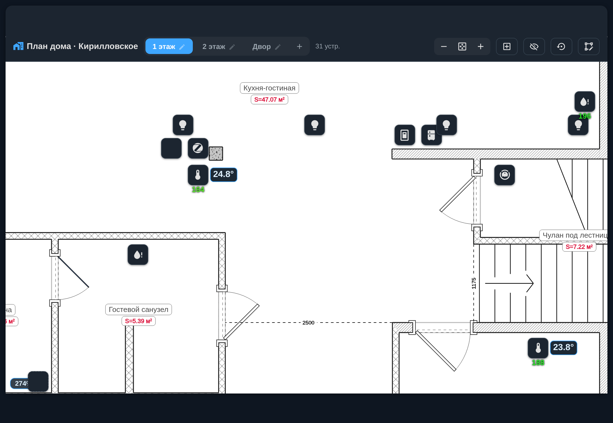
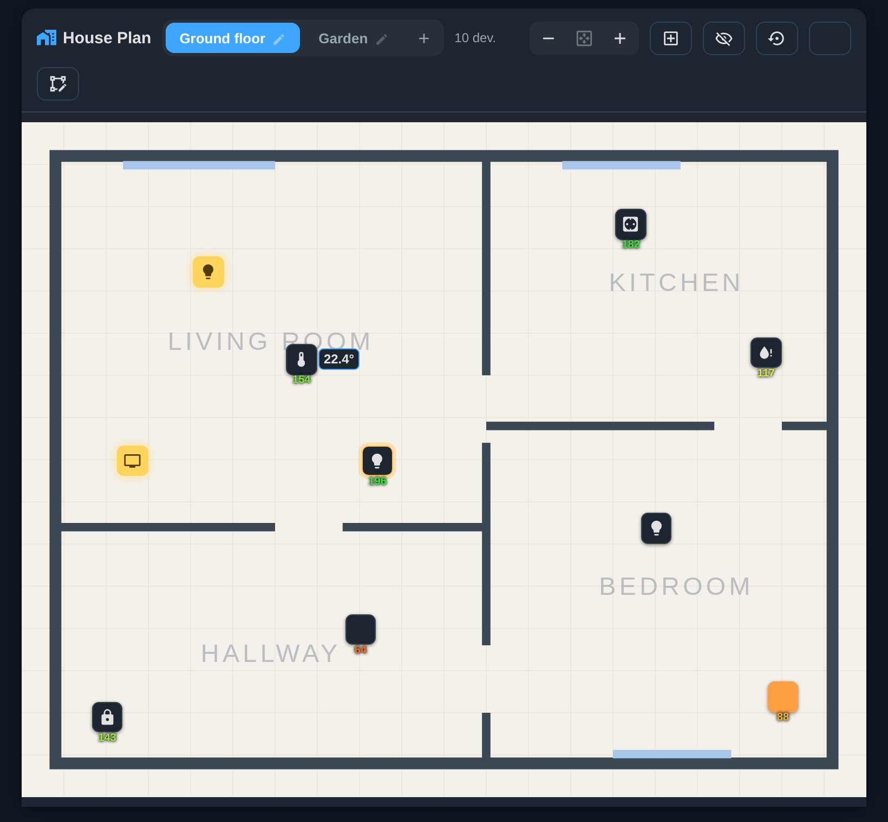
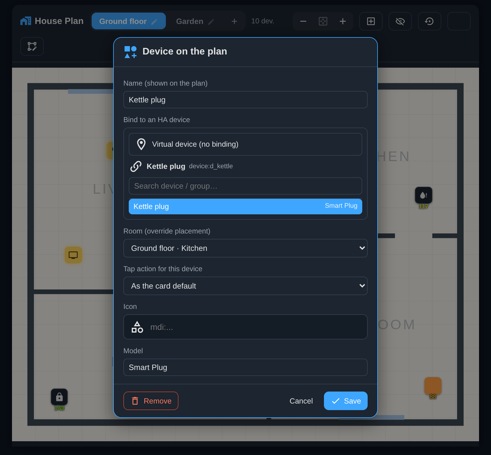

# 🏠 House Plan — интерактивный поэтажный план дома для Home Assistant

[](https://github.com/hacs/integration)
[](https://github.com/Matysh/houseplan-card/releases)
[](https://github.com/Matysh/houseplan-card/stargazers)
[](https://demo.houseplan.tech)
[](https://t.me/ha_houseplan)

📘 **[Полное руководство пользователя](docs/USER-GUIDE.ru.md)** · **[Продуктовый аудит и план улучшений](docs/PRODUCT-IMPROVEMENT-PLAN.ru.md)**

**Превратите Home Assistant в живую интерактивную карту дома.** Загрузите или
нарисуйте план этажа, обведите комнаты мышкой — и умные устройства появятся на
своих местах: живые состояния, свет по клику, температура и влажность по
комнатам, карта Zigbee-сигнала, светящиеся пятна ламп и полноэкранный
киоск-режим для настенного планшета. Без YAML, без Inkscape и внешних
редакторов — весь план настраивается прямо на дашборде.



> ### 🚀 Попробовать вживую — без установки
> **[demo.houseplan.tech](https://demo.houseplan.tech)** — настоящий Home
> Assistant с готовым планом. Вход **`demo`** / **`demo`**, можно нажимать всё:
> включать свет, открывать редакторы, ломать что угодно. Каждый час стенд сам
> возвращается в исходное состояние.

🇬🇧 [Documentation in English](README.md) · 💬 [Чат в Telegram: **@ha_houseplan**](https://t.me/ha_houseplan)

**Главное**

- ♾️ **Бесконечный холст** — нет «размера плана» и нет края, за который
  нельзя выйти: рисуйте и ставьте устройства где угодно, тащите план на
  любом зуме, отдаляйтесь, чтобы увидеть всё, и одной кнопкой вписывайте
  план обратно в экран.
- 🖱 **Редакторы прямо в карточке** — комнаты, двери и окна, комнаты-острова,
  виртуальные стены и декор-слой рисуются кликами; размеры комнат меняются
  перетаскиванием стен с живыми длинами и площадями; помощник выравнивания и
  линейка в реальных метрах.
- 💡 **Свет переключается кликом** из коробки; значок выключателя может
  управлять группой ламп (в т.ч. «тупые» выключатели и кнопки-пульты).
- 🌒 **Заливка «Свет по источникам»** — тёмный дом, где каждая горящая лампа
  даёт пятно своего цвета, проникающее через дверные проёмы и открытые зоны.
- ☀️ **Солнце на плане** — задайте компас, и фон живёт вместе с днём
  (белый полдень → золотой час → глубокая ночь), а окна внешних стен пускают
  в комнаты настоящие клинья солнечного света; облачность — опционально, от
  weather-сущности.
- 🪟 **Шторы открываются тапом** — одно действие открывает, закрывает или
  останавливает штору, а сам значок морфится между открытым и закрытым
  видом и мягко пульсирует кольцом, пока штора едет.
- 🌡 **Карточки комнат**: температура, влажность, Zigbee-сигнал, свет «1 из 3»;
  температурная заливка по комфортным границам.
- 🚪 **Двери, окна и замки** с датчиками — отпирание только явной кнопкой,
  никогда случайным тапом.
- 📺 **Киоск-режим** для настенных планшетов и ТВ: полноэкранно, свайп между
  этажами, автокарусель, свои размеры на каждом экране.
- 🤖 **Роботы-пылесосы вживую** — маркер-база стоит на месте, а круглая
  шайба ездит по плану в реальном времени, «выливая» путь из-под себя;
  текущая и прошлая уборки хранятся на сервере. Калибровка — в один клик
  (по именам комнат) или перетаскиванием призрака карты. Работают Xiaomi
  Cloud Map Extractor, dreame-vacuum (Tasshack) и Valetudo.
- 🔔 Новые устройства сами появляются на плане с красной точкой; раскладка
  хранится **на сервере HA** — один план для всех экранов, живая синхронизация.

---


## Что это и зачем

House Plan показывает ваш умный дом так, как он выглядит на самом деле — на плане этажей. Вместо длинных списков сущностей вы видите комнаты и устройства на своих местах: где протечка, какая температура в детской, включён ли свет в прихожей, открыты ли ворота.

Это удобно, когда:

- устройств много, и списками пользоваться неудобно;
- нужно быстро понять состояние дома «одним взглядом»;
- хочется отдать доступ близким — по картинке разберётся любой;
- вы хотите красивый обзорный экран для настенного планшета.

Интеграция состоит из двух частей, которые ставятся вместе:

- **карточка Lovelace** `houseplan-card` — сам интерактивный план;
- **серверный компонент** — хранит разметку комнат и позиции иконок в Home Assistant, поэтому план одинаков во всех браузерах и на всех устройствах.

---

## Чем отличается от аналогов

Обычно план дома в Home Assistant делают через `picture-elements`, `ha-floorplan`
или новые GUI-карточки, где стены и мебель рисуют прямо на дашборде. Там либо
YAML/SVG, либо конфиг живёт в YAML карточки. House Plan — это **общий живой
план** на серверной интеграции Home Assistant:

| | House Plan | picture-elements / ha-floorplan | GUI-рисовалки (напр. easy-floorplan) |
|---|---|---|---|
| **Настройка** | Полностью через интерфейс, мышкой | Ручной YAML / Inkscape SVG | Рисование стен и мебели в карточке |
| **Добавление устройств** | Автоматически по **зоне** HA | Каждую сущность вписываете руками | Ставите сущности руками на чертёж |
| **Координаты иконок** | Перетаскиваете мышью | Считаете пиксели в YAML | Drag на холсте |
| **Разметка комнат** | Встроенный редактор контуров, привязка к зонам | Сторонний SVG-редактор | Сами рисуете стены (мебельный CAD) |
| **Хранение** | На сервере HA (`.storage`, общее, multi-client) | В YAML дашборда | В карточке / YAML дашборда |
| **Оверлеи** | Glow, климат, LQI, солнце, пылесосы, киоск | Что пропишете в SVG/CSS | Зависит от карточки |
| **Масштаб** | Плавный векторный зум | Обычно фиксированная картинка | SVG / виртуальный холст |

**Одной фразой:** House Plan — это общая, area-aware живая карта дома, а не
универсальная CAD-система. Редактор подложки покрывает практический декор,
надписи и мебель; для свободного архитектурного черчения лучше отдельный
draw-инструмент. При наличии плана и зон HA House Plan держит один живой layout
на всех планшетах.

Ключевые преимущества коротко:

- **Никакого кода.** Всё — пространства, комнаты, устройства — настраивается кликами.
- **Автоматическое добавление устройств.** Обвели комнату и привязали её к зоне Home Assistant — устройства этой зоны сами появляются на плане.
- **Ручное добавление своих.** Любое устройство, группу или даже «виртуальную» точку можно поставить на план вручную, задать имя, иконку, модель, ссылку и приложить PDF-инструкцию.
- **Живые состояния.** Температура, уровень сигнала Zigbee, вкл/выкл, открыто/закрыто — всё обновляется в реальном времени.
  Цвета значков подчиняются одному принципу — **жёлтый значит «устройство прямо сейчас выполняет свою основную работу»**:
  лампа светит, розетка подаёт, вентилятор крутится, пылесос убирает, термоголовка
  реально греет (а не просто включена). Для climate-сущностей переданное действие приоритетно;
  если интеграция сообщает только включённый HVAC-режим, он служит лучшим доступным приближением.
  Оранжевый = открыто / не заперто. Пульсирующее красное
  кольцо = авария (протечка, дым, газ). Цвет RGB-лампы живёт в её пятне света (режим glow),
  где само пятно — индикатор включения, а подложка значка остаётся стандартной.
  Полупрозрачный значок = недоступно. Тёмный = покой.
- **Единый визуальный редактор подложки.** Линии, фигуры, надписи и мебель используют общее выделение, физические стили и Undo/Redo. Картинка плана не прибита к холсту: отдельный инструмент двигает, масштабирует и поворачивает её, а числовой диалог задаёт точный размер и угол.
- **Чёткий зум.** Приближение не «мылит» картинку: план, подписи и иконки остаются векторно-чёткими на любом масштабе.

---

## Настенный планшет / ТВ (киоск-режим)

Отдельный дашборд с view типа «панель», у карточки — `kiosk: true` (или
галочка «Режим настенного устройства» в редакторе карточки):

```yaml
type: custom:houseplan-card
kiosk: true
cycle: 0   # автосмена пространств каждые N секунд, 0 = выкл (удобно для ТВ)
```

Без шапки и редакторов — только живой план. Свайп листает этажи (при 1:1),
пинч — зум, двойной тап — сброс. Долгое нажатие (3 с) по пустому месту —
настройка размеров значков и текста для ЭТОГО экрана (хранится на
устройстве). Шапку самого Home Assistant скрывают настройки companion-app
или плагин [kiosk-mode](https://github.com/NemesisRE/kiosk-mode).

## Установка

В один клик, если у вас уже есть HACS:

[](https://my.home-assistant.io/redirect/hacs_repository/?owner=Matysh&repository=houseplan-card&category=integration)


### Через HACS (рекомендуется)

1. Откройте **HACS → меню (⋮) → Custom repositories**.
2. Вставьте URL этого репозитория, категория — **Integration**, и нажмите **Add**.
3. Найдите в списке **House Plan**, установите и **перезапустите Home Assistant**.
4. Перейдите в **Настройки → Устройства и службы → Добавить интеграцию** и выберите **House Plan**.

Карточка подключается автоматически — добавлять ресурс Lovelace вручную не нужно.

> **Карточка не грузится (`Custom element doesn't exist: houseplan-card`) или вы ведёте ресурсы
> Lovelace в YAML?** Добавьте ресурс вручную, указав URL, который *раздаёт сама интеграция*:
>
> ```yaml
> resources:
>   - url: /houseplan_files/houseplan-card.js
>     type: module
> ```
>
> **Не** используйте `/custom_components/houseplan/frontend/houseplan-card.js` — это путь к файлу
> на диске, который Home Assistant не отдаёт по HTTP (получите ошибку MIME `text/plain`, и элемент
> не зарегистрируется). Правильный URL, который раздаёт интеграция, — `/houseplan_files/houseplan-card.js`.
> Обе карточки (`houseplan-card` и `houseplan-space-card`) лежат в этом одном файле — отдельный ресурс
> не нужен.

### Вручную

1. Скопируйте папку `custom_components/houseplan` в каталог `config/custom_components` вашего Home Assistant.
2. Перезапустите Home Assistant.
3. Добавьте интеграцию: **Настройки → Устройства и службы → Добавить интеграцию → House Plan**.

### Добавление экрана с планом

Создайте новую вкладку дашборда (удобнее всего — в режиме «Панель»/Panel) и добавьте карточку:

```yaml
type: custom:houseplan-card
title: План дома
```

Больше ничего указывать не нужно — всё остальное настраивается прямо на экране.

---

## Как пользоваться

### Шаг 1. Добавьте пространство (этаж)

При первом открытии план ещё пуст — House Plan сразу предложит создать первое пространство.

Если в вашем Home Assistant уже настроены **этажи**, мастер предложит создать
пространство для каждого: названия подставятся сами, план попросит по очереди,
любой этаж можно пропустить.



В диалоге задайте **название** (например, «1 этаж») и выберите подложку: **загрузите** картинку плана (SVG, PNG, JPG, WebP), **возьмите уже загруженную** на сервер ранее или отметьте **«без подложки, нарисую комнаты сам»**. Холст бесконечный; картинка по умолчанию сохраняет пропорции, а подвинуть, изменить размер или повернуть её можно в любой момент в редакторе подложки.



> 💡 Подложку можно нарисовать в любом планировщике (например, РЕМПЛАННЕР) или сфотографировать бумажный план. Лучше всего SVG — он остаётся чётким при увеличении.

Позже можно добавить сколько угодно пространств (этажи, двор, гараж) кнопкой **＋** рядом со вкладками.

### Шаг 2. Обведите комнаты

После добавления первого пространства карточка сама переходит в режим разметки. Кликайте по точкам сетки, соединяя их линиями, и замкните контур комнаты кликом по первой точке.

Как только контур замкнётся, появится окно сохранения комнаты. Здесь нужно **привязать комнату к зоне Home Assistant** — именно это включает автоматику. Для служебных помещений без устройств (холл, сауна) есть кнопка **«Без зоны»**.



Во время рисования у курсора показывается линейка с реальной длиной текущего отрезка (метры или футы+дюймы на имперской системе HA). Масштаб задаётся для каждого пространства — поле **«Масштаб (размер ячейки сетки)»** в диалоге пространства: сколько сантиметров в одной ячейке (по умолчанию 5 см).

Комнаты не могут пересекаться: клик строго внутри существующей комнаты или контур, охватывающий её, отклоняются. Ещё два инструмента помогают перекроить план позже:

- **Объединить** — кликните комнату, затем соседнюю с общей стеной; они сольются в одну. Диалог выбирает, чьё имя и зона останутся.
- **Разделить** — кликните комнату, затем две точки на её стенах; хорда разрежет её надвое. Бо́льшая часть остаётся прежней комнатой (имя, зона, устройства), меньшая просит новое имя и зону.


### Двери, окна и замки

В режиме разметки инструмент **«Проём»** ставит двери и окна: кликните рядом со стеной — проём
примагнитится к ней. Выберите тип, **длину в реальных сантиметрах** (по умолчанию дверь 90 см,
окно 120 см), датчик открытия и — для двери — **замок**.

С привязанным датчиком план оживает: створка двери поворачивается на петле, и дуга распахивания
дорисовывается по мере открытия настоящей двери; окно раскрывает две створки. Пока открыто,
подвижные части подсвечены акцентным цветом. У двери с замком рядом отображается замочек —
зелёный, когда заперто, оранжевый, когда нет. Ради безопасности замок с плана **нельзя**
переключить — клик по проёму показывает карточку с обоими статусами.

Проёмы легко поправить позже: при наведении проём подсвечивается, его можно **перетащить вдоль
стен** (в том числе за угол), а **двойной клик открывает свойства**.

### Шаг 3. Устройства появляются сами

Как только вы сохранили комнату с привязкой к зоне, **устройства этой зоны автоматически расставляются внутри контура**. Берутся те же устройства, что показаны на странице **Настройки → Устройства → (фильтр по нужной комнате)** — только осмысленные, без служебных записей, мостов и дубликатов.

По умолчанию на план попадают только осмысленные устройства: нефизические (служебные записи, мосты, сцены, лампы, свёрнутые в световую группу) могут быть скрыты автоматически. Управление находится в левом нижнем углу диалога устройства: **«Скрыть»** убирает маркер после сохранения, а у уже скрытого маркера там же появляется **«Показать»**. Чтобы найти скрытые устройства, откройте редактор устройств и нажмите **«Показать скрытые»**: они отобразятся полупрозрачными синими призраками, клик открывает диалог. Скрытые устройства учитываются в Zigbee-сигнале комнаты, но света не дают.

Дальше можно просто пользоваться планом: клик по иконке открывает карточку устройства с моделью, ссылкой и кнопкой перехода в Home Assistant.



### Шаг 4. Масштаб

Колесо мыши или кнопки **－ / ⊹ / ＋** приближают и отдаляют план; на сенсорном экране работает «щипок» двумя пальцами. При отдалении виден весь план целиком, при приближении — детали, и всё остаётся чётким. Масштаб запоминается отдельно для каждого пространства.



### Шаг 5. Расставьте значки по местам

Расставлять значки нужно на вкладке **«Устройства»**: там они перетаскиваются мышью, а клик открывает редактор. В режиме **«Просмотр»** ничего сдвинуть нельзя — панорамирование карты больше не сдвигает датчики (главная просьба пользователей). Позиции сохраняются на сервере и одинаковы во всех браузерах и устройствах. Кнопка **↺** возвращает автоматическую раскладку.



### Управление с плана (tap actions)

По умолчанию тап по значку открывает инфо-карточку. В настройках карточки можно
переключить **«Тап по устройству»** на *Переключить* — тогда тап включает/выключает
свет, розетки, вентиляторы и увлажнители прямо с плана (режим настенного планшета).
Для безопасности общий toggle не действует на замки, сигнализации, шторы/ворота и
клапаны; для конкретного устройства toggle можно включить осознанно в его диалоге
(кроме замков и сигнализаций — они с плана не переключаются никогда). **Долгое
нажатие** всегда открывает инфо-карточку.

### Правила иконок

Какая MDI-иконка достанется устройству, решают **правила иконок** — редактируются
прямо в карточке (кнопка ⬡ в шапке): упорядоченный список «шаблон имени → иконка»
с живым тест-полем, двуязычные умолчания (EN/RU) и сброс одной кнопкой. Если ни одно
правило не подошло — решает *device class* сущности (термометр для датчиков
температуры и т.п.).

### Шаг 6. Добавление своих устройств вручную

Можно поставить и **отдельную сущность** (не только устройство целиком): начните печатать в поиске привязки — рядом с устройствами появятся отдельные сущности. Удобно, когда одно устройство отдаёт несколько значений (например, температуру и влажность), а вы хотите каждое своей иконкой.


Не всё нужно оставлять на автоматику. Кнопкой **＋** в шапке можно поставить на план любое устройство, группу или **виртуальную точку** (например, «Вентиль на вводе», которого нет как устройства). Задайте имя, иконку, модель, ссылку, описание и при желании приложите **PDF-инструкцию**.

В этом же диалоге настраивается вид устройства на плане. **Отображение** переключает значок,
анимированную **пульсацию присутствия** (расходящиеся кольца, пока сущность активна, и тусклая
точка в покое — идеально для датчиков движения) или то и другое сразу, с цветом и размером колец
на устройство. **Размер значка** (×0,5–3) и **поворот** — тоже индивидуальные: вентиль на стене
может быть маленьким и повёрнутым так, как он установлен.



### Свои стили через card-mod (для продвинутых, без поддержки)

Карточка приезжает готовой, и поля для CSS у неё нет — но если у вас уже стоит [card-mod](https://github.com/thomasloven/lovelace-card-mod), у каждого объекта плана теперь есть стабильный «крючок», за который можно зацепиться: `data-hp="device"` (плюс `data-entity`, `data-area`), `data-hp="room"`, `data-hp="opening"`, `data-hp="decor"`, `data-hp="room-label"`, `data-hp="space-tab"`. Мы обещаем их не переименовывать; сам card-mod мы не поставляем, не поддерживаем и за то, что ваш CSS сделает с карточкой, не отвечаем. Полная таблица, примеры и ограничения — в **[docs/STYLING-HOOKS.md](docs/STYLING-HOOKS.md)**.

---

## Удаление

1. Уберите карточку (или вкладку с планом) из дашборда.
2. **Настройки → Устройства и службы → House Plan → Удалить** запись интеграции.
3. Удалите интеграцию из **HACS** (или папку `custom_components/houseplan` при ручной установке) и перезапустите Home Assistant.
4. При желании удалите сохранённые данные плана: файлы `config/houseplan/` (подложки и вложения) и записи `houseplan.config` / `houseplan.layout` в каталоге `config/.storage`.

---

## Помощь и обмен опытом

- 💬 **[Чат в Telegram — @ha_houseplan](https://t.me/ha_houseplan)** — вопросы,
  помощь с настройкой, идеи и скриншоты ваших планов. Самый быстрый способ
  связаться с автором и другими пользователями.
- 🐞 [Issues на GitHub](https://github.com/Matysh/houseplan-card/issues) — баги
  и запросы фич (пожалуйста, указывайте версию House Plan).
- 💡 [Discussions](https://github.com/Matysh/houseplan-card/discussions) — для
  развёрнутых обсуждений.
- 📜 [История изменений](docs/CHANGELOG.ru.md) — что менялось в каждой версии.

Версия видна в консоли браузера при загрузке (`HOUSEPLAN-CARD vX.Y.Z`) и в
**Настройки → Устройства и службы → House Plan** — с ней разбираться сильно
быстрее.

---

## Часто задаваемые вопросы

**Нужно ли что-то писать в YAML?** Нет. Единственная строчка — это добавление карточки на дашборд; всё остальное делается мышкой.

**Мои устройства не появились на плане.** Устройство появляется, только если его зона в Home Assistant привязана к нарисованной комнате. Проверьте, что у устройства задана комната (Настройки → Устройства), а комната обведена и привязана к этой зоне. Если устройство есть, но скрыто автоматически — откройте редактор устройств, нажмите **«Показать скрытые»**, откройте его диалог, нажмите **«Показать»**, затем **«Сохранить»**.

**Можно ли скрыть лишнее устройство или переименовать его?** Да — кликните по устройству на плане и в его карточке нажмите «Редактировать»: там можно сменить имя, иконку, модель или скрыть значок.

**Данные хранятся в облаке?** Нет. Всё хранится локально в вашем Home Assistant.

---

<p align="center"><sub>Скриншоты сделаны на реальной конфигурации Home Assistant.</sub></p>
