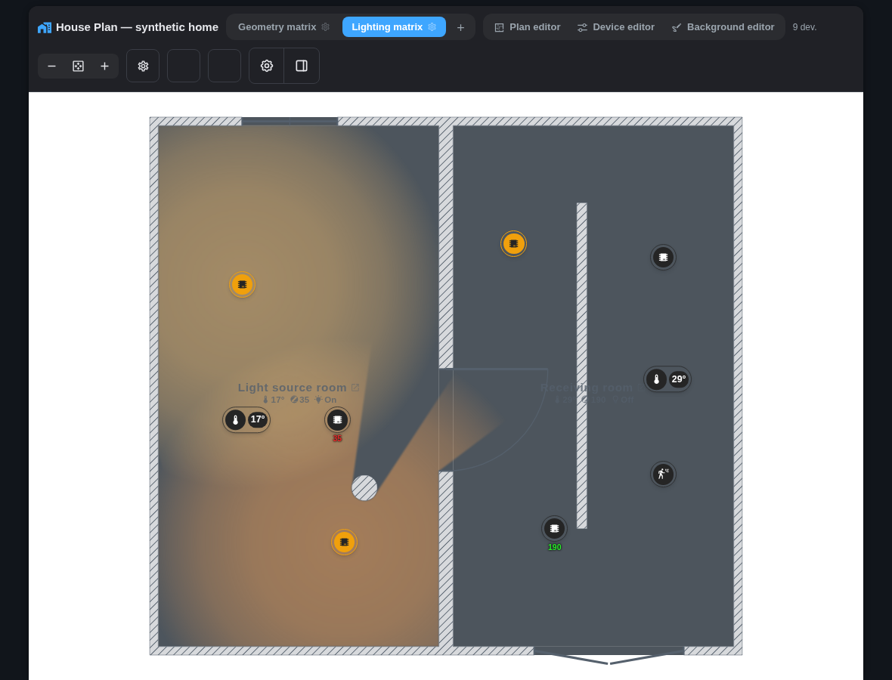
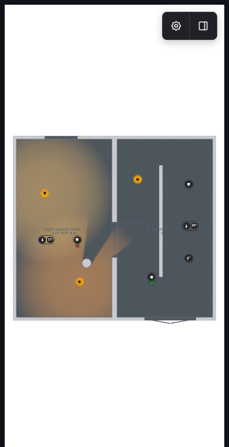

# 🏠 House Plan — живой план дома для Home Assistant

[](https://github.com/hacs/integration)
[](https://github.com/Matysh/houseplan-card/releases)
[](https://github.com/Matysh/houseplan-card/actions)
[](https://demo.houseplan.tech)
[](https://t.me/ha_houseplan)

📘 **[Полное руководство](docs/USER-GUIDE.ru.md)** · 🇬🇧 **[English](README.md)** · 🗂 **[Задачи проекта](https://github.com/Matysh/houseplan-card/issues)**

<!-- docs-section: overview -->

## Дом целиком — одним взглядом

House Plan превращает Home Assistant в живую карту дома. Загрузите изображение
плана или нарисуйте комнаты прямо на дашборде, свяжите их с зонами Home
Assistant — и устройства появятся на плане автоматически. Сразу видно, где
горит свет, открыта дверь, слишком холодно, слабый Zigbee-сигнал или сработал
датчик протечки.



Настройка выполняется в графическом интерфейсе: без YAML-разметки, Inkscape и
внешнего редактора плана. Данные плана и расположение устройств хранятся на
сервере Home Assistant и синхронизируются между экранами.

> **Редактируйте на компьютере.** Режим просмотра и киоск полноценно работают
> на телефонах и планшетах. Редакторы рассчитаны прежде всего на мышь и
> клавиатуру; на touch отдельные операции могут быть неудобны или недоступны.
> Подробный контракт: [поддержка touch](docs/TOUCH-SUPPORT.md).

<!-- docs-section: features -->

## Что умеет House Plan

- **Живые состояния и безопасные действия.** Свет и другие безопасные устройства
  переключаются с плана; замок нельзя открыть случайным нажатием.
- **Три встроенных редактора.** «План» создаёт комнаты, стены и проёмы;
  «Устройства» размещает и настраивает маркеры; «Подложка» добавляет линии,
  подписи и мебель.
- **Комнаты, связанные с зонами HA.** Новые устройства появляются автоматически,
  а карточки комнат показывают температуру, влажность, свет и средний LQI.
- **Свет и окружение.** Заливки комнат, Glow от ламп, тени от стен, дневной фон и
  солнечные лучи из окон.
- **Двери, окна, ворота и пылесосы.** Проёмы отражают реальные датчики и замки;
  робот показывает позицию, базу и пройденный путь.
- **Несколько этажей и экранов.** Вкладки пространств, жесты переключения,
  локальный масштаб и отдельный стартовый этаж для каждой карточки.
- **Киоск для настенного экрана.** Только план, полноэкранная навигация и размеры
  значков, сохранённые отдельно для этого устройства.



<!-- docs-section: first-run -->

## Первая рабочая комната

1. Установите интеграцию и добавьте карточку на дашборд.
2. Создайте первое **пространство**: загрузите SVG/PNG/JPG/WebP либо выберите
   вариант без изображения, чтобы нарисовать план вручную.
3. В редакторе «План» выберите **Контур комнаты**, поставьте вершины и замкните
   контур нажатием на первую точку.
4. Назовите комнату и свяжите её с зоной Home Assistant. Для помещения без
   устройств выберите «Без зоны».
5. Откройте «Устройства»: устройства связанной зоны уже размещены автоматически;
   перетащите маркеры в нужные места.
6. При необходимости оформите подложку линиями, текстом и мебелью.
7. Вернитесь в «Просмотр» — теперь план показывает живые состояния и принимает
   безопасные действия.


Пошаговые сценарии, все инструменты и особые случаи описаны в
[полном руководстве](docs/USER-GUIDE.ru.md). Возможности подложки отдельно
зафиксированы в [документе редактора](docs/DECOR-EDITOR.md), а роботов — в
[руководстве по пылесосам](docs/VACUUM.md).

<!-- docs-section: installation -->

## Установка

### Через HACS

[](https://my.home-assistant.io/redirect/hacs_repository/?owner=Matysh&repository=houseplan-card&category=integration)

House Plan входит в основной каталог HACS — пользовательский репозиторий
добавлять не нужно.

1. Найдите **House Plan** в поиске HACS и установите.
2. Перезапустите Home Assistant.
3. Откройте **Настройки → Устройства и службы → Добавить интеграцию → House Plan**.

Карточка регистрируется автоматически. Если ресурсы Lovelace управляются вручную,
добавьте именно URL, который публикует интеграция:

```yaml
resources:
  - url: /houseplan_files/houseplan-card.js
    type: module
```

Не используйте путь к файлу внутри `custom_components`: Home Assistant не
публикует его как JavaScript-модуль.

### Вручную

Скопируйте всю папку `custom_components/houseplan` из релиза в
`config/custom_components`, перезапустите Home Assistant и добавьте интеграцию
House Plan. Одного `houseplan-card.js` недостаточно: карточке также нужны
внутренний манифест и хешированные модули из того же релиза.

### Добавление карточки

Создайте представление дашборда (лучше Panel) и добавьте карточку через UI либо:

```yaml
type: custom:houseplan-card
title: План дома
```

Для нескольких экранов можно задать разные стартовые пространства:

```yaml
type: custom:houseplan-card
default_floor: ground
```

Все карточки используют общие серверные комнаты и координаты. Текущий режим,
масштаб и выбранное пространство локальны для экрана. Одновременное
редактирование поддерживает синхронизацию и проверку ревизий, но один объект
лучше не менять параллельно в двух браузерах.

## Где искать подробности

- [Полное руководство пользователя](docs/USER-GUIDE.ru.md)
- [Матрица mouse/touch/keyboard](docs/USER-GUIDE.ru.md#6-навигация-масштаб-и-жесты)
- [Инструменты плана](docs/USER-GUIDE.ru.md#инструменты-плана-в-короткой-таблице)
- [Редактор подложки](docs/DECOR-EDITOR.md)
- [Роботы-пылесосы](docs/VACUUM.md)
- [Поддержка touch](docs/TOUCH-SUPPORT.md)

<!-- docs-section: support -->

## Помощь и обратная связь

- Вопросы и примеры планов: [Telegram @ha_houseplan](https://t.me/ha_houseplan).
- Баги и предложения: [GitHub Issues](https://github.com/Matysh/houseplan-card/issues).
- Перед отчётом обновите House Plan, перезапустите HA и выполните жёсткое
  обновление страницы (`Ctrl+F5`). Приложите версию, браузер, логи и шаги
  воспроизведения; приватные entity ID можно заменить вымышленными.

Скриншоты в документации получены воспроизводимой командой
`npm run build && node demo/docs/capture.mjs` только на синтетических данных. Версия сценариев,
fingerprint исходников и хеш каждого изображения находятся в
[индексе снимков](docs/images/screenshots.json).

Лицензия: [MIT](LICENSE).
