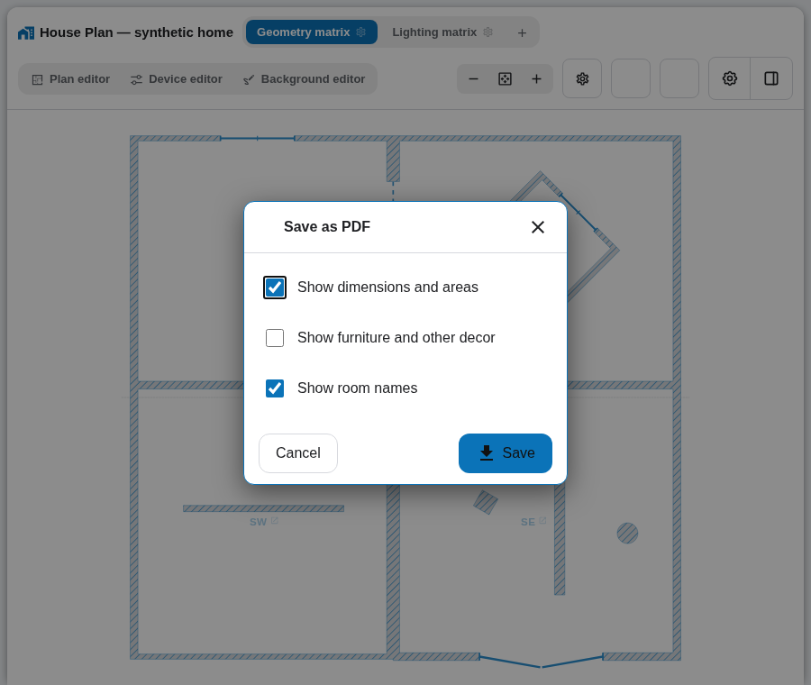

# PDF export

House Plan can save the current space as a one-page A4 architectural PDF.
For administrators, the printer button appears in the card header between
**General settings** and **Help & feedback**. The export is always a flat plan,
even when the card currently uses the isometric view.

The PDF always contains the physical architecture: walls, partitions, columns,
zero-thickness walls and door, window, gate and passage openings. Device
markers, Home Assistant states, Glow, sunlight, vacuum trails, room colours and
Zigbee topology are intentionally excluded.

The dialog can additionally include:

- room dimensions and clean floor areas;
- room names;
- furniture and other Background-editor decor;
- the current space backdrop, when one is configured.

The selected options are remembered in this browser. The export reads the
current plan but never changes it.

## Sheet and measurement rules

The output is a single A4 sheet. House Plan chooses portrait or landscape and
the first standard scale that fits the current space. The footer shows the
scale, a 1 m or 5 ft scale bar, north when configured, the date, House Plan
version and a legend containing only symbols present on the sheet.

Areas use the same clean-floor geometry as the room information card. Internal
dimensions follow the inner wall faces; external dimensions follow the outer
physical outline. Units follow Home Assistant. Very short internal edges use a
tick instead of unreadable text, while required values that cannot fit beside
an edge use numbered callouts.

## Images, fonts and limits

Backdrop and decor images are embedded locally in the browser. They are not
sent to a conversion service. Embedded image data is limited to 25 MB; an
unavailable image or exceeded limit stops the export and leaves the dialog open
so the options can be changed.

Text uses an embedded subset of Roboto Regular covering the four House Plan
interface languages. The bundled font is distributed under the Apache License
2.0; its license is stored in `assets/fonts/LICENSE`.

The resulting file is named
`houseplan-<space-name>-<YYYY-MM-DD>.pdf`. Browser and Home Assistant mobile-app
download handling determines its final Downloads location.
