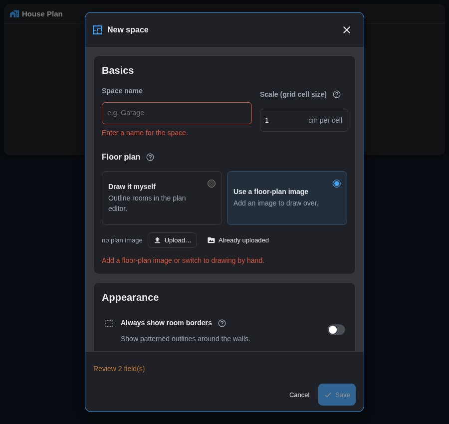
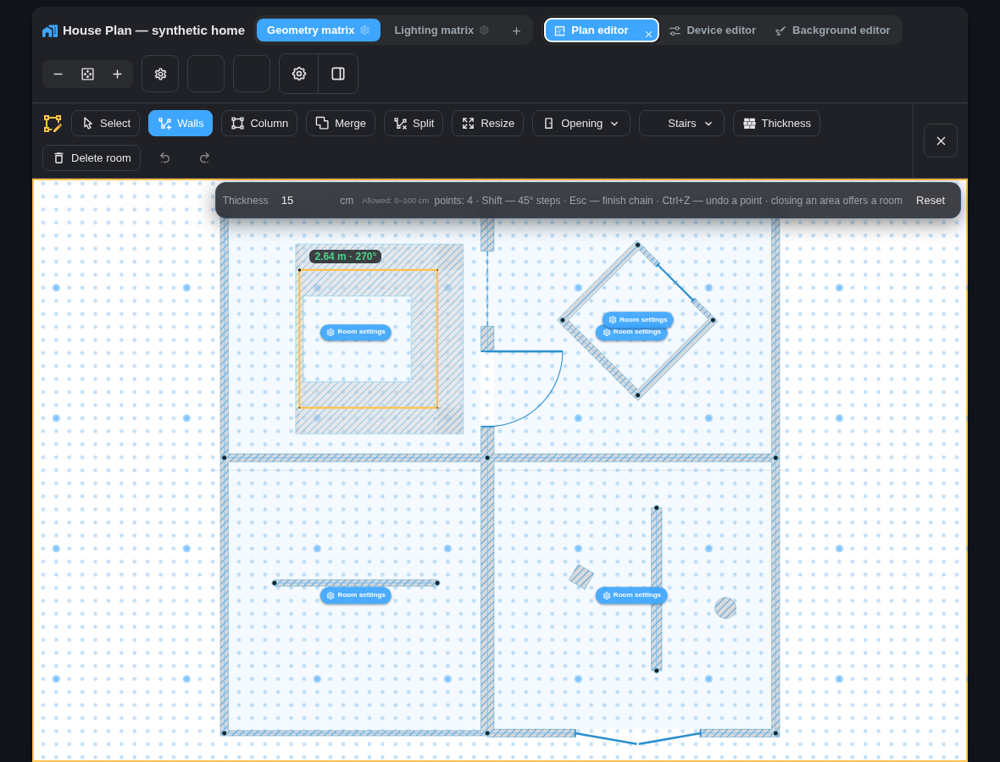
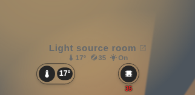
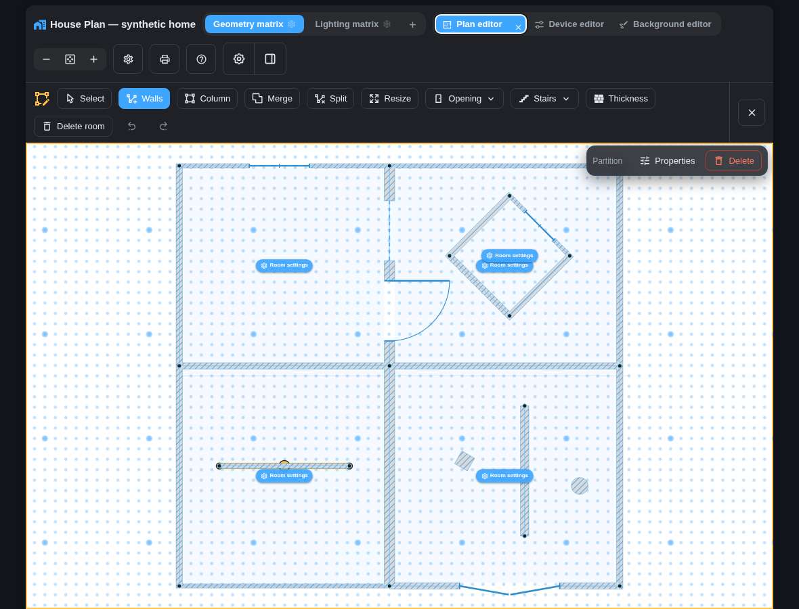
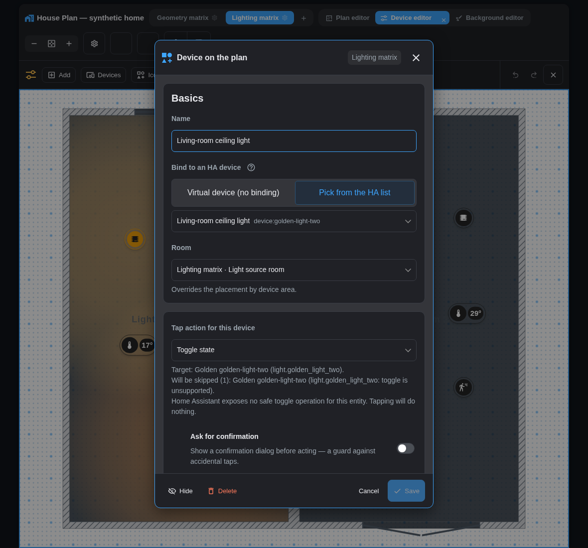
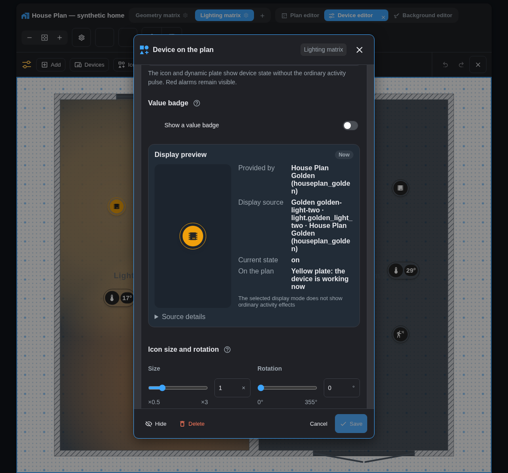
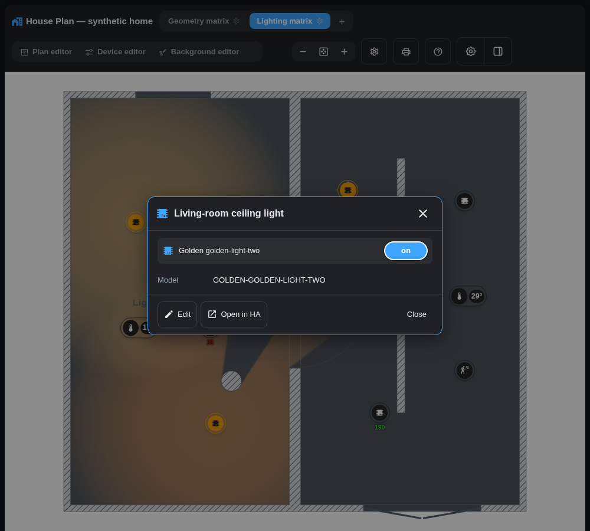
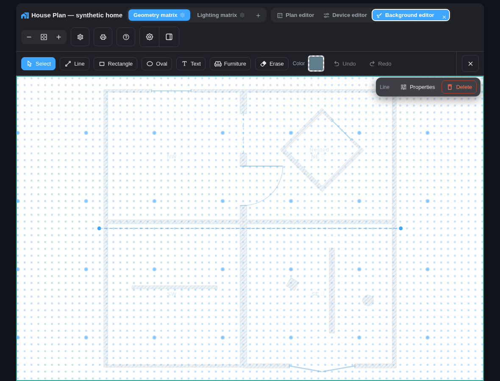

# House Plan — complete user guide

Current for **v1.78.0-beta.5**. This guide describes the interface implemented by the
current source. [Русская версия](USER-GUIDE.ru.md).

House Plan adds a dedicated **House Plan** page to the Home Assistant sidebar.
That full-page panel is the primary way to view and edit the shared plan. The
integration also installs two optional Lovelace cards:

- `custom:houseplan-card` — the live plan, editors, state and actions;
- `custom:houseplan-space-card` — an inert rendering of one space with a link
  to the full plan.

Configuration, uploaded files and shared positions stay inside Home Assistant.
Only the explicit Help & feedback action can contact the House Plan support
relay, and exact plan geometry is attached only after you opt in and preview it.

> **Input support.** View and kiosk are supported on phones, tablets and wall
> touch panels. Create and maintain a plan on a desktop browser with a mouse
> and keyboard. Touch editing is best effort: an operation may be awkward,
> limited or absent, but it must not corrupt data or trigger an accidental
> Home Assistant action. The authority is [TOUCH-SUPPORT.md](TOUCH-SUPPORT.md).

## Contents

1. [Data model and terms](#1-data-model-and-terms)
2. [Installation and access](#2-installation-and-access)
3. [Adding a card](#3-adding-a-card)
4. [Quick start](#4-quick-start)
5. [Interface modes](#5-interface-modes)
6. [Navigation, zoom and input](#6-navigation-zoom-and-input)
7. [Spaces](#7-spaces)
8. [Rooms and walls](#8-rooms-and-walls)
9. [Doors, windows, gates and locks](#9-doors-windows-gates-and-locks)
10. [Devices](#10-devices)
11. [Tap actions](#11-tap-actions)
12. [Device visual states](#12-device-visual-states)
13. [Room fills and light](#13-room-fills-and-light)
14. [Background editor](#14-background-editor)
15. [Sun and Moon: background, window rays and the moon](#15-sun-and-moon-background-window-rays-and-the-moon)
16. [Robot vacuums](#16-robot-vacuums)
17. [Kiosk](#17-kiosk)
18. [Static space card](#18-static-space-card)
19. [Plan maintenance](#19-plan-maintenance)
20. [Storage, multiple cards and backups](#20-storage-multiple-cards-and-backups)
21. [Current limitations](#21-current-limitations)
22. [Troubleshooting](#22-troubleshooting)
23. [Help and private feedback](#23-help-and-private-feedback)

<!-- docs-section: model -->

## 1. Data model and terms

Settings form a hierarchy. Global settings provide defaults; a space may
override them; a room may override its space; a marker may override its room.

| Level | Meaning | Stored data |
|---|---|---|
| Panel/card | Primary sidebar page or one optional dashboard instance | Last/initial space; dashboard cards may additionally set language, icon size, value/LQI display, kiosk and cycle |
| Global settings | Defaults for all spaces | Fill palette, background, Glow radius, north, sun, room-hover information, 2.5D view and icon rules |
| Space | Floor, yard, garage or building | Plan image, scale, rooms, walls, openings, decor and display settings |
| Room | A closed outline | Name, optional HA area, temperature/humidity source and local fill |
| Wall | A room-contour or independent segment | Stable identity and thickness from 0 to 100 cm; zero-thickness appearance is selected per space |
| Opening | Door, window, open passage or gate on a room wall or completed independent wall | Size, orientation where applicable, contact and optional lock |
| Marker | A device shown on the plan | HA binding, room, action, presentation, light role and attachments |
| Decor | Background-layer item | Line, shape, text, furniture or plan-image transform |

Room walls are derived from the room's closed contour. Open and free-standing
walls are stored separately as independent walls; they do not create a room or
floor on their own.

<!-- docs-section: installation -->

## 2. Installation and access

### Requirements

| Component | Requirement |
|---|---|
| Home Assistant | 2024.6.0 or newer |
| Installation | Any installation that supports custom integrations |
| Browser | Web Components, SVG and Pointer Events |
| Editing permission | Administrators by default |

### HACS

1. Search for **House Plan** in HACS and install it — the integration is in
   the HACS default catalog, no custom repository needed.
2. Restart Home Assistant.
3. Open **Settings → Devices & services → Add integration → House Plan**.
4. Keep “administrators only” enabled unless other users must edit the plan.

The integration registers both the sidebar panel and its Lovelace resource
automatically. After installing or updating House Plan, restart Home Assistant
and fully reload the page:
`Ctrl+F5` on Windows/Linux or `Cmd+Shift+R` on macOS.

#### Storage mode (Home Assistant default)

No YAML is normally needed. If automatic registration did not make the card
available, open **Settings → Dashboards → menu ⋮ → Resources → Add
resource**, enter `/houseplan_files/houseplan-card.js`, and select **JavaScript
module**.

#### YAML resources mode (Home Assistant 2026.2+)

To manage resources in `configuration.yaml` independently of the dashboard
mode, use:

```yaml
lovelace:
  resource_mode: yaml
  resources:
    - url: /houseplan_files/houseplan-card.js
      type: module
```

#### Legacy Home Assistant 2024.6–2026.1

Only for a full-YAML dashboard that is already managed in YAML, use:

```yaml
lovelace:
  mode: yaml
  resources:
    - url: /houseplan_files/houseplan-card.js
      type: module
```

`mode: yaml` changes the dashboard itself to YAML mode. Do not switch a storage
dashboard to legacy YAML just for House Plan; use the Storage mode instructions
above instead. Do not use
`/custom_components/houseplan/frontend/houseplan-card.js`; it is an on-disk
path, not the JavaScript URL served by Home Assistant.

### Manual installation

Copy the release folder to `config/custom_components/houseplan`, restart Home
Assistant, and add the integration. If the card is still unavailable, follow
the Storage or YAML resource instructions above for your Home Assistant
version and resource mode. Always copy the complete integration folder: the
stable resource URL remains one file, but that entry loads internal
content-hashed modules. A lone `houseplan-card.js` is not a supported install.

The ordinary View does not download editor code. The first opening of Plan,
Device or Background may therefore take a brief moment. If that internal module
cannot be loaded after one retry, the plan stays in View; no half-open editor is
kept. After a network failure the card invites you to check the connection and
press again — the next press starts a fresh download. Only when the tab holds
code from another build does the advice ask for a page refresh instead. A fully
stale proxy-cached `houseplan-card.js` no longer leaves an empty card after an
update: it shows a panel asking to reload the page.

### Permissions

Every signed-in user can view the plan. Home Assistant permissions still govern
device service calls. With the default integration option, only administrators
can edit configuration or upload files. If that option is disabled, ordinary
household users may edit, but members of Home Assistant's `system-read-only`
group never become writers. Plan optimization and its undo always require an
administrator.

The **House Plan** sidebar item is visible to every signed-in user. A user who
cannot edit gets the complete View experience without editor controls. On an
empty installation that user sees a read-only explanation, not an Add space
button or an automatically opened setup dialog.

## 3. Adding a card

Normally there is nothing to add: open **House Plan** in the HA sidebar. It
occupies the available page area, keeps the existing space/editor controls, and
does not duplicate the product title inside the plan. Leaving the page ends an
editor session; returning keeps the last space and opens View.

The dashboard card remains available for layouts that intentionally embed the
plan. In a Sections view it requests full width and 10 rows by default, with a
minimum of 6 rows. Use Home Assistant's standard resize handle while editing
the dashboard to make the plan taller or shorter; View and every editor fill
the selected height. A size explicitly chosen in Home Assistant remains
authoritative. Existing Sections cards that did not have an explicit row count
adopt the new 10-row default once after this update.

Minimal configuration:

```yaml
type: custom:houseplan-card
title: House plan
```

| Field | Default | Purpose |
|---|---:|---|
| `title` | empty | Card title |
| `default_floor` | first/last opened | Initial/fallback space for an unpinned card |
| `floor` | not pinned | Keep this card on one stable space ID or zero-based YAML index |
| `language` | HA language | `auto`, `en`, `ru` or `de` |
| `icon_size` | `2.5` | Base marker size, 1–6% of plan width |
| `show_temperature` | `true` | Compact temperature and humidity values |
| `live_states` | `true` | Work/open/unavailable presentation and activity; alarms remain visible |
| `show_signal` | `true` | Base LQI display, overridable by a space |
| `kiosk` | `false` | Full plan without editors or header |
| `cycle` | `0` | Kiosk auto-cycle interval in seconds; `0` disables it |

The legacy card-level `tap_action` is ignored. Each marker owns its action.

`auto` recognizes the primary Home Assistant locale: `de`, `de-DE`, `de-AT`
and `de-CH` use German, while `fr`, `fr-FR`, `fr-CA`, `fr-BE` and `fr-CH` use
French (a community translation — thank you, @OUARZA). Lazy dictionaries
(German, French) are downloaded once on first use and shared by
all House Plan cards on the page. Until it is ready, a neutral busy surface is
shown instead of briefly flashing English; if both bounded download attempts
fail, the card becomes usable in English and says so with a "Could not load
the language pack" toast.

<!-- docs-section: first-run -->

## 4. Quick start

Use this order for a first working room:

1. Add a space with **+**, or import Home Assistant floors.
2. Upload SVG/PNG/JPG/WebP, reuse an uploaded plan, or choose no image.
3. Set the real size of a grid cell. It controls wall, opening, furniture and
   area measurements.
4. In Plan choose **Walls**, draw the boundary, then click its first point to
   close the first room face.
5. Name the room and bind it to an HA area, or use **No area**.
6. Add wall thickness and openings if needed.
7. In Device, position auto-discovered markers and choose their actions.
8. In Background, align the plan image and add labels, lines or furniture.
9. Return to View and confirm live values and actions.





Do all plan creation on desktop. Phone, tablet and wall-panel View remain full
product surfaces after setup.

<!-- docs-section: modes -->

## 5. Interface modes

View is the state with no editor open. Close the active editor to return to it.
Escape first cancels the current dialog, popover, drag, selection or tool; press
it again after the editor is neutral to return to View.

| Mode | Devices | Geometry | Background/openings |
|---|---|---|---|
| View | Live and actionable | Read-only; room hover shows summary | Visible according to space settings |
| Plan | Hidden | Rooms, walls, columns and openings editable | Openings always visible |
| Device | Draggable; click opens settings | Read-only background | Read-only background |
| Background | Dimmed and inert | Dimmed | Background objects editable |
| Kiosk | Actionable as in View | Read-only | Read-only; no editors |
| Static card | Live states, values and alarms as in View (`live_states`), no tooltips or more-info | Render only | Render only; not interactive |

### Phone header

At a width of 480 px or less, the header stays on one row: the horizontally
scrollable space tabs, zoom controls and one **Actions and settings** gear. The
card title is hidden and the current tab remains visible. The gear contains
**Plan editor**, **Device editor**, **Background editor**, **Configure space**,
**Add space**, **General settings**, **Save as PDF** and **Help & feedback** for
an administrator. In View it also contains **Summary panel settings** and the
local show/hide action for every user. Selecting an item closes the menu;
Escape or a tap outside only closes it and never activates the plan below. In
an editor the close button remains in the row, while the editor buttons live
in the menu. Wider screens keep the regular header; kiosk has no header.

### Summary panel

The two-part control at the end of the View header opens **Summary panel
settings** with its left gear and shows or hides the panel with its right
sidebar icon. Only the right half is highlighted when the panel is on. In kiosk
the control floats above the plan. The panel is off on a new screen until you
explicitly show it. Its contents are shared for the whole House Plan
installation; the show/hide choice belongs only to your Home Assistant user
and this particular card or sidebar panel. A read-only user and kiosk can
change that local choice without being allowed to edit the shared contents.

An administrator can name the panel, add up to ten ordered blocks, show a block
on every space or one selected space, and add up to twenty values to a block.
A value can be the state of any entity available to that user, the number of
real HA devices represented on valid plans, the total clean room area across
all spaces, or the current date and time. Entity values use Home Assistant's
own formatting and units. Rows are informational only: pressing them never
opens more-info or calls a service.

Press a value's source field to open its picker. Only that row's picker is
shown: search by friendly name or exact entity ID, then choose one of the
matching entities or a built-in value. A broad search shows the first 100
matches and asks you to refine it; the search still covers every entity. Escape
or a press outside closes the picker without changing the draft. A missing old
source remains visible until you explicitly replace it.

The wide settings dialog separates general settings from the block cards.
Use a block's eye button to show or hide it, its grip or arrow buttons to
reorder it, and the dashed add buttons to add values or blocks. A source field
shows its friendly name above the entity ID. On a narrow screen or with
enlarged text the fields stack; Save and Cancel remain in the footer. There
are no icon/text size controls in this dialog; previously saved per-card
sizes are preserved.

**Display on mobile devices** is disabled while **Show panel on this card**
is off. Its previous value is kept, not reset. Both switches are drafts until
Save; Cancel, Escape or closing the dialog discards their changes. Leaving the
House Plan page, reconnecting under another user, or changing edit permission
closes an open summary draft rather than carrying it into the new context.

The compact panel floats over the plan without resizing it, with a separate
header and scrollable block cards. Showing and hiding it both use a brief
slide and fade; reduced-motion preferences are respected. It appears on the right
when the House Plan working area is at least as wide as it is tall and at the
bottom otherwise. It temporarily hides when the card cannot fit a readable
panel, and restores itself after the card grows. Turning off **Display on
mobile devices** also hides it whenever Home Assistant reports a narrow view;
the show/hide button remains pressed because the local choice was not erased.
The panel itself is absent from all three editors and from the static space
card. On a screen wider than 480 px, its two header buttons stay available in
the editors: you can open settings or change the local show/hide choice there,
but the panel appears only after you return to View. On a phone those two gear
menu items remain available only in View.

The room highlight remains available in View and kiosk. To keep that highlight
but hide the floating room summary, turn off **General settings → Show the room
information window on hover**. The option is on by default and does not affect
device tooltips.

An administrator turns the volumetric plan on once: **General settings →
Display → Show the plan in 2.5D**. After saving, View and kiosk in every space
and on every device show walls, doors, windows and device markers with depth.
The plan itself does not move: rooms, furniture, other decor and room names
stay exactly where they are on the flat plan, and walls grow straight up from
it. Every device marker and door lock is lifted by the same distance — the wall
height — as a raised tile with a soft shadow; near a wall a tile may overlap it.
Windows cast a soft wash of sunlight (when sun rays are on and north is set).
Walls keep the wall colour from General settings in light and dark themes
alike. Switching the option, or opening an editor from the 2.5D View, keeps the
zoom and position on screen. Editors are always flat. The option is off by
default; turning it off or **Reset** returns the flat plan. There is no
separate button on the card.

For an occasional Zigbee placement check, an administrator can enable
**General settings → Show Zigbee links when hovering over a device**. The option
is off by default. Load the provider snapshot there: **Read ZHA data** reads
ZHA's existing cache, while **Update map** starts an explicit Zigbee2MQTT raw
network-map scan for each entered base topic (default `zigbee2mqtt`). The latter
may take 10 seconds to 2 minutes and can temporarily slow the Zigbee network.

After data is loaded, moving a real mouse over a mapped Zigbee marker shows
only its observed direct neighbours. Links to markers on the current space are
lines; drawable neighbours on other spaces are summarized as a temporary
count. An arrow on a line shows the next step towards the coordinator: an
ordinary device points to its parent, while arrows pointing into a router show
devices whose path goes through it. Neighbour links outside the derived path
tree remain plain lines.

The active diagnostic layer is deliberately drawn above room names and devices
that are not part of the shown link, so a busy plan cannot hide the route. The
complete source and locally connected device markers remain above the lines.
An unknown-quality gray dashed link has a thin dark outline for contrast; this
does not change its meaning. The whole layer is pointer-transparent, so device
and room actions continue to work normally.

If the next step is in another space, a short bubble names that space. If the
needed router or coordinator is not placed on the plan, the bubble says so. If
the snapshot has no coordinator or the graph is disconnected, House Plan does
not invent a direction and leaves the link without an arrow. This is a stable
path approximation derived from the neighbour snapshot, not the route used by
every current packet. The layer does not appear on touch/pen, in kiosk, in
editors or in the static card, and hovering never starts a scan.

The editor grid continues across the whole working canvas; View does not show
it. Each editor has a stable primary toolbar. Tool parameters and selected-object
actions appear in a context tray over the top of the canvas. On a narrow screen
the tray scrolls horizontally instead of shrinking the plan.

Where an editor offers a color sample, one click opens the House Plan color
picker. Hue, saturation, brightness, an exact HEX value and opacity (when the
setting supports it) are available together; there is no second browser color
dialog. The Hue track shows the full colour spectrum at a glance, with a
contrasting ring keeping its slider visible. Changes remain a draft until the
owning properties dialog is saved.

This is the same control everywhere: decor and custom fills, the global
light/temperature/LQI/Glow/wall palettes, global and per-space backgrounds,
room colour, marker Glow and the device activity ripple. Settings that already
have opacity show it in the picker; colour-only settings do not acquire one.
**Default** and **Inherited** background actions remain beside the colour
sample and do not save the displayed fallback unless a colour is changed.

### Contextual setting help

A circled question mark beside a complex setting opens a short explanation
without changing the value. It works with mouse, keyboard and tap, closes on
`Escape` before the owning dialog and does not add another scrollbar. Help is
available for space scale, global and local background, north, room fill,
global and per-marker Glow radius, zero-thickness wall style, light-source role
and links, binding, icon, marker display and size, and **Show hidden on plan**.
The zero-thickness help also states that dashed lines pass Glow and sunlight,
while solid lines block them.

### How settings dialogs work

The four dialogs — **Space**, **General settings**, **Room settings** and
**Device on the plan** — use the same 560 px-wide form with one scrollbar.
Settings are grouped into cards; a card or field may carry a `?` help action.

| Element | Appearance | Behaviour |
|---|---|---|
| Switch row | Icon, title, caption and switch on the right | The whole row toggles one setting |
| Segment | A short set of choices in one frame | Works like a radio group, including arrow keys and screen readers |
| Colour plate/tile | Colour, HEX and opacity where supported | Opens the House Plan picker; the number edits opacity directly |
| Field with a unit | Number plus `cm`, `°C`, `m`, `%` or `°` | Empty means inheritance only where the help explicitly says so |
| Slider with a number | Slider, editable value and optional reset | Drag the slider or type an exact value |
| Picker button | Dropdown-styled button | Expands search and results inside the card, not over it |
| Chips | Selected items with remove buttons | Used for linked lights and attachments |
| State message | Tinted row with an icon | Explains a current problem or a consequence of Save; it is never hidden under `?` |

**Save** is enabled only after a change; no footer sentence duplicates that
state. Closing with an unsaved draft through the close button, **Cancel** or a
click outside first asks whether to discard it. **Continue** keeps the draft and
reopens the form; **Discard** closes it. Invalid required values are explained
under the field, and **Review N fields** moves to the first problem. Empty room
temperature bounds are the deliberate exception: each inherits its space
value. If Home Assistant recreates the card without a full page reload, an
open dialog, its draft and its original comparison point are restored for a
short window; a full reload does not restore drafts.

<!-- docs-section: input -->

## 6. Navigation, zoom and input

The canvas is effectively infinite: objects may be drawn outside the original
plan square. **Fit all** frames the actual content. The View and kiosk touch
gestures below are supported; editor touch is best effort, so use a desktop for
precise drawing, Resize, keyboard modifiers and double-click properties.

| Scenario | Mouse | Touch View | Touch editors | Keyboard |
|---|---|---|---|---|
| Zoom and pan | Wheel; drag empty space; `−`/`+`; double-click background/room to Fit all | Pinch; drag; double-tap background/room to Fit all | Available but precision is not guaranteed; no Fit-all double-tap | — |
| Room | One clean click fits the room after the 350 ms double-click window | One clean tap fits the room after the 350 ms double-tap window | — | Immediate `Enter`/`Space` on a visible room label |
| Change space | Click a tab | Tap; in kiosk at 1:1, swipe inward from the 48 px edge that has a neighbour | Tap a tab | — |
| Device | Click/double-click per mode | Tap; safe actions equal desktop | Drag/properties are best effort | `Esc` closes the top surface |
| Walls drawing or precise drag | Full contract | Not applicable | Best effort; use desktop for Resize and exact nodes | `Shift` changes magnet/angle; `Esc` finishes a Walls chain or cancels the current precise drag |
| Editor history | Undo/Redo controls | Not applicable | Controls may work; no gesture guarantee | `Ctrl/Cmd+Z`, `Ctrl/Cmd+Shift+Z`, `Ctrl+Y` |
| Kiosk sizing | — | Hold empty space for 3 seconds | — | — |

Important details:

- wheel, `−`/`+`, **Fit all**, the return arrow and a plan-surface
  double-click/tap in View or kiosk use a short smooth camera transition;
  rapid wheel events update one destination instead of building a queue;
- pinch and pan remain directly under the fingers; reduced motion makes every
  commanded zoom immediate, and panning works at every zoom;
- fitting a room uses its visible floor and walls, but not markers, labels,
  Glow, sun rays, backdrop or decor. Manual pan/zoom and **Fit all** release the
  fitted-room hold on the next resize;
- each space keeps its own local View viewport. Editor pan/zoom is a working
  view and does not replace it;
- a hint appears when objects lie far away from the main plan;
- a kiosk space swipe starts only in the inner 48 CSS px of an edge with a
  neighbouring space, points inward and stays strongly horizontal. Elsewhere,
  at an unavailable edge and above 1:1 the gesture pans. Any manual kiosk
  operation pauses auto-cycle for 60 seconds;
- `Shift` keeps positional grid snapping. For room walls it locks the current
  segment to the nearest 45° direction; in Background it creates a square or
  circle, allows independent axes for ordinary decor, unlocks furniture
  proportions and snaps furniture rotation to 45°. On the compass it enables
  a 15° step.

### Cancel and undo

| Context | `Esc` | `Ctrl+Z` / `Cmd+Z` | `Ctrl+Shift+Z` / `Ctrl+Y` |
|---|---|---|---|
| Active **Walls** chain | Finishes accepted segments as independent walls and keeps the tool active | Removes the last accepted point and segment | — |
| Unfinished Split | Removes the last point or leaves the tool | Removes the unfinished point first | — |
| Any other Plan tool | Cancels the current gesture or selection | Undoes the last named geometry command | Redoes it |
| Background | Cancels unfinished drawing or restores the state from before the active move/resize/rotate | Undoes the last named decor/backdrop command | Redoes it |
| Text field | Closes the top dialog | Browser text undo | Browser text redo |

Plan and Background share one 50-command geometry history. Both toolbars have
**Undo** and **Redo**, whose tooltip names the next command. The history lasts
for the current card session and resets safely when a newer external plan
revision arrives. In every dialog, `Tab` and `Shift+Tab` stay inside the open
surface; `Esc` closes the top one and focus returns to the control that opened
it, including through nested dialogs.

<!-- docs-section: spaces -->

## 7. Spaces

A space may represent a floor, garden, garage or separate structure. It stores
its image, grid scale, geometry, Background layer and display overrides.

### Plan source

| Choice | Use it when | Behaviour |
|---|---|---|
| Image | You already have a drawing or photo | SVG, PNG, JPG or WebP; proportions are preserved and Background can move, scale or rotate it later |
| Previously uploaded file | A plan is reused or already stored on the server | Pick it from the server list; a file used by a space cannot be deleted |
| No image | You will draw directly in House Plan | The paper follows room contours; borders and names start enabled |
| Import HA floors | Home Assistant already has a floor registry | A wizard creates spaces in order and lets you skip any floor |

Very large rasters (roughly 32 megapixels and up) are recognised from the file
header before heavy work starts. A dialog shows exact resolution and memory
figures and offers a safe reduced copy. The original and the current plan stay
untouched in every outcome. Browsers cannot display a side wider than 16384 px;
reduce such an image on a desktop first. SVG is never rasterised.

An image-backed new space starts with borders and names off. **No image** starts
with both on. Once either choice is edited, switching source no longer resets
it. Every floor-import step receives its own clean defaults. Detaching an image
never deletes the server file; deletion always requires an explicit action.

### Tab order

Space tabs follow the order in which the spaces were created, and that order can
be changed: in any editor mode, grab a tab with the mouse and drag it to a new
position. The new order is saved immediately and applies everywhere — the tabs,
the kiosk swipe between floors and the carousel arrows. While dragging, a thin
divider shows the exact insertion side; release outside the tab strip to keep
the existing order.

Dragging works **with a mouse and in the editors only**. In ordinary View and on
touch screens a tab still does one thing: it switches the space. There it is the
primary way to navigate, and a gesture must not compete with a plain tap. Order
is changed on a computer, like the rest of the plan work.

If a card anywhere pins its floor **by number** (`floor: 0`), remember that the
number means a position: after a reorder such a card shows a different floor.
The card warns about this once. Pin the floor by space id instead of a number to
avoid it entirely.

### Space settings

| Card | Setting | Result |
|---|---|---|
| Scale | Centimetres or inches per cell | Converts the grid to physical dimensions and area; a new space starts at 1 cm or 1 in according to HA units |
| Appearance | Always show room borders | Draws room outlines in View |
| Appearance | Zero-thickness walls | **Dashed / Solid**, with a line sample |
| Appearance | Visible layers | Separate switches for **Decorative layer** and **Doors, windows and gates**; hiding symbols does not disable sunlight, light transport or sensors |
| Appearance | Room colour and fill | Colour/opacity plus None, Custom, Zigbee, Lights or Temperature; temperature adds two °C bounds and a legend |
| Room cards | Show room names | Draws room cards in View, kiosk and the static card; no fallback label remains when off |
| Room cards | Temperature, humidity, signal and light | Four metric tiles; they are disabled until names are on |
| Room cards | Card font size | 50–300% slider, exact number, reset and a live sample |
| Sun and light | Background | As general, Static or Follow the sun |
| Sun and light | North and rays | Inherit N°, or use a custom compass; rays can inherit, turn on or turn off |
| Sun and light | Glow | Independent switch; base dimming is used only when no other visible fill exists |

The scale is the real size of one grid cell. A finer cell adds snap points per
metre but does not change the finished appearance: physically equal rooms,
walls, openings, labels and markers look the same at 1 and 5 cm per cell.
Existing spaces keep their value; a legacy space without `cell_cm` keeps the
5 cm compatibility fallback and is not silently migrated.

Room cards are positioned and scaled on the plan. View renders only the metrics
enabled for that space.

In an existing space's settings, **Copy** creates a new space from its walls,
openings, columns, Background objects, image transform, scale and display
settings. The suggested name is the first free numbered copy, but duplicate
names are allowed. Rooms and device placements are deliberately not copied;
room walls become ordinary independent walls, ready for a different room
layout. House Plan opens the accepted copy in Plan with **Walls** selected. If
the saved plan must first be repaired, a separate warning explains that
**Optimize plans** will change the whole plan; cancelling that warning writes
nothing.

Deleting a space is blocked while any active device still points to the space,
one of its rooms or a saved position on it, provided another space remains.
Move or delete those devices first; then the confirmed delete removes the
space-owned layout. The sole remaining space can still be deleted after
confirmation: affected devices keep their bindings, icons, actions and settings
but become unplaced. Plan images and attachments are not deleted automatically.



<!-- docs-section: plan-tools -->

## 8. Rooms and walls

### Create a room

Select **Walls** and draw one continuous chain. Every completed segment is
saved immediately as an ordinary independent wall. Changing tool, editor,
floor or leaving the card finishes the session-local chain: compatible straight
sections become one wall and a proven duplicate over room masonry is absorbed
immediately. Undo/Redo remains segment-by-segment but restores a canonical
result, so a normal current-version chain leaves no work for **Optimize plans**.
Reloading preserves the accepted walls but cannot finish the interrupted
session. When the
latest segment creates bounded endpoint/T/X faces, House Plan offers them from
smallest to largest. Save creates that room and consumes exactly coincident
chain walls, Keep as walls rejects only that candidate, and Cancel leaves all
accepted walls in place with no partial rooms.

If the walls were completed earlier, a plain click inside the smallest free
closed area opens the same room dialog. `Shift+click` deliberately starts a
new chain instead; a click on an axis or node still draws. An opening does not
break the structural wall axis, and a zero-thickness axis remains part of the
closure graph. A new room may not partially overlap another room, while a
fully nested island room is supported.

The room dialog is grouped into four cards: the first has no heading (display
name and Home Assistant area side by side), followed by **Fill**, **Sensor
sources** (temperature and humidity) and **Font sizes**. The area help is next
to its field; the other cards keep their `?` beside their heading.

**Fill** starts with an **As the space** switch row: while it is on, the room
follows the space's fill mode and the caption says which one. Turn it off and a
five-mode segment appears (None / Zigbee signal / Lights / Temperature / Custom
color), starting at the mode the space already uses rather than at None.
**Custom color** reveals a colour plate — the space colour until you change it,
then the room's own with a Reset link. When the temperature fill is in effect
(own or inherited), two °C comfort-bound fields appear with a Cold / Comfort /
Hot legend and an **As the space** link.

The measurement source is chosen with a room average / specific sensor segment;
underneath it is still an ordinary radio group, so arrow keys and screen readers
behave exactly as before. For a specific sensor a picker button appears below,
and its search-and-list panel opens inside the card. Name and label sizes are two
sliders with an editable number, "Reset to 100%" and a sample card underneath.
**Save** is enabled only when something changed; closing with unsaved changes
asks first.

While drawing an open chain, `Esc` finishes all accepted segments as ordinary
independent walls and keeps **Walls** selected; the next click starts a new
chain. `Ctrl/Cmd+Z` instead removes the last accepted point and segment. Pan,
pinch and `pointercancel` neither finish the chain nor add geometry.

Existing segment endpoints and lines appear above walls while drawing. An
endpoint grows when the next click will join it. A point on a line shows where
the click will create a valid T-junction without splitting the existing wall.
The active thick wall also shows its centre axis, exact endpoint, length and
angle. Only an actually 45°-multiple vector is green. Hold `Shift` to lock the
segment to the nearest such direction: a compatible endpoint or exact ray/wall
intersection is accepted and an incompatible snap target is ignored. If
several different endpoints look like one at the current zoom, no wall is
added; the conflict is highlighted and asks you to zoom in.

When explicitly creating a room, one unambiguous contour gap up to 2 cm may be
repaired exactly to an endpoint or solid wall axis. A red dashed preview shows
the repair. It is saved in the same Undo command as the room; Cancel and **Keep
as walls** repair nothing. Larger, ambiguous or multiply matching gaps must be
joined manually.

A segment which is visually horizontal or vertical within `0.25°` is stored as
an exact axis: House Plan moves only the free endpoint, and preview already
shows the final result. A real diagonal remains unchanged. Older invisible
one-grid-step slopes are offered separately by **Optimize plans**, with the
number of walls and maximum movement shown before confirmation.

If **Room settings** covers an element you need, drag anywhere on its capsule.
It stays inside that room and remembers the temporary position until you leave
the Plan editor; zooming, panning or visiting another floor does not reset it.
This is session-only assistance: it writes neither config nor Undo history. A
plain click or tap without a drag still opens Room settings. A wall-resize
preview does not discard the position when cancelled; after a confirmed room
shape change it is retained only while it remains inside the room.

### Wall junction limits

To keep the plan physically meaningful, House Plan refuses a write that would
create an impossible junction. These are absolute physical limits and do not
scale with `cell_cm`:

| Rule | Threshold |
|---|---|
| Angle between neighbouring walls at one node | at least 15° |
| Walls meeting at one node | at most 6 |
| Complete wall length | at least 20 cm and never below its own thickness |
| Distance from a non-incident node to another node or foreign wall | at least 5 cm |
| Room interior after subtracting masonry | at least 25 cm² |

Length is measured along the complete wall, not one contour atom: a short
filler that compensates a thickness step is legal when the wall as a whole is
long enough. A T-junction is not rejected by the distance rule. If the check
itself fails, nothing is saved and a toast says that the junction check could
not run; a write is never allowed on faith.

Checks run only when geometry is written. Existing plans, migrations, imports
and backup restores are not re-judged, and an edit that does not touch the old
problem still passes. Drawing and **Thickness** leave a refused value unapplied
and name the rule; Resize stops at the last valid position and explains once
per gesture what the next step would break.

### HA area binding

One HA area may be bound to one room. It drives automatic device placement,
room LQI, light and climate averages. A real temperature or humidity sensor
manually assigned to another House Plan room follows that placement instead of
its registry area. This also works in a room without an HA area. An explicitly
selected room measurement source still has priority over the automatic average.

### Plan tools

#### Plan tools at a glance

| Tool | Result | Room area | Light and shadow | Main limit |
|---|---|---|---|---|
| Walls | Continuous wall chain; offers rooms when it closes faces and finishes open chains as independent walls | Only a confirmed room has area | Positive thickness blocks light; zero thickness follows the space's dashed/solid policy | Partial room overlap is rejected; there is no separate Partition or Boundary drawing tool |
| Column | Square or circular support | Does not change area | Blocks light inside its shape | One shape/size/rotation; not a wall or room |
| Opening | Door, window or gate | Does not change area | Door/gate passage follows state; window may cast sun | Must fit completely on a suitable wall segment |
| Stairs | Straight flight or one-turn spiral with automatic 30 cm treads and an ascent arrow | Subtracts only its footprint overlap from clean area | No effect on Glow, sun or walls | Lives on this floor only; a valid optional target makes it a View link |

Other operations edit existing geometry:

| Operation | Result |
|---|---|
| Merge | Joins adjacent rooms; a dialog chooses the surviving identity, name and area |
| Split | Cuts a room from one wall to another; the larger part keeps the original room |
| Resize | Moves one eligible horizontal/vertical wall without changing room topology. Live labels report the two changing **inner** side-wall dimensions, highlight those walls, and place each affected room's area beside its side of the moving wall |
| Thickness | Changes one span or every wall of a room, including zero-thickness walls |
| Delete room | Deletes the room after choosing whether its exclusive physical walls remain; shared walls always remain |

Choose **Stairs → Straight** or **Stairs → Spiral**, then draw on the plan
like a decor shape: press, drag and release. The drag direction is the
direction of ascent, the drawn extents are the size, and a plain click still
places the default size. The selected stair shows a frame above the walls with
corner, side and rotation handles; the cursor over a handle shows which way it
moves. A handle resizes about the opposite side without turning or mirroring
the stair and snaps the dragged side flush to a parallel wall; dragging the
body snaps the nearest side to a wall (turning the stair by at most 5°) or
flush to another stair; `Shift` snaps rotation to 45°. **Optimize plans**
preserves the exact continuous transform. Double click opens size (30 cm to
100 m, saved exactly as shown), direction, angle, line/fill colour and opacity,
and target-floor properties. A new stair copies the main decor colour and has
no visible fill. Straight **Up/Down** changes the 100%/80% taper but not the
arrow direction; rotate the whole stair to turn the arrow. Treads and spiral
sectors divide the full run evenly at the closest possible step to 30 cm.
In View, hovering a stair with a valid target shows "Go to floor …", and a
clean activation switches to that target and restores its saved view; gesture
tails, broken links and fixed-floor cards do nothing. The target floor is
never changed automatically. In 2.5D the symbol is flat on the floor. See
[Stairs](STAIRS.md).



### Merge

- Rooms must share a boundary.
- Choose which room keeps its identity, name and HA area.
- The other room's name, HA area and area-discovered devices are not silently
  copied. Assign the area elsewhere if those devices should reappear.
- Nested or geometrically incompatible candidates may be refused.

Deleting a room also clears that exact room from direct device assignments and
vacuum segment maps, including maps owned by a vacuum on another floor.
Merging rooms redirects the same references to the surviving room. The change
is part of the room command: Undo and Redo restore or reapply geometry and
references together without changing unrelated marker settings.

When deleting a room, choose whether its exclusive physical walls remain.
Keeping walls converts positive-thickness pieces into independent walls and
reattaches their openings; zero-thickness pieces remain independent `0 cm`
walls. Removing walls deletes only openings hosted by exclusive room masonry.
Shared walls, coincident independent walls and their openings remain. Thickness
records are normalised by their new physical role, never across an outer/shared
transition or between different room pairs.

### Split

- The first and last points must lie on the selected room boundary.
- Intermediate points stay inside the room and may not cross the contour or
  the cut itself.
- The larger result keeps the original room and its devices; the room dialog
  opens for the smaller result.
- A cut may start or end at an existing corner. Even when the new shared wall
  is thicker than the facade, it joins the facade from the inside and does not
  change the outer shape.

### Resize

Resize changes one room, or exactly two rooms when their shared wall coincides
endpoint-to-endpoint. The wall stops at the first corner, opening, foreign room
or other position that would change topology; no more than two rooms can change.
It also stops where extending or shortening an adjacent wall would turn shared
material into outer material (or the reverse), so one saved thickness never
silently serves both roles. If neither direction has even one safe grid step,
the handle explains that only part of a shared wall cannot be moved.
Resize also preserves every unrelated wall exactly: changing the length of a
neighbouring wall cannot shift a thickness boundary to an invented off-grid
point. An ambiguous candidate is rejected instead of damaging another wall.
Partial shared walls, diagonal walls and walls overlapped by an independent
partition/column keep a dimmed handle with an explanatory tooltip and
cannot start a drag. The former corner scale frame was removed. An ordinary
opening on the moving wall follows it once; a side-wall opening stops the
moving masonry at its physical jamb. Release creates one Undo step, while Esc
or an interrupted pointer writes nothing.

The moving wall has no redundant length badge. An outer wall shows one clean
area; a shared wall shows two on opposite sides with short leaders. In a narrow
room a label may extend outside the room rather than overlap the other area or
the Room settings button. Live dimensions are measured to the inner faces of
the two changing side walls and those walls are highlighted.

| Scenario | Result |
|---|---|
| Outer wall | Only the selected room changes |
| Endpoint-to-endpoint shared wall | Exactly two rooms change |
| Irregular room | Movement is allowed only until the first corner that would change the wall extent |
| Opening on the moving wall | Follows the wall once |
| Opening on a side wall | Masonry stops at the nearest jamb, including half its thickness |
| Side material would switch between shared and outer | Movement stops at the exact role boundary; if neither direction has a safe step, the handle explains that only part of a shared wall cannot move |
| Partial/diagonal shared wall, third room, overlapping partition or column | Handle remains visible but dimmed and explains why movement is unavailable |
| Room becomes too small | Stops at the last position preserving the 30 cm minimum without deleting a vertex |

### Wall thickness

| Property | Behaviour |
|---|---|
| Value | 0–100 cm for room and independent walls; empty/non-numeric input is rejected |
| Geometry | Grows by half the value on both sides of the axis; a shared boundary is one physical wall |
| Clean area | Measured to the inner wall faces |
| Hatching | 9.6 cm physical pitch, independent of grid scale and zoom |
| Junctions | Exact shared nodes form one bounded mitre/bevel; a T-junction does not split the through wall |
| Equal adjacent pieces | Normalised only when thickness, direction and physical role match |

Wall thickness is stored in real units, and one room may use different values
on different spans. Open branches and T-junctions are allowed. At a saved
T/X-junction the complete physical width stays solid through the node: the
bounded bevel removes only an excessive corner and never creates a white
triangle, painted cap, invented shadow or light barrier. A short arm stops at
its saved endpoint; the removed bevel remains connected to the surrounding
room/background instead of becoming a tiny enclosed hole. This is a rendering
correction, so a valid plan may remain unchanged after **Optimize plans**.

Legacy near-axis walls are different: Optimize can explicitly straighten them,
counts a shared wall once and leaves unsafe candidates unchanged. Cancel writes
nothing; Apply is one server-side Undo step. Independent walls and columns can
be dragged on the grid and edited by double-click. An independent wall accepts
0–100 cm. A column is square or circular, 1–150 cm; a square rotates and a
circle uses the size as its diameter. They subtract from clean area and block
Glow/sun, but Resize does not move them. Outside rooms they create no floor.

### Zero-thickness walls

A wall thickness of **0 cm** is a real wall-axis record without a masonry body:
it does not create hatch, wall area, an opening tunnel or a valid opening host.
It is drawn and edited with the same Walls and Thickness tools as every other
wall. In Space settings choose whether all zero-thickness walls are
**Dashed** or **Solid**. Dashed zero walls let Glow and sun through; solid zero
walls are zero-area light barriers. Missing settings use Dashed. Changing the
style affects every `0 cm` wall in that space; there is no separate Boundary
tool or separate virtual-wall type.

An opening cannot be placed on a zero wall, and changing an occupied span to
`0 cm` is rejected atomically. When room borders are hidden, the line is hidden
in View/kiosk but its light semantics stay active; every editor still shows the
axis.

## 9. Doors, windows, gates and locks

An opening belongs to one room-wall segment or one completed independent Walls
segment. Door and open passage default to 90 cm, window to 120 cm and gate to
300 cm; the UI accepts 20–600 cm in 5 cm steps. **Opening** first opens a compact
Window / Door / Open passage / Gate menu. Hover a physical wall: door, window
and gate show the exact translucent symbol and opening side, while a passage
shows the future wall-coloured cut and two orange boundary marks. Click opens
properties and **Save** creates it. The selected type remains armed for a
series; `Esc`, another tool/editor or another space ends the series.

The placement preview also draws a thin dimension line from each jamb to the
physical inner end of the wall. On a wall shared by two rooms, four values are
shown — two along each room's inner face — because their usable boundaries can
differ. On a finished independent wall, each value stops at the nearest
physical face of a connected wall; where no such face exists, it keeps the
distance to the independent wall's own endpoint. These richer dimensions apply
only before a new opening is placed; dragging an existing opening retains its
two established end-distance badges.

On a finished independent wall, a new or directly edited opening must leave a
jamb at each endpoint equal to at least half that wall's real thickness. The
same limit applies to placement, drag, rebind and length edits. Existing
near-end openings remain visible and are not moved until their geometry is
edited.

Clicking the body of a thick wall works without a prior hover: the editor finds
its axis and opens the same dialog. A zero wall cannot host an opening. An exact
independent wall over room masonry is an explicit host and cuts the one combined
body; an ambiguous junction is never guessed. Deleting a host wall asks about
all attached openings and removes them in the same Undo step only after
confirmation. A legacy opening whose host disappeared is marked for rebind in
Plan and omitted from View and light transport.

A gate behaves like a door in data and light, but uses two half leaves without
a large arc. It may have a contact and lock. An open passage has no leaf, sensor,
lock, inversion or swing: it is simply an always-open cut through masonry.
Changing a door/gate into a passage warns that Save removes its contact and
lock; Cancel preserves the original.

### Opening settings

| Field | Door | Window | Open passage | Gate |
|---|---:|---:|---:|---:|
| Size | Yes | Yes | Yes | Yes |
| Contact sensor | Yes | Yes | No | Yes |
| Invert sensor | Yes | Yes | No | Yes |
| Hinges on the other side | Yes | Yes | No | No — leaves are symmetric |
| Opens the other way | Yes | Yes | No | Yes; outward by default |
| `lock.*` | Yes | No | No | Yes |

Contacts come from suitable `binary_sensor` entities and door covers. The
contact animates the leaf; inversion handles integrations with opposite logic.
Contacts and locks are exact opening bindings: removing a separate marker for
the same entity does not clear them. A live YAML entity without a registry row
also works while HA supplies its exact state; a disabled, missing or unavailable
entity does not. Search by friendly name or `entity_id`; **— none —** stays
first and clears the binding.

### Behaviour by mode

| Mode | Activation | Drag |
|---|---|---|
| View | The opening body is inert; only its lock badge opens the opening card | No |
| Plan editor | Opens properties | Along the host wall, snapping to its centre or grid step |
| Other editors | Inert | No |

### Lock

- `locked` uses a closed lock on green; `unlocked`/`open` uses an open lock on red;
- an unknown state uses neutral unknown styling;
- the badge opens the opening card; a plan tap never toggles a lock;
- locking needs no extra confirmation; unlocking uses the common House Plan
  confirmation with the lock name and **Cancel** as the safe initial action;
- marker actions never toggle `lock.*` or disarm `alarm_control_panel.*`.

### Thick walls

The opening cuts the full masonry depth and keeps visible jambs. Door, window
and gate symbols stay centred on the wall; **Opens the other way** mirrors only
the leaf direction, not the symbol position. Internal light passes through a
door, gate or passage along the tunnel and is clipped by its reveals. A sun ray
starts at the inner or outer window-tunnel corners according to General
settings (inner is the default). Only exterior room windows cast sun; internal
windows and windows on independent walls do not.

Openings may slide along joined corners. Double-click in Plan opens properties.
The static card also cuts an open passage through the wall and carries the
current fill/Glow base through its tunnel.

<!-- docs-section: devices -->

## 10. Devices

### How markers appear automatically

House Plan reads Home Assistant device, entity and area registries. A device in
a bound HA area receives an automatic marker. Service-only records, bridges and
other non-spatial records are filtered; a light group may replace its members.
Newly discovered devices get a red dot until first opened in Device.

When the Area of a direct HA device or a separately placed entity changes,
House Plan moves its automatic marker to the room bound to the new Area. A
previous manual drag is layout, not a room override: it is discarded, the
ordinary room grid chooses the new position and the red attention dot appears.
Selecting a room explicitly in the marker settings overrides HA Area placement.
Ambiguous or unbound Areas never make House Plan guess a destination.

Service and non-spatial integrations such as HACS, system records, bridges,
scenes and some aggregates are filtered when the list is first materialised.
Room light members may be replaced by one group marker. Newly discovered
devices receive a red attention dot until their marker settings are first
opened. The compact marker size is stored directly in its base geometry, so
its saved point remains the centre and the action target does not shrink. In
Value mode the inner number capsule has true semicircular ends and even inset
inside the outer shell.

### Bindings

| Binding | Use |
|---|---|
| HA device | Uses its related entities and resolves a primary function |
| HA entity | Exact entity binding after enabling “Show entities” |
| Virtual device | Label/icon/description only, with no live active state |

The same binding cannot be used by two markers.

When an exact HA entity belongs to a device, placing that entity gives its
channel to the entity marker. The automatic parent marker, if needed, contains
only the remaining active, HA-visible and unplaced entities; it disappears
when that residual is empty. HA-hidden siblings alone do not keep an automatic
parent on the plan. To show both the exact entity and the complete device,
place `entity:X` and `device:D` explicitly — two explicit markers are treated
as an intentional configuration. Deleting an entity marker returns the entity
to automatic parent discovery; its binding tombstone does not remove registry
data from the live HA device.

After deleting a complete HA device, you can restore only one of its entities:
open **Devices → Available**, enable **Show entities**, and select that entity. House Plan
returns the selected marker with a fresh position while the complete device
and its other entities remain deleted. The complete device stays available in
**Available again** if you later decide to restore it explicitly as well.

### Device editor

- drag a marker to save its server-side position. One completed drag creates
  one position-history step; a cancelled, unchanged or failed drag creates
  none;
- persistent Undo/Redo buttons affect marker positions only. The same
  session-local history is available through `Ctrl/Cmd+Z`,
  `Ctrl/Cmd+Shift+Z` and `Ctrl+Y`, keeps up to 50 completed moves, and is not
  restored after reopening the card;
- click it to edit name, binding, room, tap action and presentation;
- **Add** opens the new-device dialog directly, without going through the
  device catalog;
- **Devices** opens one searchable lifecycle catalog. Its **On plan**,
  **Available**, **Hidden** and **Available again** tabs explain where every
  exact HA binding is and offer the next valid action;
- **Hide selected** / **Show selected** (#618): the **On plan** and **Hidden**
  tabs have a checkbox on every row and **Select all (N)** above the list. N
  counts every eligible row of the tab after search and **New only**,
  including rows behind **Show more**. With a selection the panel shows
  “Selected: K”, the action button with the count and **Clear selection**. The
  whole batch is saved in one write and confirmed by a “Hidden: K” / “Shown: K”
  toast. There is no confirmation prompt — the same tab reverses it. Rows that
  are disabled or missing in Home Assistant, or unverified, cannot be
  selected. The selection resets when you switch tabs, edit the search or
  toggle **New only**, survives opening a device from the catalog, and is
  cleared after a successful save; a failed save changes nothing and keeps it;
- **Discovery filters** (#44) live on the **Available** tab: a switch that
  groups room lights into one marker (on by default) and the list of excluded
  integrations with search and a "Restore recommended" reset. Changes show
  appear/disappear counters before anything is written; Save stores the
  settings once. Filters only affect automatic candidates — a device you
  placed explicitly never disappears because of them, and an excluded
  candidate names its integration in the catalog;
- **Add virtual device** lives at the top of that catalog. Enable **Show
  entities** in **Available** to place an individual entity;
- **Show hidden on plan** is a local catalog switch. It reveals user-hidden
  and HA-disabled records as service ghosts only until you leave the Device
  editor; it never changes the saved Hidden flag;
- **Icon rules** edits the first-match regular-expression list.

An automatically discovered marker is already **On plan** even before it has
saved marker settings. The **New** badge is independent and remains until the
marker settings are opened. **Find on plan** centres and briefly selects the
marker without changing config or acknowledging that badge. Hide and Show are
reversible; Delete leaves an exact binding tombstone and moves an active HA
binding to **Available again**. A disabled or missing binding keeps its saved
category and receives a separate Home Assistant status instead of silently
moving to another tab.

### Marker basics

The dialog has five cards: **Basics**, a compact tap-action card without a
repeated heading, **Light and glow**, **Appearance** and **Details**. **Hide**
and **Delete** sit on the left of the
footer, **Cancel** and **Save** on the right; Save is enabled only when
something changed. Binding is a **Virtual device / Pick from the HA list**
segment; in the second case a picker button opens a panel inside the card with
search, the **Show entities** checkbox and the device list — until a binding is
chosen, Save stays disabled and the reason is written under the field.
**Ask for confirmation** is shown only for actions that do something (toggle or
run). The light-source role and the glow mode are segments; with **Never** the
whole glow block is dimmed and explains why. The glow radius is a field with a
unit — empty means the general radius, and the hint names it; a value that is
not a positive number is saved as the general radius too, as before. The dialog shows
binding provenance, exact next tap result, skipped targets and a live
presentation preview in a tinted **Display preview** block. Icon size and
rotation are two sliders with compact numbers. **Additional actions** are near
the end of **Details**; the device-temperature switch follows them. A saved
missing source is shown as missing rather than silently replaced.

| Field | Purpose |
|---|---|
| Name | Plan label and House Plan card title |
| Binding | Virtual device or an HA picker with search and **Show entities**; Save stays disabled until a required binding is chosen |
| Room | Automatic HA area or an explicit room, including one with no HA area |
| Tap action | House Plan card, HA more-info, Toggle, Run or **Do nothing**, with the exact target/result shown below |
| Controls other light sources | Other placed `light.*`/`switch.*` markers or forced sources; the marker's own entities are not listed |
| Is a light source | **Auto / Always / Never**; Auto shows its resolved result, Always may choose a leading entity, Never disables only the marker's own source |
| Glow colour and brightness | From source, fixed colour, or fixed colour and brightness; manual brightness is 1–100% |
| Glow radius | Empty means the current General setting; valid stored range is 0.1–100 m |
| Icon and display | Automatic or manual `mdi:*`; icon/state/activity, value/state, static icon or value/static icon |
| Icon size and rotation | ×0.5–×3 and a 5° angle step |
| Device temperature | After **Additional actions**; includes climate `current_temperature` in the marker and its room average |
| Model, link, description and instructions | Informational card data and multiple PDF/PNG/JPG/WebP/TXT attachments |

The footer keeps **Hide** and **Delete** on the left and **Cancel**/**Save** on
the right. Hide preserves configuration and may preserve aggregate room data;
Delete removes the marker and its layout after confirmation.





### A “dumb” lamp with a smart switch

1. Add a virtual marker at the lamp's real position.
2. Set **Is a light source → Always**. With no HA entity it becomes a passive
   source; choose its colour, brightness and radius manually.
3. Open the smart-switch marker and add that lamp under **Controls other light
   sources**.

The switch now reports aggregate work, while the floor pool, room fill and
statistics belong to the lamp and its room. Several switches use OR. A
`marker:*` value is only an internal plan link and is never sent to HA as an
entity ID. Tapping the linked virtual lamp with **Toggle state** toggles the
union of its real incoming controllers; tapping a switch controls only that
switch's own group. Live HA state remains authoritative, so physical switches,
automations and other dashboards update both markers and all lighting effects.

Without incoming controllers, the same virtual **Always + Toggle** combination
uses the manual lifecycle: a new lamp starts on, the state is shared by full
and static cards and survives reloads and HA restarts. Saved outgoing controls
are retained but do not call services in that unlinked mode. Adding/removing
the last incoming link does not erase the previous manual state. Hide preserves
it; deleting the marker clears it. It is not an HA helper and is not included
in plan import/export.

Delete and Hide are different. Delete removes the marker from LQI, climate,
light, Glow, room cards, actions, live text and other markers' external
controls; its binding moves to **Available again**. An exact opening contact or
lock remains a separate binding. Re-adding creates a new position and restores
saved references without duplicating the opening binding. Marker position,
attachments and a vacuum trail are deleted with the marker.

### Hidden devices

A hidden marker:

- is absent from View and appears in Device only while **Show hidden on plan**
  is enabled;
- has no state colour, value, temperature, humidity, LQI, Glow or light-source
  contribution;
- may still contribute LQI and climate data to the explicitly assigned room.

Use **Devices → On plan**, row checkboxes or **Select all (N)** and **Hide
selected** for a batch; reverse it under **Hidden → Show selected**. Disabled,
missing or unverified bindings cannot be selected and explain why. Selection
resets on tab/search/**New only** changes, survives opening one device, clears
after a successful save and remains after a failed one.

### Disabled in Home Assistant

When a device, exact entity or every entity of a device has `disabled_by`, its
binding is temporarily excluded from markers, LQI, climate, light, Glow, live
text, openings, actions and vacuum position/trail. Configuration, layout,
attachments and server history are retained. The catalog keeps the marker in
its lifecycle tab with **Disabled in Home Assistant** status; **Show hidden on
plan** reveals a gray service ghost. You may inspect it, edit description,
remove it from the plan or open HA settings, but Show is unavailable until HA
enables it. The same ID then returns with its old settings and position,
including the user's separate Hidden choice.

If the current account cannot read the complete HA registry, House Plan does
not infer disabled state from a missing row. Proven live bindings continue to
work; unverified ones safely stay out of the plan until registry access returns.

### Presence radars

For a recognized presence radar, **Additional actions** contains the enabled
**This is a presence radar** switch and its settings directly below it. Verify
the exact Home Assistant sources and select the room whose contour must contain
the observations. Unknown/custom real devices can enable the same switch and
choose an explicit data profile. Turning the switch off removes the radar setup
on Save; turning it back on before Save restores the current draft. The editor
never guesses coordinate units, axis directions or a bearing from entity names.

**Configure on plan** records the physical sensor position and direction,
independently of the decorative marker. Coordinate profiles can then use two
measured reference positions; an optional third point checks the result without
changing it. Use a desktop browser and stand alone/still at each reference.
**Check live data** distinguishes no target, stale or partial coordinates,
unavailable sources and presence without a usable position.

Live dots and range arcs do not intercept clicks and are clipped to the selected
room. Their short trail and smoothing exist only in the open browser session;
House Plan does not save raw radar samples or target history. Disable either
the radar itself or **General settings → Show live presence on the plan** to hide the
layer. See [Presence radars](RADAR.md) for supported profiles, setup and privacy.

## 11. Tap actions

### Marker gestures

| Gesture | View | Device editor |
|---|---|---|
| Short click/tap | Configured action | Open marker settings |
| Hold 600 ms | House Plan device card | No device control |
| Right click | Native HA more-info for the primary entity | Browser/editor context |

When a short activation actually sends a device command, the marker gently
shrinks by 5% and returns over 0.2 s. Merely opening information, an editor or a
confirmation does not trigger feedback; with confirmation it starts only after
approval and dispatch. Reduced motion replaces the scale with a brief steady
accent.

### Actions

| Action | Behaviour | Safety |
|---|---|---|
| Device card | House Plan card with entities, model, description, links and files | No state change |
| HA more-info | Native dialog for the exact primary entity | No state change |
| Toggle state | Toggles the exact binding, supported device function or configured light-source group | Locks, alarm panels and protective garage/door/gate targets are no-op; confirmation is optional |
| Run | Runs an automation, script or scene | Explicit target; confirmation is optional |
| Do nothing | Short click/tap, Enter and Space are ignored | No dialog, command, confirmation, toast or press feedback |

When confirmation is enabled for **Toggle state**, the dialog shows the current
state and the exact expected result (`On`, `Off`, `Open`, `Closed` or `Stopped`).
A group shows the active/total count and lists unavailable targets separately;
the result describes only the targets that will receive the command. The text
is a snapshot, but Confirm re-resolves the live state and direction. If the
target set changed while the dialog was open, House Plan cancels the action and
asks you to try again.

A light defaults to Toggle; other devices default to the House Plan card. An
unsupported Toggle remains a visible no-op and is never changed into another
action behind the user's back. **Do nothing** is an explicit saved choice, not
the default: it keeps the marker's normal appearance, hover, long-press House
Plan card and right-click HA more-info while disabling only short activation.

If every explicitly configured `controls` target is unavailable, missing or
disabled in HA, a short tap sends no service call and the standard local House
Plan message names the target and explains that no action was performed. A
partially available group still operates only its available subset, so it does
not show the misleading no-action message.

When a device-bound marker has two or more own `light.*`/`switch.*` entities,
**Entity to toggle** appears below Toggle. It selects the exact own channel and
updates the target hint before Save. **Automatic** keeps the previous binding /
functional-role rules. A missing saved entity stays configured, shows a
warning and temporarily falls back; returning the same entity restores the
choice. This setting is independent from **Leading light entity**. With an
explicit external controls group, an explicitly selected own entity joins the
group; without a selection existing groups remain external-only.

Toggle remains selectable for every marker, including virtual ones. A marker
with no suitable target states the no-op directly; House Plan does not silently
replace it with a card. An exact entity binding never substitutes a sibling
relay. With several controlled sources, any active source makes the next action
turn all off; if all are off, it turns all on. Only available targets receive
the command, and the hint names every skipped target. The controller's own
availability remains independent from that aggregate work state.



<!-- docs-section: visual-states -->

## 12. Device visual states

Presentation uses one shared outer shell around three independent layers:
stable core, icon or value, and optional activity pulse. Visual priority is
**alarm → keyboard focus → selected → hover → semantic state → neutral**.

Unavailable markers keep the normal presentation with reduced icon opacity,
no visual hover and no pulse, but their ordinary activation may still open
information or settings. A media player in `off` uses the same dimmed treatment.
Hover starts only from a real hover-capable mouse. Finger or pen input clears
tooltip/highlight immediately; later mouse movement restores desktop hover.

### Background and stable status

| State | Meaning | Examples |
|---|---|---|
| Red alarm | Critical condition, even with live states disabled | Smoke, gas, CO, leak, tamper/problem/safety, triggered alarm |
| Yellow | Device is doing its main job | Light/switch/fan on, active climate, vacuum cleaning, known appliance work |
| Red lock | Lock is unsecured | Unlocked/open lock |
| Green lock | Lock is secured | Locked lock |
| Orange | Physically open | Door/window contact, opening valve |
| Faded | Data unavailable | All relevant entities unknown, unavailable or absent |
| Neutral | No alarm, work or open condition | Off, closed, idle, standby, docked |

For a controller with `controls`, target work and controller availability are
independent. The controlled lights still decide whether the marker is yellow,
but only the controller's own active entities decide whether it fades. A live
battery, Zigbee LQI or update entity therefore keeps a wireless switch neutral
and opaque when all of its lamps are unavailable. If an active physical HA
device exposes no entities at all, House Plan also keeps its controller opaque:
missing telemetry alone is not evidence that the device is offline, so its
controlled target makes it yellow when working and neutral otherwise. If the
device does expose own entities but all of them are missing, `unknown` or
`unavailable`, the controller fades even if a target is on. A virtual controller
is always available.
This remains true when the same target was separately removed from the plan:
the removed marker is not restored, but it cannot make the controller look
offline or make its editor preview disagree with the plan.

For a composite appliance with a dedicated Power switch, Power=`on` alone
remains neutral. If Home Assistant also exposes a strict lifecycle entity such
as Status/Run state/Job state, active values (`start`, `running`, `washing`,
`rinse`, and similar work states) make the marker yellow; idle, paused and
terminal values remove it. Power=`off` or unavailable still fades the marker
even if the lifecycle value is stale. Mode, Program, Stage and remaining time
are not treated as independent proof of work, and an ordinary lone relay keeps
its existing yellow-on behaviour.

### Activity

Ordinary activity appears only for **Icon + state and activity** while live
states are enabled; a critical alarm remains a separate signal in every dynamic
mode.

| Activity | Duration | Sources |
|---|---|---|
| Short event, three waves | about 3.3 s | motion/vibration/sound trigger, contact opening, button/event change, manual Run, terminal transition without a travelling state |
| Persistent presence | while active | occupancy/presence binary sensor |
| Persistent transition | while moving | cover opening/closing, lock locking/unlocking, valve opening/closing, moving sensor, vacuum returning |
| Persistent work | while working | lights, switches, fans, humidifiers, climate work, vacuum cleaning, scripts and known appliance lifecycle states |

Activity may be a finite three-wave event, persistent presence, a travelling
transition, or persistent work. Continuous motion uses a 3.6 s cycle (green
presence, amber work, blue neutral transition), a short event lasts 3.3 s, and
the two-wave red alarm cycles in 2.4 s. Explicit saved pulse color/size remains
authoritative; the package size default is 1.5 diameters. `prefers-reduced-motion`
replaces ordinary motion with a compact colored indicator while the static red
alarm remains clear.

### Five Display modes

| Choice | Icon | Status background | Activity | Value |
|---|---:|---:|---:|---:|
| Icon + state | Yes | Yes | Alarm only | Optional compact °/% and LQI |
| Icon + state and activity | Yes | Yes | Yes | Optional compact °/% and LQI |
| Value + state | Automatic fallback when no unambiguous value; a virtual marker keeps an icon fallback | Yes | Alarm only | Automatic or explicitly selected state, attribute, LQI or linked-light state |
| Always-static icon | Yes | Theme-neutral | No | No |
| Value + static icon | Same value/fallback rules as Value + state | Theme-neutral | No | Same source as Value + state |

The five display choices are icon + state; icon + state + activity; value +
state; always-static icon; and value + static icon.
**Value + static icon** combines the two: the marker content follows the same
rules as **value + state** — the same Value source, the same numbers and
localized states, the same icon fallback with its reason — while the colour
behaves like **always-static icon**. State, alarm, unavailability, live RGB
colour and activity never change the marker; there is no pulse at all, the
compact °/% and LQI readings stay hidden, and the separate value badge is
suppressed the same way (the setting is kept), because the value is already
inside the marker. A vacuum in this mode draws no live puck, trail or route
warning, and its saved history is not deleted.
For **value + state**, the Device editor also offers **Value source**. Keep
**Automatic (as before)** for the legacy choice, or select one of those same
readings—for example, cover position—to replace the icon with `42 %` rather
than `Open`. A temporarily unavailable saved source stays selected and shows
`—` until it recovers; it is not silently replaced. Changing this source never
changes what a click or tap does.
Text and adjacent values are sections of the same shell. They shrink to a
readable floor and then expand the shell; they are never ellipsized.
The complete visible value capsule is one hover and action target: clicking or
tapping its value section runs exactly the same configured action and safety
checks as the icon core.

### Value badge beside a device

The editor may add an independent badge, select a state, useful attribute,
average LQI or linked-light state, and place it on the right, bottom, left or
top. A missing saved source stays selected and shows `—`. It may accompany a
normal icon or Value + state. Bottom placement puts system LQI on a second row;
when the badge itself is LQI, the duplicate row is hidden. Old markers keep
their automatic °/% badge; explicitly turning the badge off suppresses that
legacy heuristic. The badge does not depend on the general temperature option,
which now affects only room averaging.

The whole outer capsule is one hover and activation target. Always-static icon
and Value + static icon temporarily hide the badge without deleting its setup.
The preview uses the unsaved form and live HA state, and may run a local short
or persistent pulse sample without touching HA, the saved config or the marker
on the plan.

### Icon changes by state

With live states enabled, known pairs change automatically:

- door/window/garage: closed/open;
- blinds, shutters, gates and other covers: closed/open;
- lock: locked/unlocked;
- standard bulb: off/on.

A manual icon normally stays fixed. A known `cover.*` pair may still change so
the open state is not hidden.

### Matrix by device type

| Type | Stable status | Activity in Icon + activity | Default short click |
|---|---|---|---|
| `light.*` | Yellow while on | Work while on | Toggle |
| `switch.*`, `fan.*`, `humidifier.*` | Yellow while on | Work while on | House Plan card unless Toggle is explicit |
| Composite appliance with Power | Power on alone is neutral; explicit active lifecycle is yellow; Power off/unavailable dims | Work only from an explicit lifecycle | House Plan card |
| Motion/vibration/sound sensor | Neutral | Short event on off→on | House Plan card |
| Occupancy/presence sensor | Neutral | While presence is active | House Plan card |
| Door/window/garage contact | Orange while open | Short opening event | House Plan card |
| Ordinary `cover.*` | Neutral | Travelling while opening/closing | House Plan card; explicit Toggle does open/close/stop |
| Protective garage/door/gate cover | Neutral | Travelling | Saved Toggle is a stated safe no-op |
| `lock.*` | Red unlocked, green locked | Travelling while locking/unlocking | Card; Toggle forbidden |
| `valve.*` | Orange while open/moving | Travelling | Card; Toggle may be explicit |
| `climate.*` | Yellow for real heating/cooling/work; HVAC mode fallback only when action is absent | Work | House Plan card |
| `media_player.*` | Neutral when active, dimmed at off | None | House Plan card |
| `vacuum.*` | Yellow cleaning/returning | Work/travelling | House Plan card; live puck opens HA more-info |
| `script.*` / `automation.*` | Script yellow while on; automation stays neutral | Work / short explicit Run event | Card or explicit Run |
| `button.*` / `event.*` | Neutral | Short event on change | House Plan card |
| Smoke/gas/CO/moisture/safety/tamper/problem, siren, triggered alarm | Red alarm | Alarm has priority | Card; dangerous Toggle forbidden |
| Virtual marker | Neutral | None without an HA source | Card or explicit Run |

Virtual devices use the ordinary neutral/hover background with a dashed outer
circle. An HA-less virtual device does not invent unavailable or activity;
a linked virtual light may still follow its real controller. Unavailable keeps the ordinary
presentation with the standard icon opacity reduction, no visual hover and no
motion; its existing click/tap still opens information or settings. Marker LQI
uses the same continuous red-to-green scale as before the package update; the
room fill gradient and the displayed number are unchanged.

Interactive View/kiosk and Device-editor markers have at least a 44×44 CSS px
target. Enter and Space reuse the exact current click and confirmation path;
Plan, Background, preview and the read-only static card add no tab stop.
In the full View, Tab focus also opens the same device tooltip as mouse hover;
moving to the next control closes or moves it. The active space is exposed as
the current item of the named space navigation. The static card remains
non-interactive.

## 13. Room fills and light

### Space fill modes

| Mode | Source | Colour/behaviour | No data |
|---|---|---|---|
| None | — | Transparent room / border only | — |
| Zigbee signal | Average LQI for room devices | Red at ≤40 through green at ≥180 | No fill |
| Lights | One resolved set of visible sources: external controls plus own Auto/Always/Never source | Configured on/off/no-source colours | No-source colour when its opacity is above zero |
| Temperature | Room source or sensor average | Cold below minimum, comfort between bounds, hot above maximum | No fill |
| Custom color | Space or room setting | Constant colour and opacity | Safe `#607d8b` at 18% |

**Light-source Glow** is an independent switch and works with every fill. With
no data, room-level None or a zero-opacity custom colour it adds base dimming
plus light pools. When an LQI, light, temperature or visible custom fill exists,
base dimming is omitted and the chosen colour/opacity stays exact while pools
remain visible. A new manual space starts with Custom color at 0% and Glow on,
which looks like the former None default. Legacy light-source and None settings
are read without visual change and migrate on the next normal save.

Space fill modes include user colour, temperature comfort range and LQI. Room
settings may override the space. A room has its own colour only while its fill
is set to its own **Custom color**; choosing **As the space** forgets that
colour and the room is painted like the rest of the space. Glow is independent
from the base fill.

### Inheritance

| Level | Overrides |
|---|---|
| General settings | Fill-state colours/opacity, Glow colours and radius, wall colour |
| Space | Fill mode and custom colour, Glow switch, temperature bounds, LQI display and background |
| Room | Inherit or select None/LQI/Lights/Temperature/Custom; independent lower/upper temperature bounds and a colour only in room Custom mode |
| Device | Auto/Always/Never own light role, Glow colour, brightness and radius |

When a room effectively uses the temperature fill, its settings show optional
lower and upper comfort bounds. Each blank field independently inherits the
matching space bound, and the **As the space** link under the fields clears
both overrides. The range
changes only the room floor and opening-tunnel fill; room-card and tooltip
temperature values are unchanged.

### What counts as light

| Source | Lights fill | Glow pool | Yellow marker |
|---|---:|---:|---:|
| Visible `light.* = on` | Yes | Yes | Yes |
| Ordinary `switch.* = on` | No | No | Yes |
| `switch.* = on` with **Always** | Yes | Yes | Yes |
| Passive **Always**, no controllers | Always on | Yes, manual/fallback parameters | By resolved marker state |
| Passive source linked from controllers | OR of active controllers | At the passive lamp position | Controller shows aggregate work |
| External `controls` group | Yes, by group state | Only at separate real/Always source markers | Yes when any source works |
| Hidden marker | No | No | Not drawn |

A light source may come from automatic classification, an explicit Always
role, or a controlled source group. Walls, partitions and columns occlude Glow;
open passages transmit it. When a configured light source disappears or loses
its valid binding, its contribution is removed instead of keeping stale light.

Glow, Lights fill, the room-card light row and group Toggle use the same
deduplicated source set. `controls` describes state and control, not the
switch's physical light position. **Never** removes only the marker's own
source, not external controls. A manually assigned room wins over HA Area.
Manual brightness uses the same perceptual curve as live `brightness`: 100%
keeps the old ceiling and low values remain visible; use **Never** instead of a
nonexistent 0% to disable it. An off/unavailable source draws no pool.

Walls block by their true thickness; partitions and columns block too. Doors,
gates and passages transmit light through their tunnels. Dashed zero walls are
transparent; solid zero walls are zero-area barriers. Overlap is additive where
the browser supports SVG blending. Colour priority is live RGB, then colour
temperature, then the configured general light colour; brightness has a 15%
visual floor.

Overlapping Glow pools add brightness and colour where browser SVG blending is
supported; otherwise House Plan uses a safe normal blend without changing the
saved setting.

<!-- docs-section: background -->

## 14. Background editor

The authoritative technical interaction contract is
[DECOR-EDITOR.md](DECOR-EDITOR.md).

While this mode is active, device markers and room labels do not intercept the
pointer (#362, #376): drawing works right through them.

The main-toolbar default colour and style for new objects is saved with the
plan (#377): it survives a page reload and is shared by everyone who edits
this plan.

### Tools

| Tool | Create | Edit |
|---|---|---|
| Select | Select an item | Move, scale, rotate; double click properties; Delete/Backspace removes |
| Backdrop | Available when a plan image exists | Move, corner-scale, rotate; double click numeric size/angle |
| Line | Drag endpoints | Colour/opacity, physical thickness and solid/dashed style |
| Rectangle | Drag diagonal; Shift makes a square | Stroke plus independent fill, size and angle |
| Oval | Drag bounds; Shift makes a circle | Stroke plus independent fill, radii and angle |
| Text | Click to open dialog | Multiline text, HA tokens, colour, physical size and angle |
| Furniture | Pick a front-view category, pick a top-view variant, then click | Symbol, smooth size, horizontal/vertical mirror, colour, outline and wall magnet |
| Image | Upload PNG/JPEG/WebP/SVG or choose a previous upload, then click | Smooth size, horizontal/vertical mirror, opacity, angle and file replacement; no wall magnet |
| Erase | Click an item | Confirmed deletion, undoable |

Creation and ordinary decor transforms snap to the grid plus nearby
room/background anchors. Furniture resize is the exception: corners move
smoothly and preserve proportion (`Shift` changes axes independently), while
four middle handles change one axis. Crossing the opposite edge mirrors the
item. Rotation is smooth and `Shift` snaps it to 45°; signed size fields and
the two mirror checkboxes provide the same result numerically. Furniture is
selected within 10 physical centimetres of its drawn strokes, not throughout
its empty bounding box.
**Optimize plans** preserves the complete smooth position, size and rotation of
furniture and uploaded images; these authored transforms are not grid debt.
The plan image is interactive only with Backdrop selected. Undo/Redo shares the
50-command editor history.

New shapes are at least half a grid cell. The created object stays selected.
Arrow keys in **Select** move the chosen decor by exactly one current grid cell
without re-running wall/decor magnetism; `Shift` does not accelerate the step,
and each press is one Undo command. The backdrop is fully opaque outside this
editor and at 0.5 opacity here unless Backdrop itself is selected. The main
toolbar colour applies only to new objects; selecting an existing object's
colour makes it the next default without recolouring other objects. Outline and
text sizes are physical centimetres/inches, so zoom changes their on-screen
width consistently rather than changing the saved line weight.

### Double-click in Select

| Object | Properties opened |
|---|---|
| Text | Full text and HA-token dialog |
| Line | Length, angle, colour/opacity and physical thickness; endpoints also have handles |
| Rectangle/oval | Width, height, angle, stroke and independent translucent fill |
| Furniture | Symbol, signed width/depth, horizontal/vertical mirror, angle, colour/opacity and physical outline |
| Backdrop | Width, height and angle, while the Backdrop tool is active |

### Live Home Assistant text

Text accepts ordinary content and any number of brace tokens within the
200-character limit:

```text
Outside {sensor.outdoor_temperature}, humidity {sensor.outdoor_humidity}%
Boiler: {climate.boiler:hvac_action}
```

Use `{sensor.room_temperature}` for formatted state and either
`{climate.living_room:current_temperature}` or
`{climate.living_room.current_temperature}` for an attribute. The entity and
state/attribute pickers insert at the caret or replace the current selection;
tokens may also be typed. Missing, unknown and unavailable values render `—`,
arrays join with commas, objects are omitted, malformed braces remain text and
values longer than 60 characters are shortened. `Ctrl/Cmd+Enter` saves;
newlines are preserved and do not auto-wrap.

### Furniture

The Furniture palette always uses two levels: categories first, then the
available plan variants. **All categories** returns to the first level and
disarms the current symbol. Existing placed furniture keeps its saved size and
position when the built-in artwork is updated.
The library has 60 top-view symbols in 33 populated categories. **Other →
Exercise equipment** now contains the exercise machine previously mislabeled
as Cactus; Plant contains only the plant. Bookcase and floor shelving show
their corrected drawings. A Cactus item on an older saved plan still appears
as exercise equipment without changing its saved position, size or styling.

After choosing a symbol, mouse hover shows the exact future position, size and
rotation; editing width/depth updates that preview and a click places it there.
Leaving the plan, `Esc`, changing tool/space/editor cancels it. On touch there
is no hover preview: a clean tap places, while movement, pointer cancellation
or a second finger cancels. Near a wall, furniture aligns to the nearest
physical face and rotates parallel. `Shift` bypasses only wall magnetism while
decor/room/grid snapping still applies.

### Custom images

The Image palette stores reusable files privately in House Plan. Each saved
canonical file is at most 2 MiB; PNG, JPEG, WebP and safe SVG are supported.
When a raster source exceeds that limit, the warning dialog offers to upload a
reduced copy while keeping the oversized original unavailable. Picking a file
arms one placement: the pointer preview shows the result, one click adds it at
100 cm wide (aspect-preserving, height capped at 200 cm), and the tool returns
to Select. Images use the same smooth handles, mirroring and `Shift`-45°
rotation as furniture, but never snap to a wall. Their complete rectangle is
selectable, including transparent pixels.

Deleting or replacing a placed image leaves the reusable file in the palette.
The palette deletes a file only after all placed copies in all spaces are gone.
If a file is missing or fails its integrity check, View hides it; Background
shows a crossed placeholder that can be selected and repaired with Replace.
Exports still keep that image object without embedding the absent file. A later
import shows the existing missing-content confirmation and, once confirmed,
keeps the same repairable placeholder instead of rejecting the whole plan.



## 15. Sun and Moon: background, window rays and the moon

These are independent features. **Follow the sun** needs no compass: it uses
valid `sun.sun` data and otherwise falls back to the browser clock. North and
`sun.sun` are required only for window rays. A space may override the General
settings.

### Setup

1. Choose **Follow the sun** for the background if desired.
2. For rays, enter north as 0–359° or rotate the compass. The N arrow must
   literally point to true north on the drawing, not to an inverse correction.
3. Turn on **Sunlight through windows**.
4. Choose ray origin from the inner window corners (the existing default) or
   the outer corners. This General setting remains editable while rays are off.
5. For one floor, inherit or override north/background/rays.

If an old setup mirrored the compass to compensate for the former direction
bug, return N to real north after updating.

### Behaviour

| Condition | Result |
|---|---|
| Any editor open | Rays are hidden |
| Sun below 3° | No rays |
| Crossing 3° | Layer fades in/out over 2 seconds |
| Internal window or window facing away | No ray |
| Thick exterior wall, inner-corner mode | Ray starts on the room side of the tunnel |
| Thick exterior wall, outer-corner mode | Ray starts at the facade and reaches the room only through the tunnel |
| Zero-thickness wall | Both origin modes look the same |
| Opening-symbol layer hidden | Window symbol is hidden; its ray still works |
| White plan | A thin 1 px dark edge keeps the ray readable |
| Any weather, including rain or snow | Weather does not alter rays |

Rays are clipped by the clean room contour, have crisp sides and fade along
their length. They are visual only and never change HA state.

The background has dawn, day, sunset and night. With `sun.sun`, elevation and
direction of travel choose the phase; clock fallback uses 05:00–08:00,
08:00–18:00, 18:00–21:00 and 21:00–05:00. Environment transition lasts 1.1 s
or is immediate with reduced motion. Only the area around the plan and its
outer translucent outline change: rooms, fill, Glow, markers, labels, decor,
backdrop, vacuum, hover and window rays are not recoloured. Full card, kiosk and
static card share the phase; editors keep their normal background. New installs
and spaces default to Follow the sun; upgrades/imports preserve their existing
choice. Shadows from trees, awnings or other building wings are not modelled.

### Moon

On the **Follow the sun** background, at dawn, dusk and night, the moon in its
current phase stands in the top-left corner of the scene — a thin crescent, a
half, a full disc. One switch in General settings turns it on: **Sun and Moon**
→ **Moon over the plan at dusk and night**. It is on for new installations and
off for upgraded ones until switched on: an update never changes how a plan
looks.

| Condition | Result |
|---|---|
| Daytime, moon below 3° above the horizon, or new moon (under 3 % lit) | No moon |
| The moon rises above 3° or sets below it | Fades in/out over 2 seconds; immediately with reduced motion |
| Phase | Changes continuously, every day; the lit side is always on the left, waning runs the same states backwards |
| Space with its own static background | No moon — it belongs to the Follow the sun background |
| The plan covers the corner of the scene | The moon is behind the plan: the part of the disc in the margins shows; the plan, devices and labels are always on top |
| Editors | No moon |
| Full card, kiosk, static space card | The same |

Position and phase are computed in the card from the Home Assistant home
location (Settings → System → General) and the device clock, with no
integration or external data. A Home Assistant that kept the default location
shows someone else's moon — as with `sun.sun`; a wrong tablet clock gives a
wrong phase and moment. Position accuracy is about 1°, so crossing 3° may
differ from ephemerides by a few minutes. The terminator tilt and earthshine
are not modelled; the dark side is a faint silhouette so a crescent reads.

## 16. Robot vacuums

Live position needs finite `vacuum_position` or `robot_position` coordinates.
Xiaomi Cloud Map Extractor, Tasshack dreame-vacuum and Valetudo-like cameras are
supported; Roomba's string `position` is not. **Live position** reports source,
integration, health, position, rooms, path and map ID. A source belonging to
the same device is selected deterministically; an unrelated XCME camera must be
chosen explicitly through **All cameras**. A saved source is pinned and is not
silently replaced when it is disabled, missing, unavailable or unreadable.

### Calibration

| Mode | Requirement | Result |
|---|---|---|
| Automatic | At least three matching room names in robot map and plan | Computes an affine transform and saves it immediately when maximum error is at most 40 cm |
| Manual | Robot map/contours are available | Move, scale, rotate by 90° and mirror a translucent map overlay |

A multi-floor robot uses **Maps and floors**: map every distinct map ID to one
space and calibrate it there. The dock marker remains in its configured space;
live puck and trail appear only in the space mapped to the current map. Until a
map is identified, mapped and calibrated, no puck is guessed and the dock shows
the reason. Routes referencing a deleted space remain in a separate **Space
deleted** group for explicit remap or removal. Above 40 cm error, nothing
changes until **Apply**; manual fitting and Cancel remain available.

### Position and path

| Path setting | During cleaning | Afterwards |
|---|---|---|
| Never | No path | No path |
| During cleaning | Current path | Hidden |
| Always | Current path | Last completed path |

- Position appears for cleaning/returning/on with valid data; a moving puck
  opens the vacuum's HA more-info, while the dock marker remains separate.
- The server path survives card reloads and is shared across clients. Current
  and previous runs are kept; raw storage is bounded to 2,000 points, the live
  browser buffer to 600.
- A position older than 60 seconds is visually stale. Integration gaps remain
  separate segments (up to 64 drawn segments / 4,000 points), never false
  connecting lines.
- Current and previous trails use bounded curves that preserve endpoints and
  gaps and deviate no more than 17.5 cm from the recorded polyline.
- Current-path priority is integration path, then server current run, then the
  local buffer; an empty or one-point segment cannot steal priority.
- Stop, pause or docking hides the current trail in **During cleaning**. Motion
  on the same map within 30 minutes resumes that run; another map or a longer
  stop starts a new one. Mere entity unavailability does not end a run.

Deleting the marker erases its server trail immediately; adding it again starts
from scratch. See [VACUUM.md](VACUUM.md) for the source and calibration contract.

## 17. Kiosk

```yaml
type: custom:houseplan-card
kiosk: true
cycle: 30
```

| Capability | Behaviour |
|---|---|
| Card header | Hidden |
| Editors | Unavailable |
| Height | `100dvh` |
| Swipe | At 1:1, switches to an existing neighbour from the inner 48 px edge |
| Pinch/pan | Zooms and moves the plan |
| Double-tap background or room | Fits all content without an intermediate room jump |
| Hold empty space for 3 seconds | Opens per-display icon/text sizing |
| `cycle` | Automatically advances; any interaction pauses it for 60 seconds |

Kiosk sizing is stored in that display's browser, so one tablet may use larger
markers without affecting other clients. House Plan hides only its own header;
hide the Home Assistant header with Companion App or a separate kiosk tool.

## 18. Static space card

`custom:houseplan-space-card` renders one space as a non-interactive live
diagram. Markers use the same states, values, alarms and effects as the full
plan, but never open tooltips or more-info. The footer link is its only action;
use it for compact dashboard navigation, not direct control.

The compact card keeps radial light pools and wall shadows off by default, so
existing dashboards retain the cheapest render path. Set `light_pools: true`
to show the full plan's Glow: the same source colour, brightness and radius,
additive overlap, passages and shadows from walls, partitions and columns.
This is independent from `live_states`; disabling ordinary live marker dressing
does not disable light transport. The option is intentionally heavier than the
default because every visible source needs clipped floor visibility geometry.

```yaml
type: custom:houseplan-space-card
space: ground
title: Ground floor
fit: house
show_button: true
button_label: Open full plan
button_target: /lovelace/house
icon_size: 2.5
live_states: true
show_temperature: true
show_signal: true
light_pools: true
```

| Field | Default | Purpose |
|---|---:|---|
| `space` | required | Space ID |
| `title` | space name | Header; exact `""` removes it and only the top scene padding |
| `fit` | `content` | `content` fits visible content with 5%; `house` tightly fits structural geometry |
| `show_button` | `true` | Shows the footer link |
| `button_label` | localized | Link label |
| `button_target` | `/plan-doma` | Full-plan path; the card adds `#space=<id>` |
| `icon_size` | base | Static marker size |
| `live_states` | `true` | Work/open/unavailable state, icon changes and activity; alarms always remain |
| `show_temperature` | `true` | Compact temperature/humidity values |
| `show_signal` | `true` | Marker LQI when available |
| `light_pools` | `false` | Full Glow transport and wall shadows; the heavier render path |

`fit` controls only this compact card's frame:

- `content` (default) keeps the existing frame around all visible content and
  its 5% breathing room;
- `house` removes that intentional padding and fits every room, every visible
  opening symbol, and — when `show_borders` keeps them visible — every wall,
  partition and column (#384: hidden architecture does not widen the frame).
  A detached but valid wing stays in the frame. Backdrop, decor, room labels
  and device markers do not widen it.

Choose `house` when the building should occupy as much of the card as possible.
Auxiliary objects remain rendered, but an object outside the structural bounds
may be clipped. An image-only or empty space safely falls back to `content`.

By default the card uses the configured space name as its header. A non-empty
`title` replaces that text. Set `title: ""` explicitly when the surrounding
dashboard already provides the name: the header is omitted and the plan meets
the top of the stage, while the normal left, right and bottom breathing room is
kept. Omitting `title` is not the same as setting it to an empty string.
With `fit: house` all four intentional paddings are already zero, so
`title: ""` removes only the header and leaves the same structural frame.

The old `aspect_ratio` YAML field has had no effect since v1.59.1 and is no
longer offered by the visual editor. The canvas is square and content controls
the card size; the field may be removed safely.

## 19. Plan maintenance

### Save the current space as PDF

Administrators can press the printer button between **General settings** and
**Help & feedback** to download the current space as a clean one-page A4 plan.
The sheet always includes walls, partitions, columns and openings, but excludes
devices, live states, Glow, sunlight, room colours, vacuum trails and Zigbee
topology. The dialog can add dimensions and clean floor areas, room names,
Background-editor decor and the space backdrop. Its choices are remembered in
this browser.

House Plan lays out the complete selected content before choosing portrait or
landscape and a standard scale, then centres that complete scene on the sheet.
Physical walls use a grey base and architectural hatch. Measurements are
limited to horizontal and vertical walls, and a matching opposite pair is
printed once within its own room or connected outer contour. The footer
includes a scale bar, a vector compass when north is configured, the date and
version; the old architectural-symbol legend is no longer printed. The export
is read-only and always uses the flat plan, including while the card is in
isometric view. Its dialog remains usable without horizontal scrolling down to
a 320 px-wide View area. See [PDF export](PDF-EXPORT.md) for measurement,
image-limit and font details.

Rectangular facade steps keep a complete reconstructable dimension chain:
both adjacent exterior sections, the height of the step and one copy of its
depth remain visible without adding diagonal measurements.

### What Optimize plans does

Ordinary config or marker-position saves remove invisible numeric noise without
snapping legitimate diagonal walls or free decor to the grid. Import and
server Undo use the same canonical boundary. Saving an unchanged plan creates
no revision and does not consume the last maintenance Undo. Simply opening an
old plan still writes nothing; its geometry is cleaned on the next edit, or all
at once through **General settings → Optimize plans** after preview.

Current plans give every stored wall segment a stable internal identity. This
keeps the wall's thickness and its door, window, gate or passage attached while
Resize, Split, Merge and other structural tools change surrounding geometry.
There is no new control and the plan is not rewritten merely by opening it.

An older plan is upgraded atomically on its first structural edit or when you
run **Optimize plans**. Names, colours and other presentation settings do not
trigger the upgrade. If old geometry is ambiguous, House Plan cancels the edit
without partially saving it and asks you to run **Optimize plans**. If the same
message remains, fix the reported conflicting wall geometry or attach that
space's export to a bug report.

Optimization compacts old off-grid geometry and repairs the plan's reference
graph while preserving rooms, bindings and supported settings. An exact
independent-import signature restores the copied space, room and positions. If
there is no exact copy, an active real device follows its unambiguous HA Area;
otherwise only its missing placement is detached, so the marker becomes
available on a valid plan without losing its settings.

Old plans can also contain invisible floating-point tails around ordinary grid
nodes. Optimize reports how many coordinate values it will canonicalize, the
maximum physical movement and only the affected spaces. This cleanup does not
pull intentional off-grid or diagonal geometry to a node. Current ordinary
edits apply the same invisible boundary automatically, so the noise cannot
return after a later room, opening, decor or marker-position save.

### What optimization preserves

Equal neighbouring wall-thickness fragments are compacted only while they have
the same physical role: one outer room or the same pair of shared rooms. A
shared-to-outer transition or a change of shared-room pair stays as an exact
breakpoint even when the thickness is equal. Optimize may also
remove a different-thickness fragment shorter than half a grid step when equal
pieces of the same straight wall prove the replacement. This includes a
fragment touching exactly one room T-junction: the junction and perpendicular
wall do not move. A fragment between two room vertices or touching an opening
boundary is preserved. Ordinary opening, rendering, Save and editing never
perform this cleanup without explicit Optimize confirmation.

Before an editor stores a change to rooms, walls, boundaries, openings,
partitions or columns, House Plan builds the exact candidate with the
same physical-geometry engine used for display. If the result is unsafe, the
change is canceled before Undo history or server storage is touched and the
card reports that the wall geometry could not be built safely. Titles, colours,
markers and other non-geometry settings remain editable.

When an old plan contains an independent wall exactly on top of solid room
masonry, Optimize can absorb each proven covered section even when consecutive
room-wall intervals form the cover. Free or ambiguous residual sections remain
independent walls with stable identities. Doors, windows and gates stay in
place: each is reattached to the room wall or to the retained residual that
still hosts it. The resulting thickness is the wider original thickness, so
visible masonry does not shrink. Each independently stored section is absorbed
only when it is fully redundant; a free, partly covered or thicker partition
remains unchanged. The report counts absorbed independent-wall sections.

Every Plan editor tool draws room and independent-wall centre axes and endpoint
nodes through the same layer above wall bodies. An independent wall hidden
under other masonry additionally retains its source
diagnostic axis and nodes. These pointer-transparent layers do not change
snapping or selection and are absent outside the Plan editor. The diagnostic
disappears after Apply only when the corresponding independent geometry was
safely absorbed or removed.

Old positions are classified before Apply. A position whose room label, device
or light-group owner is proven absent is removed automatically and counted by a
plain-language category. A live owner in a deleted space is named and preserved
by default; **Remove old positions** explicitly adds only those entries to the
same Apply candidate. An owner that cannot be checked against a complete HA
registry is preserved without a destructive action. Raw IDs appear only inside
collapsed **Details**, and vacuum room mappings remain a separate warning for
manual review. Preview, the secondary option and Cancel do not write anything.
Plan images and attachments are never deleted merely because nothing currently
references them.

### Risk and Undo

Optimization creates one server-side undo point which restores automatically
and explicitly removed positions with the rest of the previous layout. Any
later edit makes that undo stale, so create a Home Assistant backup before a
large maintenance operation.

If a temporary storage error interrupts Optimize or its server-side Undo,
House Plan does not let the next edit overwrite the unfinished half. The next
save first completes the recorded operation (or its safe rollback) and then
checks the edit against the fresh revisions. A stale browser may therefore ask
you to reload and retry. If storage is still unavailable, the save fails and
the recovery record remains for another attempt or a Home Assistant restart.

<!-- docs-section: multiple-cards -->

## 20. Storage, multiple cards and backups

### Who can see and change shared data

| Home Assistant role | Visible in House Plan | May change House Plan |
|---|---|---|
| Administrator | The complete plan, represented devices and the maintenance catalog of plan files | Yes |
| Ordinary user | The complete plan and every device represented on it | Only when “administrators only” editing is disabled for the integration |
| `system-read-only` user | The complete plan and every device represented on it | Never |

House Plan is a shared spatial map of the home, not a separate per-entity
privacy boundary. The plan configuration is therefore not filtered through the
viewer's entity permissions: a household member who can open View sees its rooms
and represented devices. Normal Home Assistant permissions still govern actions
against real devices.

The maintenance catalog of stored plan files (names, sizes and usage) is
writer-only. Vacuum coordinates remain available because View renders the path,
but the map source's internal entity ID is removed from the response.

### Portable JSON backup

**Global settings → Backup and transfer** exports either the complete House
Plan model or the current space. Import first shows a server-side preview with
type, versions, object counts, source and content-link state; nothing is written
until confirmation.

A full import replaces the model and creates one undo point. A space import
assigns new internal IDs and adds the copy without replacing global settings.
When that exact import map matches orphan references already present in the
target, the preview reports them and Apply restores them together with the
space.
Re-importing a copy still creates an independent space, but no longer grows
nested service prefixes in internal IDs. Preview and **Add space** use the same
prepared candidate. **Import reference details** reports links updated inside
the copy and in the existing plan. If more than one target is possible, House
Plan preserves the reference instead of guessing and recommends running
**Optimize plans** after the import.
Internal uploaded files are not embedded in JSON; an import to another HA
instance must explicitly detach those links.

For **Current space**, enable **Plan only** to transfer the architectural
template without devices or Home Assistant bindings. It keeps rooms, walls,
openings, decor, backdrop transforms and manually positioned room labels at
their chosen scale, but removes real and virtual markers, device positions,
Area assignments,
temperature/humidity sources and opening contacts/locks. Live values in text
labels become `—`; surrounding static text stays intact. The import preview
marks this file as plan-only and adds it through the normal space-import flow.

Plan-only is not full anonymisation: space and room names, static text, file
names, exact coordinates and external URLs remain in the JSON. Internal plan
files are still referenced rather than embedded and may need to be detached on
another Home Assistant instance.

### Importing a plan from Sweet Home 3D

If the home is already drawn in [Sweet Home 3D](https://www.sweethome3d.com/),
there is no need to draw it again: the converter at
[houseplan.tech/convert](https://houseplan.tech/convert) turns a `.sh3d` file
into import documents — one per level. From there it is the ordinary space
import under **Global settings → Backup and transfer**.

This is an **optional shortcut**, not a setup step: the normal paths — a
background image or drawing from scratch — stay unchanged. The conversion runs
in your browser; the file is never uploaded.

Carried over: levels, rooms with their names, walls with thickness, doors and
windows. Not carried over: furniture, materials, textures, lights, cameras —
and the binding of rooms to Home Assistant areas together with device
placement, because the file has neither; both are done in the editor. Curved
walls are straightened, walls thicker than 100 cm are clamped to the limit, and
a level with no drawn rooms cannot be converted at all — House Plan builds
geometry from rooms. The page lists every such case before you download
anything.

### Storage locations

| Data | Location |
|---|---|
| Spaces, geometry, Background and marker settings | HA storage `houseplan.config` |
| Marker and room-card positions | HA storage `houseplan.layout` |
| Plan files | `config/houseplan/plans` |
| Marker attachments | `config/houseplan/files` |
| Reusable custom decor images | `config/houseplan/assets` |
| Vacuum path | Separate House Plan HA storage |
| Cache, viewport and kiosk scale | That browser's `localStorage` |

A normal Home Assistant backup that includes `config` preserves House Plan
configuration and files. Make a fresh HA backup before major manual plan work.

### Several clients

- Configuration and positions are shared by every card and user; point updates
  do not overwrite unrelated simultaneous marker moves.
- WebSocket broadcasts saved changes without a page reload. Viewport, last
  space and kiosk sizing remain local to the browser/card.
- A quickly rebuilt Lovelace card attempts to restore an unsaved dialog draft
  for a short window.
- Every save after initial empty storage must return the revision obtained from
  `houseplan/config/get`; a stale revision is rejected rather than overwriting
  another client. Refresh an old cached card that repeatedly reports conflicts.

### Several cards and starting spaces

Use `floor` when separate card instances must stay on separate spaces. A stable
space ID is recommended:

```yaml
type: custom:houseplan-card
floor: ground
kiosk: true
cycle: 0
```

YAML also accepts an unquoted zero-based numeric index such as `floor: 1`.
Indexes follow the current server space order, so reordering spaces may change
which one is shown. A quoted value such as `floor: "1"` is a literal space ID.

A pinned card shows only its assigned space. It ignores the browser's shared
last-space record, `#space=` links, other floor tabs, swipe and kiosk cycling,
and it does not overwrite the shared last-space record. If the configured ID
or index is invalid, the card shows a configuration error instead of choosing
another space. Remove `floor` to restore normal navigation.

Unpinned `custom:houseplan-card` instances may still use different
`default_floor` values. That option is only the initial/fallback choice; the
last selected space, a valid `#space=` link or normal navigation may replace it.
If the saved id no longer exists, runtime still opens the first valid space and
the visual card editor shows the raw missing id with an inline warning until a
valid choice is made.

- configuration, rooms, Background and device layout are shared server data;
- `floor` is a permanent per-card navigation authority, while `default_floor`
  is only an initial/fallback choice for an unpinned card;
- current mode, selected space, zoom/pan and kiosk sizing are local;
- WebSocket broadcasts saved changes and revision checks reject a stale write;
- avoid editing the same object in two browsers: the second save may need a
  refresh and manual reapplication.

Every client that saves the shared configuration must return the revision from
`houseplan/config/get`. Omitting it is allowed only while the configuration
store is still empty; afterwards House Plan rejects the save as a conflict
instead of risking another client's work. If an old cached card repeatedly
reports conflicts, update House Plan and refresh the dashboard.

### Files and quotas

Plan files accept SVG/PNG/JPG/WebP up to 8 MB, with a 200-file/256-MB total.
A plan file above that limit is not sent: the card names the limit at once
and, for a raster image, offers to upload a reduced copy.
Marker attachments accept PDF/PNG/JPG/WebP/TXT up to 50 MB, with a
1000-file/1-GB total and 50 links per marker. Writes are also refused below
512 MB free disk space. Detached files remain until explicitly deleted.

<!-- docs-section: limits -->

## 21. Current limitations

| Limitation | Practical effect |
|---|---|
| Rooms must be closed | An open path is walls, not a room with area |
| An unfinished chain does not remain a draft | Changing tool or leaving the editor keeps accepted segments as ordinary independent walls; the chain is not resumed later |
| One HA area per room | To split one HA area visually, assign devices manually |
| Zero-thickness walls cannot host openings | Give the target wall a positive thickness before adding a door, window, gate or passage |
| Opening bodies are inert in View | Only a separate lock badge is interactive |
| Editors are desktop-first | Touch editing may be awkward, limited or absent |
| Room details use hover in View | A touch-only user may need an editor or another visible metric |
| Sun has no exterior 3D model | It cannot know shadows from trees, awnings or neighbouring structures |
| Icon rules use regular expressions | First matching rule wins and invalid expressions are rejected |

Storage guards allow up to 50 spaces, 400 rooms per space, 2,000 markers, 500
openings, 1,000 Background items and bounded wall/physical-object catalogues
per space. The configuration package is limited to 2 MB.

<!-- docs-section: diagnostics -->

## 22. Troubleshooting

### Card does not load

| Symptom | Check |
|---|---|
| `Custom element doesn't exist: houseplan-card` | Integration loaded; resource is `/houseplan_files/houseplan-card.js` with type `module`; restart HA, then hard-refresh with `Ctrl+F5` (Windows/Linux) or `Cmd+Shift+R` (macOS) |
| MIME `text/plain` | Replace `/custom_components/...` with `/houseplan_files/...` |
| Integration missing | Folder is exactly `custom_components/houseplan`; restart HA; inspect import errors |
| Old version after update | Restart HA and reload resources/browser; the integration maintains the resource version query |

### Devices or values are missing

- confirm the room's HA-area binding and the device/entity registry area;
- open Device → **Devices** and inspect **Hidden** / **Available again**;
- verify the selected source still exists and is available;
- remember that a virtual marker has no active state;
- inspect the dialog's exact target and skipped-target explanation.

### Geometry looks wrong

- confirm grid cell size before judging physical dimensions;
- use Fit all to include distant objects;
- check wall thickness and the space's zero-thickness wall style;
- use desktop for precise nodes, Split and Resize.
- if some masonry remains visible but Optimize or an edit reports unsafe wall
  geometry, export the affected space and attach it to a bug report. House Plan
  preserves known-valid wall components for inspection and does not repair or
  delete the ambiguous object during rendering.

### Vacuum does not move

- confirm the active map source and map identity;
- check calibration anchors and current source availability;
- verify that the active map is assigned to this space;
- open source diagnostics instead of deleting/recreating the marker.

When reporting a problem, include House Plan version, HA version, browser,
console/server errors and reproducible steps. Replace private entity IDs and
plans with synthetic equivalents.

## Quick safety checklist

- Keep administrator-only editing enabled unless other users truly need to
  upload files and modify the complete shared plan.
- Removing a device, independent wall, plan file or space, and unlocking a
  lock, use the common House Plan confirmation. **Cancel** has initial focus;
  close, backdrop click and `Esc` change nothing. If the target changed or
  disappeared, confirmation is not applied to a different object.
- Enable confirmation for potentially dangerous Toggle, Run and cover actions.
- Unlock only through the dedicated opening card; marker configuration cannot
  bypass that path.
- Make an HA backup before deleting a space, large room merges or optimization.
- Read the optimization report: old/imported coordinates between grid nodes may
  be corrected together.

<!-- docs-section: support -->

## 23. Help and private feedback

The **Help & feedback** button follows **General settings** in the card header.
It is available to users allowed to edit House Plan in View and all editors,
but is hidden in kiosk. The dialog contains the current card version, the
GitHub and Telegram links, and this guide. Russian UI opens the Russian guide;
all other languages open this English guide.

Enter a required message and, optionally, a contact such as an email, Telegram
username or WhatsApp number. The form is kept only in the open card instance:
it is not written to House Plan settings, local storage or Home Assistant.

The diagnostic attachment is **off by default**. When enabled, House Plan
builds an allowlisted package in the integration and shows its exact size,
SHA-256 and JSON before sending. The package excludes names, Home Assistant
entity/device/area IDs, live states, URLs, paths, files, message and contact.
It does include exact room/wall/opening geometry and home dimensions. Use
**Show data** to inspect the exact bytes and **Download JSON** to keep them.
The preview expires after ten minutes; refresh it before sending if required.

On success, keep the report ID shown by the dialog. A network or relay failure
does not close or clear the draft and never claims delivery: retry with the
same preview, or copy the message/download the JSON and continue through the
provided Telegram or GitHub links. The form is available when the card and
integration support the same feedback API; their release numbers may
temporarily differ during a normal HACS update. Update an old or incompatible
side. Retention and deletion details are in
[SUPPORT-PRIVACY.md](SUPPORT-PRIVACY.md).
