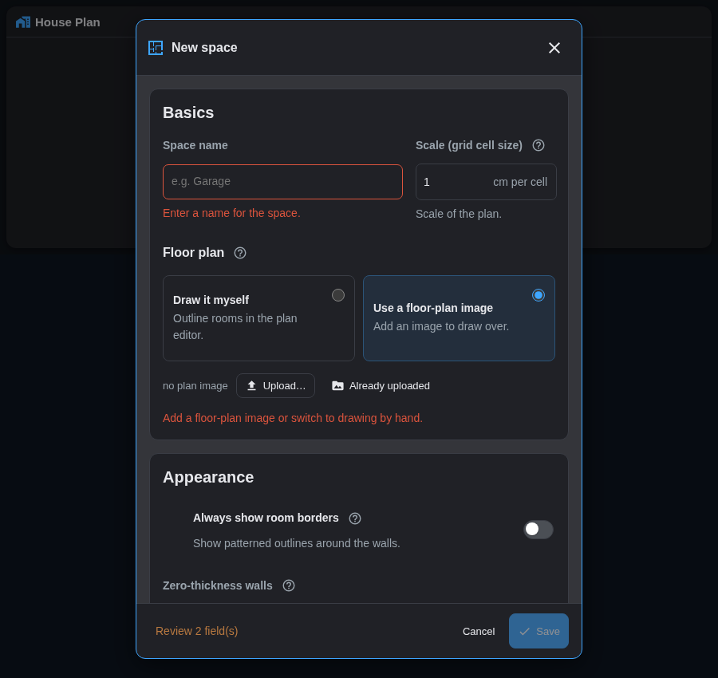
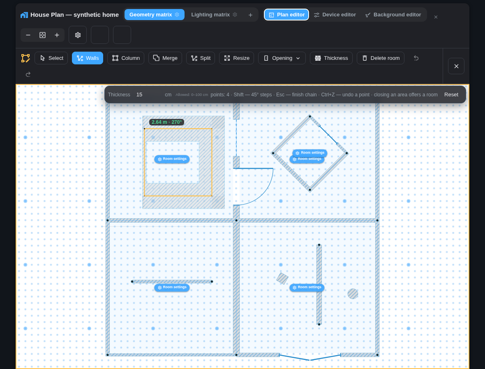
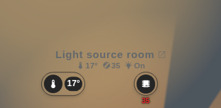
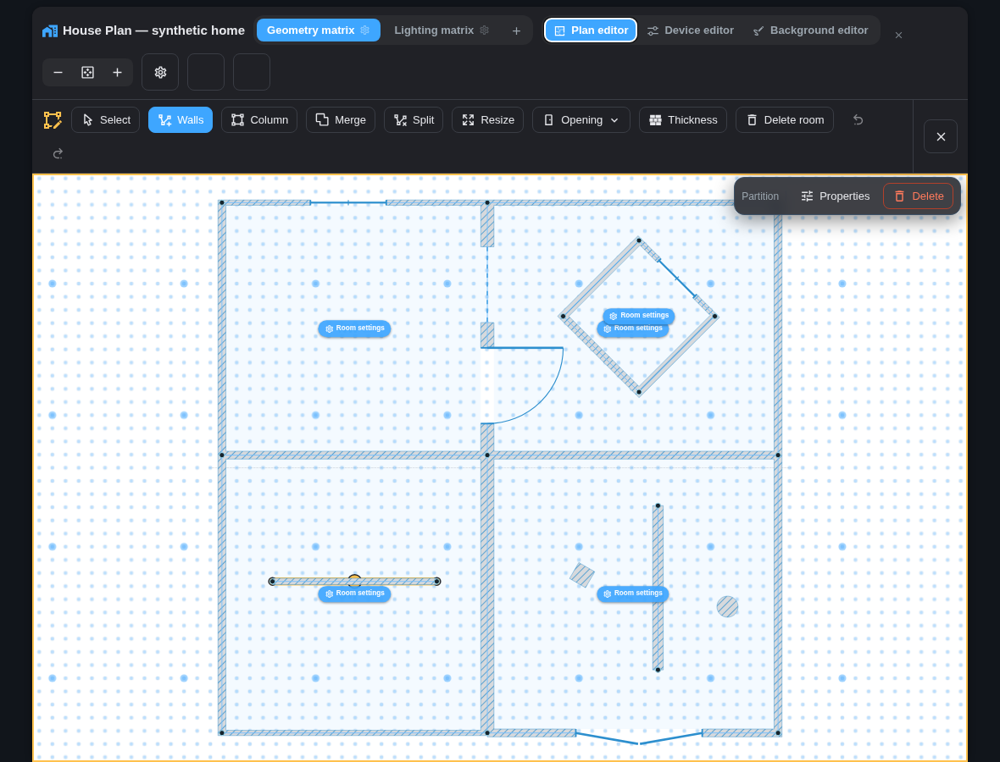
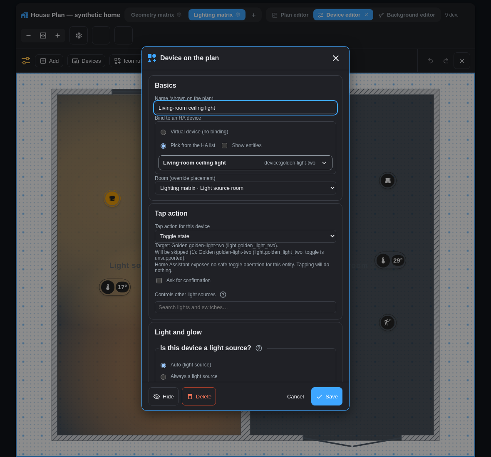
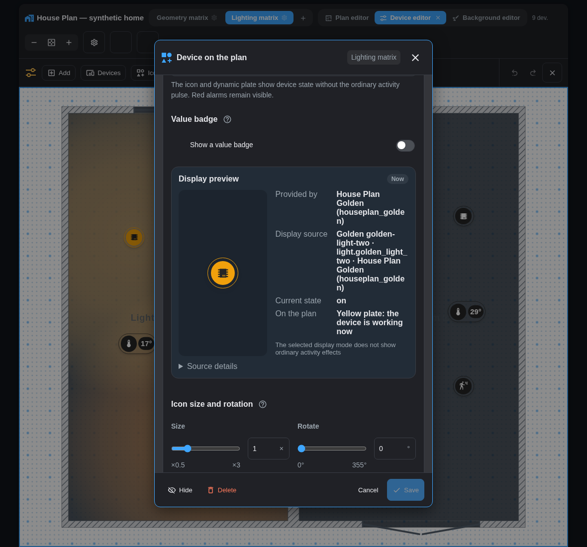
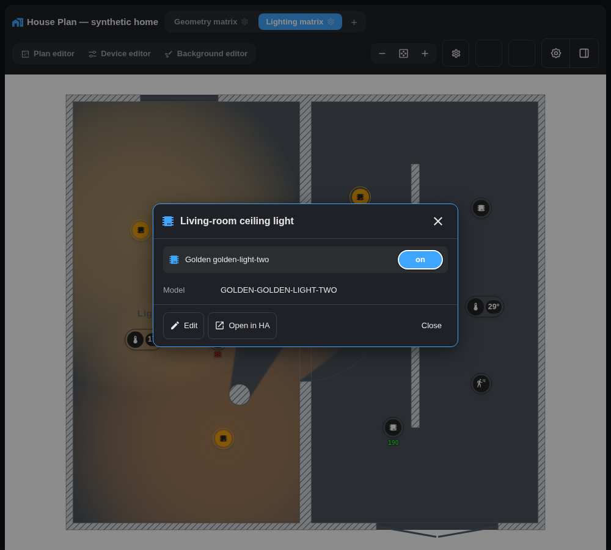
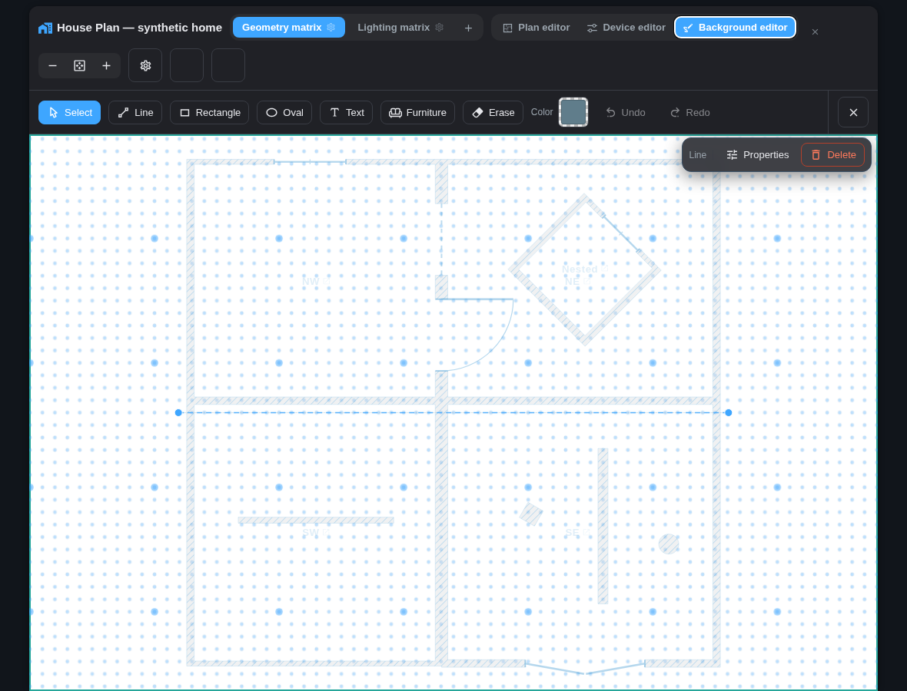

# House Plan — полное руководство пользователя

Актуально для **v1.64.0**. Руководство составлено по исходному коду и
фактическому интерфейсу этой версии. [English version](USER-GUIDE.md).

House Plan — локальная интеграция и две Lovelace-карточки для Home Assistant:

- `custom:houseplan-card` — интерактивный план с редакторами, состояниями и управлением;
- `custom:houseplan-space-card` — статическая схема одного пространства со ссылкой на полный план.

Все планы, настройки и позиции хранятся внутри Home Assistant. Облачный сервис House Plan не используется.

> **Уровень поддержки устройств ввода.** Просмотр и киоск должны полноценно и
> удобно работать на телефонах, планшетах и настенных touch-панелях. Создавать и
> редактировать планы рекомендуется на компьютере с мышью и клавиатурой.
> Редакторы на touch поддерживаются по остаточному принципу: отдельные жесты,
> точные операции или элементы интерфейса могут работать неудобно, ограниченно
> либо отсутствовать. Это не относится к безопасности данных и действий:
> touch-редактор не должен повреждать план или отправлять случайные команды.

## Содержание

1. [Модель данных и терминология](#1-модель-данных-и-терминология)
2. [Установка и доступ](#2-установка-и-доступ)
3. [Добавление карточки](#3-добавление-карточки)
4. [Быстрый старт](#4-быстрый-старт)
5. [Режимы интерфейса](#5-режимы-интерфейса)
6. [Навигация, масштаб и жесты](#6-навигация-масштаб-и-жесты)
7. [Пространства](#7-пространства)
8. [Комнаты и стены](#8-комнаты-и-стены)
9. [Двери, окна, открытые проёмы, ворота и замки](#9-двери-окна-открытые-проёмы-ворота-и-замки)
10. [Устройства](#10-устройства)
11. [Действия по нажатию](#11-действия-по-нажатию)
12. [Визуальные состояния устройств](#12-визуальные-состояния-устройств)
13. [Заливки комнат и свет](#13-заливки-комнат-и-свет)
14. [Редактор подложки](#14-редактор-подложки)
15. [Солнце: фон и оконные лучи](#15-солнце-фон-и-оконные-лучи)
16. [Роботы-пылесосы](#16-роботы-пылесосы)
17. [Киоск-режим](#17-киоск-режим)
18. [Статическая карточка пространства](#18-статическая-карточка-пространства)
19. [Обслуживание планов](#19-обслуживание-планов)
20. [Хранение, совместная работа и резервные копии](#20-хранение-совместная-работа-и-резервные-копии)
21. [Ограничения текущей версии](#21-ограничения-текущей-версии)
22. [Диагностика](#22-диагностика)

<!-- docs-section: model -->

## 1. Модель данных и терминология

Настройки образуют иерархию: общие значения задают базовый вид, пространство может их переопределить, затем отдельная комната, затем устройство.

| Уровень | Что это | Что хранит |
|---|---|---|
| Карточка | Один экземпляр `houseplan-card` на дашборде | Стартовое пространство, язык, размер иконок, показ значений/LQI, живые состояния, киоск и автолистание |
| Общие настройки | Настройки всего House Plan | Палитры заливок, фон, радиус света, север, солнце, погода, правила иконок |
| Пространство | Этаж, двор, гараж, отдельное строение | Подложку, масштаб сетки, комнаты, стены, проёмы, декор и настройки отображения |
| Комната | Только замкнутый контур | Название, необязательную HA-зону, источники температуры/влажности и локальную заливку |
| Стена | Сегмент контура комнаты или независимая стена | Стабильный ID и толщину 0–100 см; вид стен нулевой толщины задаётся для пространства |
| Проём | Дверь, окно, открытый проём или ворота на стене комнаты либо законченном независимом отрезке | Размер и, где применимо, ориентацию, контактный датчик и замок |
| Маркер | Значок устройства на плане | Привязку к HA, комнату, действие, внешний вид, свет, описание и файлы |
| Декор | Элемент подложки | Линию, фигуру, текст, мебель или положение изображения плана |

Стены комнаты выводятся из её замкнутого контура. Незамкнутые и свободно
стоящие стены хранятся отдельно как независимые перегородки; они не создают
комнату или пол сами по себе.

<!-- docs-section: installation -->

## 2. Установка и доступ

### Требования

| Компонент | Требование |
|---|---|
| Home Assistant | 2024.6.0 или новее |
| Тип установки | Любой, где доступны пользовательские интеграции |
| Браузер | Современный браузер с Web Components, SVG и Pointer Events |
| Права | По умолчанию редактировать House Plan могут только администраторы |

### Установка через HACS

1. Найдите **House Plan** в поиске HACS и установите — интеграция входит в основной каталог HACS, пользовательский репозиторий добавлять не нужно.
2. Перезапустите Home Assistant.
3. Откройте **Настройки → Устройства и службы → Добавить интеграцию** и выберите **House Plan**.
4. Оставьте включённой опцию «редактировать план только администраторам», если обычным пользователям нужен только просмотр и управление.

Интеграция сама регистрирует Lovelace-ресурс. При YAML-управлении ресурсами добавьте его вручную:

```yaml
resources:
  - url: /houseplan_files/houseplan-card.js
    type: module
```

Не используйте файловый путь `/custom_components/houseplan/frontend/houseplan-card.js`: Home Assistant не раздаёт его как модуль. Обе карточки находятся в одном файле `/houseplan_files/houseplan-card.js`.

### Ручная установка

1. Скопируйте папку `custom_components/houseplan` из релиза в `config/custom_components/houseplan`.
2. Перезапустите Home Assistant.
3. Добавьте интеграцию **House Plan**.
4. Если ресурсы Lovelace управляются YAML, добавьте ресурс из примера выше.

### Права пользователей

| Настройка интеграции | Просмотр | Управление устройствами | Редактирование планов и загрузка файлов |
|---|---:|---:|---:|
| Только администраторы — включено (по умолчанию) | Все вошедшие пользователи | По обычным правам HA | Только администраторы |
| Только администраторы — выключено | Все вошедшие пользователи | По обычным правам HA | Все вошедшие пользователи |

Оптимизация планов и отмена оптимизации всегда требуют администратора, независимо от этой опции.

## 3. Добавление карточки

Минимальная конфигурация основной карточки:

```yaml
type: custom:houseplan-card
title: План дома
```

Параметры основной карточки доступны в визуальном редакторе Lovelace.

| Поле | Значение по умолчанию | Поведение |
|---|---:|---|
| `title` | пусто | Заголовок карточки |
| `default_floor` | первое/последнее открытое | Стартовое/резервное пространство незакреплённой карточки |
| `floor` | не закреплено | Всегда показывать один stable ID пространства или числовой индекс YAML с нуля |
| `language` | язык HA | `auto`, `ru` или `en` |
| `icon_size` | `2.5` | Базовый размер маркеров, 1–6% ширины плана |
| `show_temperature` | `true` | Показывает компактные значения температуры **и влажности** у подходящих устройств |
| `live_states` | `true` | Включает рабочие/открытые/недоступные состояния, смену иконок и активность; аварии остаются видимыми всегда |
| `show_signal` | `true` | Базовый показ LQI; отдельное пространство может переопределить его |
| `kiosk` | `false` | Полноэкранный режим без шапки и редакторов |
| `cycle` | `0` | Интервал автолистания пространств в киоске, 0–3600 секунд; `0` выключает |

Карточечный `tap_action` из старых конфигураций игнорируется. Действие задаётся отдельно для каждого устройства.

<!-- docs-section: first-run -->

## 4. Быстрый старт

Рекомендуемый порядок настройки:

1. Создайте пространство кнопкой **+**. Можно импортировать этажи из реестра этажей HA.
2. Загрузите SVG/PNG/JPG/WebP или выберите вариант без изображения.
3. Укажите размер одной клетки сетки в сантиметрах. От него зависят размеры стен, проёмов, мебели и площадь.
4. В **Редакторе плана** обведите каждую комнату замкнутым контуром.
5. Свяжите комнату с одноимённой HA-зоной или оставьте без зоны.
6. Добавьте толщину стен и проёмы.
7. В **Редакторе устройств** расставьте автоматически найденные маркеры и настройте действия.
8. В **Редакторе подложки** подвиньте изображение, добавьте мебель, подписи и декоративные линии.
9. Выберите режим заливки пространства и настройте палитру в общих настройках.
10. При необходимости включите киоск, солнечные лучи и живую позицию пылесоса.

Шаги создания и редактирования плана выполняйте в desktop-браузере. Телефон,
планшет и настенная панель являются полноценными целевыми устройствами для
последующего просмотра и управления домом, но не гарантированной средой
редактирования.





<!-- docs-section: modes -->

## 5. Режимы интерфейса

Обычный просмотр — не отдельная вкладка: это состояние, в которое возвращает крестик активного редактора.
Редакторы переключаются напрямую. Новая панель инструментов коротко проявляется,
а её фактическая высота плавно подстраивается даже при переносе кнопок на несколько строк;
при системной настройке уменьшения движения переход отключается.

| Режим | Основное назначение | Устройства | Комнаты/стены | Декор и проёмы |
|---|---|---|---|---|
| Просмотр | Контроль дома | Интерактивны; видны состояния, значения и подсказки | Комната подсвечивается при наведении; подсказка показывает название, чистую площадь, температуру, влажность и LQI | Видны, если не скрыты настройками пространства; проёмы не реагируют на клик, кроме значка замка |
| Редактор плана | Геометрия комнат, стен и проёмов | Скрыты | Интерактивны; видны кнопки настроек комнат, размеры и сетка | Проёмы всегда видны и редактируются; стены нулевой толщины рисуются полностью по оси |
| Редактор устройств | Позиции и параметры маркеров | Перетаскиваются; клик открывает настройки; доступны скрытые маркеры | Не редактируются | Служат фоном |
| Редактор подложки | Изображение, линии, фигуры, текст, мебель | Не редактируются и полупрозрачны | Комнаты и все стены полупрозрачны | Декор интерактивен и непрозрачен; скрытый в просмотре декор всё равно виден здесь |
| Киоск | Настенный экран | Интерактивны как в просмотре | Только отображение | Только отображение; редакторы отсутствуют |
| Статическая карточка | Компактная схема пространства | Только рисунок | Только рисунок | Без состояний и интерактивности |

В редакторах сетка продолжается по всему рабочему холсту. В режиме просмотра сетка не показывается.

Основная панель каждого редактора содержит только постоянные инструменты, а
кнопка закрытия закреплена справа. Параметры активного инструмента, подсказки
незавершённой операции и действия выбранного объекта появляются в
полупрозрачной суб-панели поверх верхней части холста. Она не уменьшает рабочую
область и не меняет масштаб плана. На узком экране действия прокручиваются
горизонтально внутри самой суб-панели.

Если редактор показывает образец цвета, один клик открывает палитру House Plan.
Оттенок, насыщенность, яркость, точное значение HEX и прозрачность (если она
поддерживается этой настройкой) доступны вместе, без второго системного диалога
браузера. Шкала «Оттенок» сразу показывает полный цветовой спектр, а контрастный
контур сохраняет видимость ползунка. Изменения остаются черновиком до сохранения
родительского диалога свойств.

Один и тот же элемент выбора используется везде: для декора и своих заливок, общих
палитр света, температуры, LQI, Glow и стен, общего и локального фона
пространства, цвета комнат, Glow маркера и пульсации активности устройства. Если
у настройки уже есть прозрачность, она показывается внутри палитры; поля только
с цветом новую прозрачность не получают. Действия **«По умолчанию»** и
**«Наследовать»** остаются рядом с образцом фона и не сохраняют показанное
значение по умолчанию, пока пользователь не изменит цвет.

<!-- docs-section: input -->

## 6. Навигация, масштаб и жесты

Холст практически бесконечен: элементы можно рисовать и размещать за пределами исходного квадрата плана. Команда **Показать всё** подбирает вид по фактическому содержимому.

Touch-жесты просмотра и киоска из таблицы ниже входят в гарантированный
сценарий. Наличие редактора на сенсорном экране не означает полного соответствия
desktop: для точного рисования, Resize, модификаторов клавиатуры и свойств по
двойному клику используйте компьютер.

| Сценарий | Мышь | Touch в просмотре | Touch в редакторах | Клавиатура |
|---|---|---|---|---|
| Масштаб и панорама | Колесо; drag пустого места; кнопки `−`/`+` | Щипок; drag; двойной тап сбрасывает киоск | Работает, но точность не гарантируется | — |
| Переключение пространства | Клик по вкладке | Клик; в киоске свайп при масштабе 1:1 | Клик по вкладке | — |
| Устройство | Клик/двойной клик по правилам режима | Tap; безопасные действия как на desktop | Drag и свойства — best effort | `Esc` закрывает верхнюю поверхность |
| Рисование стен и точный drag | Полный контракт | Не применяется | Best effort; для Resize и точных точек используйте мышь | `Shift` меняет магнит/угол; `Esc` завершает цепочку стен или отменяет текущий точный drag |
| История редактора | Кнопки Undo/Redo | Не применяется | Кнопки могут работать, жест не гарантирован | `Ctrl/Cmd+Z`, `Ctrl/Cmd+Shift+Z`, `Ctrl+Y` |
| Киоск-размеры | — | Удерживать пустое место 3 секунды | — | — |

Особенности:

- панорамирование работает при любом масштабе;
- масштаб режима просмотра запоминается отдельно для каждого пространства на текущем клиенте;
- масштаб и панорама внутри редактора — рабочие и не заменяют сохранённый вид просмотра;
- если один или несколько объектов далеко от основного плана, появляется подсказка о дальних объектах;
- в киоске при увеличении выше 1:1 горизонтальный жест двигает план, а не листает этажи;
- любая ручная операция в киоске приостанавливает автолистание на 60 секунд;
- `Shift` не отключает позиционную сетку; при рисовании контура комнаты он фиксирует стену по ближайшему направлению с шагом 45°; в редакторе подложки делает прямоугольник квадратом/овал кругом при создании, разрешает непропорциональное масштабирование и свободный поворот; у компаса включает шаг 15°.

### Клавиши отмены

| Контекст | `Esc` | `Ctrl+Z` / `Cmd+Z` | `Ctrl+Shift+Z` / `Ctrl+Y` |
|---|---|---|---|
| Активная цепочка «Стены» | Завершает принятые отрезки как независимые стены, оставляя инструмент активным | Убирает последнюю принятую точку и отрезок | — |
| Незавершённый Split | Убирает последнюю точку или выходит из инструмента | Сначала убирает незавершённую точку | — |
| Любой другой инструмент редактора плана | Отменяет текущий жест/выбор | Отменяет последнюю именованную геометрическую операцию | Повторяет отменённую операцию |
| Подложка | Отменяет незавершённое рисование или возвращает состояние до начала активного move/resize/rotate | Отменяет последнюю именованную операцию декора или картинки | Повторяет отменённую операцию |
| Текстовое поле | Закрывает верхний диалог | Обычная отмена текста браузером | Обычный повтор текста браузером |

Общий стек геометрии хранит 50 операций и используется редакторами плана и подложки. В обе панели добавлены кнопки **Отменить** и **Повторить**; их подсказка показывает имя следующего шага. История живёт в текущей сессии карточки и безопасно сбрасывается, если с сервера приходит более новая внешняя ревизия плана.

Во всех диалогах `Tab` и `Shift+Tab` перемещают фокус только внутри открытого
окна, `Esc` закрывает верхнее окно, а после закрытия фокус возвращается на
кнопку или объект, которыми диалог был открыт. При открытии вложенного окна
возврат сначала происходит в родительский диалог.

<!-- docs-section: spaces -->

## 7. Пространства

Пространство подходит не только для этажа: это может быть двор, гараж, баня или отдельное строение.

### Источник плана

| Вариант | Когда использовать | Поведение |
|---|---|---|
| Изображение | Есть готовый чертёж или фото | SVG, PNG, JPG, WebP; пропорции изображения сохраняются, положение и масштаб можно менять позже |
| Уже загруженный файл | Один план используется повторно или файл уже лежит на сервере | Выбор из серверного списка; используемый пространством файл нельзя удалить |
| Без изображения | План рисуется непосредственно в House Plan | Бумага формируется по контурам комнат; границы и названия удобно включить сразу |
| Импорт этажей HA | В HA уже создан реестр этажей | Мастер создаёт пространства по очереди; любой этаж можно пропустить |

Новое пространство с изображением открывается с выключенными границами и
названиями. При выборе варианта **«Без изображения»** оба переключателя сразу
включаются — это видимый default ручного плана. Если изменить хотя бы один из
них, последующая смена источника больше не сбрасывает ни один выбор. В мастере
этажей каждый следующий этаж получает собственные чистые defaults.

### Порядок вкладок

Вкладки пространств стоят в том порядке, в котором пространства заведены, и
этот порядок можно изменить: в любом режиме редактора возьмите вкладку мышью и
перетащите на новое место. Порядок сохраняется сразу и действует везде —
вкладки, свайп между этажами в киоске, стрелки карусели. Во время перетаскивания
тонкий разделитель показывает точную сторону вставки; отпустите мышь вне панели
вкладок, чтобы оставить прежний порядок.

Перетаскивание работает **только мышью и только в редакторах**. В обычном
просмотре и на сенсорных экранах вкладка по-прежнему только переключает
пространство: там это основной способ навигации, и жест не должен мешать
обычному нажатию. Порядок меняется на компьютере — как и остальная работа с
планом.

Если где-то карточка закреплена за этажом **по номеру** (`floor: 0`), помните,
что номер означает позицию: после перестановки такая карточка покажет другой
этаж. Карточка предупредит об этом один раз. Чтобы этого не случалось, задавайте
этаж идентификатором пространства, а не номером.

### Настройки пространства

| Раздел | Настройка | Результат |
|---|---|---|
| Масштаб | См или дюймов на клетку | Переводит сетку в реальные размеры и площади; новое пространство начинается с 1 см или 1 дюйма по системе единиц HA |
| Отображение | Всегда показывать границы | Рисует контуры комнат в просмотре |
| Отображение | Показывать названия | Рисует карточки комнат в Просмотре, киоске и статической карточке; при выключении не оставляет упрощённых подписей |
| Отображение | Показывать LQI | Переопределяет базовую настройку карточки для этого пространства |
| Отображение | Скрыть декоративный слой | Не рисует линии, фигуры, текст и мебель в просмотре; в редакторе подложки они остаются видимыми |
| Отображение | Скрыть проёмы | Скрывает только символы дверей, окон и ворот; свет, солнечные лучи и датчики проёмов продолжают работать |
| Карточка комнаты | Температура/влажность/LQI/свет | Добавляет выбранные показатели под названием комнаты |
| Карточка комнаты | Общий размер шрифта | Масштабирует все комнатные карточки пространства, 50–300% |

Карточка комнаты остаётся частью плана: её можно перемещать и масштабировать в
редакторе, а в просмотре она собирает только включённые метрики.
Если «Показывать названия» выключено, редактор Плана временно показывает
карточку только для настройки её позиции. После возврата в Просмотр она снова
исчезает; сохранённая позиция не теряется и используется при повторном
включении названий.


| Стиль | Цвет и прозрачность | Общий цвет границ и названий |
| Фон | Наследовать/статический/день-ночь | Управляет фоном вокруг плана |
| Солнце | Север и лучи | Локально переопределяет общие настройки |
| Заливка | Свой цвет/LQI/свет/температура | Выбирает постоянный цвет либо данные для заливки комнат пространства; свой цвет является обычным режимом по умолчанию |
| Свечение источников света | Вкл/выкл | Добавляет световые пятна; базовое затемнение используется только без другой видимой заливки |

Более мелкая клетка даёт больше точек привязки на метр и повышает точность, но
не меняет внешний вид готового плана. Физически одинаковые комнаты, стены,
проёмы, подписи и маркеры выглядят одинаково при 1 и 5 см на клетку.
Существующие пространства сохраняют записанный масштаб; для старого
пространства без `cell_cm` остаётся compatibility fallback 5 см, без скрытой
миграции.

Удаление пространства блокируется, пока хотя бы одно активное устройство
ссылается на это пространство, его комнату или сохранённую на нём позицию и при
этом остаётся другое пространство. Сначала перенесите или удалите такие
устройства; затем подтверждённое удаление уберёт пространство и принадлежащую
ему раскладку. Единственное оставшееся пространство можно удалить после
подтверждения: затронутые устройства сохранят привязки к HA, иконки, действия и
настройки, но останутся без размещения. Файл подложки и вложения при этом
автоматически не удаляются.

<!-- docs-section: plan-tools -->

## 8. Комнаты и стены

### Создание комнаты

1. Откройте **Редактор плана**.
2. Выберите **Стены**.
3. При необходимости укажите толщину новых стен в появившейся над холстом
   панели параметров.
4. Рисуйте одну непрерывную цепочку. Если оставить её открытой и сменить
   инструмент, этаж либо выйти из редактора, сегменты сохранятся обычными
   независимыми стенами; отдельной кнопки завершения нет.
5. Когда новый сегмент замкнёт область собственными стенами, существующими
   стенами либо вычисляемой конечной, T- или X-точкой, откроется диалог комнаты.
   Проём не разрывает структурную ось стены и не мешает замыканию; ось стены
   нулевой толщины остаётся частью графа. Если возникло несколько областей, диалоги
    идут от меньшей площади к большей.
   Если стены были закончены раньше, обычный клик внутри наименьшей свободной
   замкнутой области открывает тот же диалог. `Shift+click` начинает новую
   цепочку и обходит это предложение; клик по оси или узлу остаётся обычным
   рисованием стены.
6. Для каждой области задайте название и свободную HA-зону и нажмите
   «Сохранить», либо выберите **Оставить стенами**. Cancel/Esc отменяет всю
   очередь без частично созданных комнат и оставляет нарисованный draft.

Во время рисования поверх толстого тела видны ось активного сегмента и его
точный конечный узел, рядом показываются длина и угол. Зелёным отмечается только
фактически кратный 45° вектор. Удерживайте `Shift`, чтобы зафиксировать текущий
отрезок по ближайшему такому направлению: House Plan примет совместимую конечную точку
или точное пересечение луча со стеной, а несовместимую привязку проигнорирует.
Новая комната не может частично перекрывать другую, но полностью вложенная
«островная» комната поддерживается.

При работе инструментом **Стены** поверх уже
нарисованных стен видны тонкие осевые линии и точки их концов. Увеличенная
точка показывает точное место следующего соединения: конец стены имеет
приоритет, а увеличенная точка посреди линии создаёт T-соединение, не разрезая
существующую стену. Осевая линия остаётся непрерывной и в месте проёма. Для точного наведения и
предпросмотра рекомендуется редактор на компьютере; tap на сенсорном экране
тоже выполняет привязку, но отдельный hover до касания не показывается.
Если несколько разных конечных точек на текущем масштабе выглядят как одна, клик не
добавляет отрезок: House Plan подсвечивает конфликт и просит увеличить масштаб.

При явном создании комнаты единственный однозначный разрыв контура до 2 см
может быть точно соединён с конечной точкой или сплошной осью стены. Красный пунктир
показывает исправление заранее; оно записывается одним Undo вместе с комнатой.
Cancel и «Оставить стенами» ничего не исправляют. Больший, неоднозначный либо
попадающий на неоднозначный участок стены разрыв нужно соединить вручную.

Толстые отрезки, соединённые в такой точке, сразу показываются как одна стена:
прямые и косые углы получают ограниченный mitre/bevel без зуба или щели, а
T-соединение входит в проходящую стену без видимого торца. Это действует уже у
активного rubber-band до клика и сохраняется после клика, в View и на статичной
карточке. Толщина каждого ранее поставленного отрезка остаётся своей; свободный
конец незамкнутой стены остаётся плоским. У сохранённого T-стыка обе половины
физической стены остаются сплошными: фаска убирает только чрезмерно выступающий
угол и не оставляет белого треугольного клина. Короткое плечо заканчивается в
своей реальной точке: исправление стыка не рисует торец, тень или световой
барьер там, где сохранённой стены нет. В стыке трёх и более стен удалённый
сектор фаски соединён с окружающей комнатой/фоном и не превращается в маленькую
замкнутую дыру. В перпендикулярном T/X-стыке полная физическая ширина каждой
участвующей стены остаётся сплошной до узла — в том числе у близко расположенных
соседних стыков. Это исправление отображения: для валидного плана команда
**Оптимизировать планы** может ничего не изменить.

Отрезок, который отклонён от горизонтали или вертикали не больше чем на
`0,25°`, инструмент «Стены» сразу показывает и сохраняет строго по оси: меняется
только свободный конец. Настоящие диагонали не выпрямляются. Старые невидимые
уступы в один шаг предлагается исправить через **Оптимизировать планы**: до
подтверждения показываются число физических стен и максимальный сдвиг, общая
стена двух комнат считается один раз, а небезопасные варианты пропускаются.
Отмена ничего не записывает, подтверждённое исправление можно отменить обычным
Undo оптимизации.

Каждый законченный отрезок цепочки сохраняется сразу. `Esc` завершает принятые
отрезки как независимые стены, оставляет инструмент **Стены** активным и
отцепляется от последней точки; следующий клик начинает новую цепочку.
`Ctrl/Cmd+Z` вместо этого удаляет последнюю точку и отрезок. Pan, pinch и
`pointercancel` ничего не завершают и не добавляют. После перезагрузки
сохранённый draft можно продолжить кликом по его концу.

### Ограничения стыков стен

Чтобы план оставался физически осмысленным, редактор отказывает в записи,
которая создала бы невозможный стык. Пороги абсолютные — они не зависят от
масштаба `cell_cm`:

| Правило | Порог |
|---|---|
| Угол между соседними стенами одного узла | не меньше 15° |
| Стен в одном узле | не больше 6 |
| Длина стены | не меньше 20 см и не меньше собственной толщины |
| Расстояние между несмежными узлами и от узла до чужой стены | не меньше 5 см |
| Внутренний просвет комнаты после вычета кладки | не меньше 25 см² |

Длина меряется по СТЕНЕ, а не по отдельному участку контура: короткий
доборный отрезок, компенсирующий перепад толщин соседних стен, законен, если
стена целиком длиннее 20 см. Т-стык (конец стены упирается в середину чужой)
правилом дистанции не запрещён.

Проверка работает только на записи. Уже сохранённый план не переоценивается:
миграция, импорт и восстановление из бэкапа не блокируются никогда, а правка,
не трогающая нарушающий элемент, проходит как обычно. Отказ виден там, где вы
работаете: рисование и «Толщина» не применяют значение и показывают тост с
названием правила, а Resize останавливает стену в последней разрешённой
позиции и один раз за жест поясняет тостом, какое правило дальше нарушится.

### Связь с HA-зоной

Одна HA-зона может быть назначена только одной комнате. Связь нужна для автоматического размещения устройств, LQI, света и средних климатических показателей. Комната без HA-зоны всё равно может иметь вручную назначенные устройства и отдельные источники температуры/влажности.

### Инструменты плана

#### Инструменты плана в короткой таблице

| Инструмент | Что создаёт | Площадь комнаты | Свет и тени | Главное ограничение |
|---|---|---|---|---|
| Стены | Непрерывную цепочку стен; при замыкании предлагает комнаты, при выходе сохраняет независимые стены | Площадь появляется только у подтверждённой комнаты | Положительная толщина блокирует свет; нулевая следует настройке пространства | Частичное перекрытие комнат запрещено; отдельных инструментов «Перегородка» и «Граница» нет |
| Колонна | Квадратную или круглую опору | Не меняет площадь комнаты | Блокирует свет внутри своей формы | Имеет одну форму/размер/поворот, но не является стеной или комнатой |
| Проём | Дверь, окно, открытый проём или ворота на стене комнаты либо законченном независимом отрезке | Не меняет площадь | Дверь/ворота пропускают свет между полами, открытый проём — всегда; только наружное окно комнаты может давать солнечный луч | Должен целиком помещаться на одном подходящем отрезке стены |

Остальные операции меняют уже созданную геометрию:

| Операция | Результат |
|---|---|
| Объединить | Склеивает соседние комнаты; в диалоге выбирается сохраняемая идентичность, имя и HA-зона |
| Split | Делит комнату путём от одной стены до другой; большая часть сохраняет исходную комнату |
| Resize | Двигает одну допустимую горизонтальную/вертикальную стену без изменения топологии комнат. Подписи показывают два меняющихся **внутренних** размера боковых стен, подсвечивают эти стены и ставят площадь каждой затронутой комнаты с её стороны перемещаемой стены |
| Толщина | Задаёт толщину 0–100 см выбранному участку или всем стенам комнаты |
| Удалить комнату | Открывает выбор: удалить комнату и оставить её физические стены либо удалить комнату вместе с ними; общие стены остаются всегда |

При варианте **«Удалить комнату, оставить стены»** эксклюзивные участки
положительной толщины становятся обычными независимыми перегородками с той же
толщиной, а их двери/окна перепривязываются к ним. Нулевые участки сохраняются
как независимые стены `0 см`, если выбран вариант оставить стены. При варианте
**«Удалить комнату и стены»** удаляются
только проёмы, принадлежавшие эксклюзивной стене этой комнаты; общая стена,
явная совпадающая перегородка и их проёмы сохраняются. Оставшиеся записи
толщины нормализуются уже по новому составу комнат: одинаковая толщина не
склеивается через переход «общая ↔ наружная» или между разными парами комнат.



### Merge

- Комнаты должны иметь общую границу.
- Пользователь выбирает, какая комната остаётся основной.
- Название, HA-зона и привязанные к ней устройства второй комнаты не переносятся автоматически. Устройства её HA-зоны исчезнут с этого плана, пока зона не будет назначена другой комнате.
- Вложенные и геометрически несовместимые варианты могут быть отклонены.

### Split

- Первая и последняя точки разреза должны лежать на границе выбранной комнаты.
- Промежуточные точки должны идти внутри комнаты и не пересекать контур или сам разрез.
- Большая по площади часть сохраняет исходную комнату и устройства.
- Для меньшей части открывается диалог новой комнаты.
- Разрез можно начать или закончить точно в существующем углу. Наружная форма
  дома при этом не меняется: общая стена двух новых комнат примыкает к фасаду
  только изнутри, даже если она толще наружной стены.

### Resize

| Сценарий | Что происходит |
|---|---|
| Движение внешней стены | Меняется только выбранная комната |
| Движение общей стены | Меняются ровно две комнаты, только если обе их стены совпадают от конца до конца |
| Комната неправильной формы | Движение разрешено, пока сохраняется точное совпадение; у первого угла стена упирается |
| На перемещаемой стене есть обычный проём | Проём один раз следует за стеной и сохраняет остальные параметры |
| На примыкающей стене есть проём | Кладка останавливается у ближнего косяка с учётом половины своей толщины |
| Боковая стена перестала бы быть общей или, наоборот, стала бы общей | Движение упирается в точную границу роли; если безопасного шага нет ни в одну сторону, ручка объясняет: «Нельзя сдвинуть только часть общей стены» |
| Общая граница частичная, диагональная, затрагивает третью комнату или перекрыта независимой стеной/черновиком/колонной | Ручка остаётся видимой, но приглушена; наведение, фокус или нажатие объясняет запрет |
| Размер стал слишком мал | Последняя допустимая позиция сохраняет минимум 30 см и не удаляет вершину |

Resize показывает живые длины и чистую площадь по внутреннему контуру толстых
стен. Он больше не имеет угловой рамки масштабирования, не двигает диагональные
стены, не вставляет вершины на частичной общей границе и не меняет больше двух
комнат. Завершённый drag становится одним именованным шагом общего
50-командного Undo/Redo; Esc, pointercancel и потеря захвата ничего не записывают.
Границы толщины соседних стен при этом остаются на своих реальных точках сетки:
Resize не пересчитывает их пропорционально новой длине. Неоднозначный результат
отклоняется целиком, а не повреждает стену в другом месте плана.

У самой перемещаемой стены больше нет дублирующей подписи длины. У внешней
стены показывается одна площадь, у общей — две на противоположных сторонах, с
короткими выносными линиями. В узкой комнате площадь остаётся видимой и может
выйти за контур, но не перекрывает вторую площадь или кнопку настроек комнаты.

Прямая стена, нарисованная в несколько кликов, сохраняется одной перегородкой:
соседние отрезки одинаковой толщины и направления срастаются сразу после
завершения цепочки. Узел остаётся там, где в него приходит третья стена, стена
комнаты, колонна или конец сохранённого черновика — то есть везде, где он
что-то значит. Планы, нарисованные раньше, приводит в порядок «Оптимизировать
планы».

Перегородки и колонны можно перетаскивать по сетке и редактировать двойным
кликом. У перегородки задаётся толщина 0–100 см. У колонны задаются квадратная
или круглая форма и внешний размер 1–150 см; у квадрата доступен поворот, у
круга размер означает диаметр. Они вычитаются из чистой площади, перекрывают
Glow и солнечные лучи, но при Resize комнаты остаются на месте. За пределами
комнат эти объекты не создают пол или фон. Проём в независимой стене движется
вместе с выбранным отрезком и остаётся в том же относительном месте.

### Толщина стены

| Параметр | Поведение |
|---|---|
| Значение | 0–100 см для стен комнаты, независимых стен и черновиков; пустое/нечисловое значение отклоняется |
| Какие стены | Любые: контуры комнат, отдельно стоящие стены и сегменты сохранённых черновиков; при точном наложении клик берёт отдельно стоящую стену — именно её тело видно |
| Геометрия | Толщина растёт на половину значения в обе стороны от оси стены |
| Общая стена | Одна физическая стена между комнатами |
| Чистая площадь | Считается по внутренней грани стен |
| Углы | Соседние тела стен соединяются; на малом масштабе штриховка скрывается, тело остаётся |
| Штриховка | Шаг полос — расстояние на плане (9.6 см), одинаковое при любом масштабе сетки и при любом зуме; стена вдвое толще получает вдвое больше полос |
| Независимые стыки | Контуры и перегородки с точным общим узлом образуют один ограниченный mitre/bevel; T-стык не дробит исходную стену |
| Соседние одинаковые участки | Нормализуются в один участок при редактировании/оптимизации |
| Нулевая толщина | Не имеет тела, штриховки и откосов; реальные соседние остатки сохраняют свою толщину |

### Стены нулевой толщины

`0 см` — обычное значение толщины стены, а не отдельный тип объекта. Такую
стену можно рисовать инструментом **Стены**, получить при замыкании комнаты
или назначить инструментом **Толщина** любому участку контура, независимой
стене либо сохранённому черновику. Она сохраняет ось и узлы, но не создаёт
кладку, штриховку, площадь тела, откосы или тоннель проёма. Дверь, окно,
открытый проём и ворота нельзя разместить на нулевой стене; перевод занятого
проёмом участка в `0 см` отклоняется целиком.

В настройках пространства поле **«Стены нулевой толщины»** применяется сразу
ко всем таким стенам:

| Вариант | Вид | Glow и солнечные лучи |
|---|---|---|
| Пунктирные | Осевая пунктирная линия | Пропускают свет |
| Сплошные | Осевая сплошная линия | Блокируют свет как барьер нулевой площади |

Если настройка отсутствует, используется пунктир. При отключённых границах
линия скрыта в просмотре/киоске, но её световая семантика сохраняется; во всех
редакторах ось остаётся видимой. Отдельного инструмента «Граница» и отдельной
сущности виртуальной стены больше нет.

## 9. Двери, окна, открытые проёмы, ворота и замки

Проём всегда привязан к одному отрезку стены комнаты или к одному законченному
независимому отрезку «Стен». Дверь и открытый проём по умолчанию создаются
шириной 90 см, окно — 120 см, ворота — 300 см. Допустимый размер в интерфейсе:
20–600 см с шагом 5 см.

В **Редакторе плана** кнопка **Проём** сама по себе ничего не размещает: она
открывает компактное подменю **Окно / Дверь / Открытый проём / Ворота**. После выбора типа
наведите указатель на физическую стену. Для окна, двери и ворот полупрозрачный
символ показывает точный будущий вид, положение и сторону открывания. Для
открытого проёма полупрозрачный сегмент цвета стены показывает точную длину и
глубину будущего разрыва, а две оранжевые засечки отмечают его границы. Клик
открывает свойства, а **Сохранить** создаёт объект. После сохранения или
отмены выбранный тип остаётся активным для серии одинаковых проёмов. `Esc`,
выбор другого инструмента, редактора или пространства завершает эту серию.

Возле превью также рисуются тонкие размерные линии от обоих косяков до
физических внутренних концов стены. На общей стене двух комнат одновременно
видны четыре размера — по два вдоль внутренней грани каждой комнаты, поскольку
их полезные границы могут различаться. На законченном независимом отрезке
каждая линия заканчивается на ближайшей физической грани примыкающей стены или
перегородки; если такой грани с этой стороны нет, остаётся расстояние до
собственного торца отрезка. Эти расширенные размеры относятся только к
размещению нового проёма: при переносе уже сохранённого проёма остаются две
прежние подписи расстояний до концов стены.

Наводить указатель перед кликом необязательно: клик по телу толстой стены сам
находит её ось и открывает тот же диалог. Виртуальная стена не принимает проёмы.
Если независимая стена точно совпадает со стеной комнаты, House Plan использует
её как явную привязку и прорезает единое составное тело. Не совпадающая
геометрически неоднозначность у стыка не угадывается: поставьте проём чуть
дальше от узла.

Проём можно перетаскивать только вдоль того же независимого отрезка. При его
размещении, перепривязке, переносе или изменении длины у каждого торца такой
стены должен остаться участок не меньше половины её фактической толщины. На
точной границе проём допустим; если места недостаточно, редактор показывает
требуемое расстояние. Уже сохранённый проём у торца остаётся видимым и может
быть сохранён без изменения геометрии — House Plan не сдвигает его сам.

При удалении стены House Plan показывает отдельное подтверждение со всеми привязанными
проёмами; отмена ничего не меняет, подтверждение удаляет стену и перечисленные
проёмы одним шагом Undo. Если привязанный отрезок пропал из старого или
повреждённого конфига, в Редакторе плана проём помечается как потерявший стену
и предлагает перепривязку; в Просмотре он не рисуется и не создаёт ложный
проход для света.

Ворота по данным и поведению равны двери: могут иметь датчик открытия и замок, вырезают стену и пропускают Glow. Отличается только символ: две половинные створки без большой дуги, приоткрытые наружу на 10°. С датчиком угол меняется от 0° до 10°; без датчика показаны статически открытыми на 10°. Выбор распашных/откатных и других типов пока не предусмотрен.

**Открытый проём** обозначает арку или проход без полотна. В обычном виде у
него нет самостоятельного символа: видны только разрыв кладки и пол в тоннеле.
Он всегда пропускает внутренний свет, не имеет датчика, замка, инверсии и
настроек створки. При смене существующей двери или ворот на открытый проём
диалог предупреждает, что сохранение удалит их датчик и замок; отмена оставляет
исходный объект без изменений.

### Настройки проёма

| Поле | Дверь | Окно | Открытый проём | Ворота |
|---|---:|---:|---:|---:|
| Размер | Да | Да | Да | Да |
| Контактный датчик | Да | Да | Нет | Да |
| Инверсия датчика | Да | Да | Нет | Да |
| Петли с другой стороны | Да | Да | Нет | Нет: створки симметричны |
| Открывается в другую сторону | Да | Да | Нет | Да; по умолчанию — наружу |
| Замок `lock.*` | Да | Нет | Нет | Да |

Контакт выбирается из подходящих `binary_sensor` и дверных `cover`. Состояние
датчика анимирует створку/полотно. Инверсия нужна, если интеграция отдаёт
противоположную логику. Контактный датчик и замок — самостоятельные точные
привязки проёма: удаление отдельного маркера той же сущности с плана не убирает
её из этих списков и не выключает уже сохранённую связь. Можно выбрать живую
YAML-сущность без `unique_id` и строки в Entity Registry: пока Home Assistant
передаёт её точное состояние, она так же управляет проёмом и значком замка в
Просмотре. Явно отключённая, потерянная или отсутствующая сущность не работает.

В списках контактных датчиков и замков нажмите поле выбора и введите часть
отображаемого имени либо `entity_id`. Под каждым результатом показан полный
идентификатор. Пункт **«— нет —»** всегда остаётся первым и очищает привязку;
поиск не меняет исходный приоритет дверных и оконных датчиков.

### Поведение в разных режимах

| Режим | Клик по проёму | Перетаскивание |
|---|---|---|
| Просмотр | Сам проём инертен; значок замка открывает карточку проёма | Нет |
| Редактор плана | Открывает настройки | Да, вдоль стены |
| Остальные редакторы | Инертен | Нет |

При перетаскивании проём всегда магнитится к центру стены либо к шагу сетки вдоль стены. Обхода этой привязки нет.

### Замок

- `locked` показывается как закрытый замок на зелёной подложке;
- `unlocked`/`open` — как открытый замок на красной подложке;
- неизвестное состояние получает нейтральное/неизвестное оформление;
- клик по значку открывает карточку проёма;
- закрытие выполняется без дополнительного подтверждения;
- открытие замка требует подтверждения;
- обычное действие маркера устройства никогда не переключает `lock.*` и не снимает охрану `alarm_control_panel.*`.

### Толстые стены

Тело стены вырезается по ширине проёма, откосы идут через всю глубину стены.
Видимая группа двери, окна или ворот всегда расположена точно по центру
толщины стены; у окна это относится одновременно к стеклу, створкам и дугам.
Флаг «Открывается в другую сторону» меняет только направление створок: у двери
и окна зеркалит их относительно оси, а у ворот меняет направление 10° поворота.
Положение символа не сдвигается к грани стены. Свет проходит через дверь,
ворота или открытый проём по ширине
внутреннего тоннеля и отсекается откосами. Солнечный луч начинается из
внутренних углов оконного тоннеля.

В компактной Static-карточке открытый проём также разрывает тело стены и
продолжает текущую заливку/Glow-base через тоннель. Отображение уже существующих
дверей, окон и ворот в Static в рамках этой функции намеренно не менялось.

Солнце проходит только через наружные окна комнаты. Внутренние окна и окна в
независимых стенах солнечных лучей не создают.

<!-- docs-section: devices -->

## 10. Устройства

### Как маркеры появляются автоматически

House Plan читает реестры устройств, сущностей и зон Home Assistant. Устройства HA-зоны появляются в комнате, связанной с этой зоной. Позиция назначается автоматически, затем её можно изменить.

Некоторые служебные и нефизические интеграции скрываются при первой материализации списка: например HACS, системные сущности, мосты, сцены и часть агрегатов. Лампочки, входящие в группу света, могут быть заменены одним групповым маркером.

После первичного заполнения новые устройства отмечаются красной точкой. Точка исчезает после первого открытия маркера в редакторе устройств.

Текущий компактный размер маркера сохраняется напрямую в его базовой геометрии,
без дополнительного уменьшения уже рассчитанного результата; сохранённая точка
остаётся центром, а область нажатия не уменьшается. У режима **Значение** внутренняя подложка числа имеет
ровные полукруглые торцы и одинаковый отступ внутри внешнего shell.

### Виды привязки

| Вид | Что выбирается | Особенности |
|---|---|---|
| Устройство HA | Запись из реестра устройств | Использует все связанные сущности; основной домен выбирается автоматически |
| Сущность HA | Одна сущность | Доступно после включения «Показывать сущности»; удобно для helper/group/template |
| Виртуальное устройство | Ничего | Только подпись/иконка/описание; живого состояния HA нет |

Одну и ту же привязку нельзя одновременно использовать в двух маркерах.

Если отдельная HA-сущность принадлежит устройству, после её размещения этот
канал принадлежит точному entity-marker. Автоматический родительский маркер,
если он ещё нужен, строится только из оставшихся активных, видимых в HA и не
размещённых отдельно сущностей; при пустом остатке он исчезает. Одни только
скрытые в HA siblings не удерживают auto-marker на плане. Чтобы одновременно
показать точную сущность и полное устройство, явно разместите и `entity:X`, и
`device:D` — два явных маркера считаются осознанной конфигурацией. После
удаления entity-marker сущность снова доступна автоматическому родителю:
binding tombstone не вырезает её из живого устройства HA.

После удаления целого HA-устройства можно вернуть только одну его сущность:
откройте **Добавить**, включите **Показывать сущности** и выберите нужную
сущность. House Plan вернёт выбранный маркер на свежую позицию, а всё устройство
и остальные его сущности останутся удалёнными. Само устройство продолжит
предлагаться в **Добавить**, если позднее вы решите явно вернуть и его.

### Редактор устройств

| Действие | Результат |
|---|---|
| Перетащить маркер | Меняет его общую серверную позицию; центр всегда оказывается на узле сетки |
| Клик по маркеру | Открывает диалог настройки |
| **Добавить** | Создаёт виртуальный маркер или вручную выбирает HA-привязку |
| **Скрытые и деактивированные** | Показывает пользовательски скрытые и отключённые в HA устройства служебными маркерами только в этой вкладке |
| **Правила иконок** | Открывает приоритетный список регулярных выражений для «имя + модель» |





### Основные настройки маркера

| Поле | Назначение |
|---|---|
| Имя | Подпись и заголовок карточки устройства |
| Привязка | Устройство, сущность или виртуальный маркер |
| Комната | Автоматическая HA-зона либо ручное назначение, включая комнату без зоны |
| Действие по нажатию | Карточка House Plan, HA more-info, универсальное **Переключить состояние** или запуск сценария. Под селектором сразу показаны точная цель, текущее состояние и результат следующего нажатия либо причина, почему нажатие ничего не сделает |
| Управляет другими источниками света | Группа других `light.*`/`switch.*` и принудительных источников, уже размещённых на плане. Собственная entity и сущности привязанного устройства сюда не входят |
| Является источником света | **Авто** использует роль устройства, **Всегда** создаёт собственный источник даже без entity HA, **Никогда** исключает только собственный источник. Внешние `controls` продолжают учитываться в свете комнаты |
| Ведущая сущность | Появляется для роли **Всегда**, если у устройства несколько `light.*`/`switch.*`. Выбранная сущность определяет состояние и service call; исчезнувший выбор не стирается и временно заменяется безопасным fallback |
| Цвет и яркость свечения | **Из источника** использует живые данные HA; **Задать цвет** сохраняет живую яркость; **Задать цвет и яркость** фиксирует оба параметра (1–100%) |
| Использовать температуру climate | Добавляет `current_temperature` термостата/кондиционера в маркер и среднее комнаты |
| Скрыть / Показать | Кнопка в левом нижнем углу диалога. После сохранения убирает или возвращает значок; LQI скрытого устройства всё ещё может участвовать в среднем комнаты |
| Удалить | Кнопка рядом со «Скрыть». После подтверждения сразу полностью убирает устройство с плана и позволяет позднее добавить его заново |
| Радиус свечения | Локально переопределяет общий радиус, 0.1–100 м в хранилище |
| Иконка | Ручная `mdi:*`; пусто — автоматический подбор. Автовариант показывается в поле как значок с именем `mdi:*`, но не сохраняется как ручная замена |
| Отображение | Иконка, иконка + активность или значение вместо иконки. Ниже сразу видны фактический результат, источник и интеграция |
| Размер/поворот | Масштаб маркера и угол |
| Модель, ссылка, описание | Информация во внутренней карточке |
| Файлы | PDF, PNG, JPG/JPEG, WebP, TXT; несколько вложений |

### «Тупая» лампа с умным выключателем

1. Добавьте виртуальный маркер в реальной позиции лампы.
2. Выберите для него роль **Всегда**. Даже без сущности HA он станет пассивным
   источником; задайте цвет, яркость и радиус вручную. «Из источника» недоступно,
   потому что live-данных у такой лампы нет.
3. Откройте маркер умного выключателя. В **Управляет другими источниками света**
   найдите лампу в группе источников на плане и добавьте её.

После этого выключатель отображает агрегированное рабочее состояние, но пятно,
заливка и статистика принадлежат лампе и её комнате. Несколько выключателей
управляют одной лампой по OR. `marker:*` является только внутренней ссылкой
плана и никогда не отправляется в Home Assistant как entity ID.

Если у самой виртуальной лампы одновременно выбраны **Является источником
света → Всегда** и **Действие по нажатию → Переключить состояние**, нажатие
по связанной лампе переключает реальные реле её входящих контроллеров. Нажатие
по каждому выключателю управляет только его собственной группой, а нажатие по
лампе — объединением всех её реальных реле. Текущее состояние берётся только
из Home Assistant: физическая клавиша, автоматизация и другой дашборд одинаково
обновляют Glow, заливку «Свет», статистику комнаты и оба маркера.

Без входящих связей та же точная тройка включает ручной режим #107. Новая лампа
начинается включённой; состояние общее для всех полных и статических карточек и
сохраняется после перезагрузки страницы и Home Assistant. В этом несвязанном
режиме сохранённые исходящие `controls` не вызывают сервисы HA, но остаются в
настройках без потерь. Добавление связи не стирает ручное состояние, а снятие
последней связи возвращает его прежнее значение. Если действие лампы не равно
**Переключить состояние**, пассивный источник **Всегда** без связей остаётся
постоянно включённым по обычному правилу #84. Смена роли, привязки или действия
сохраняет прежний lifecycle #107; скрытие сохраняет состояние, удаление маркера
очищает его. Ручное состояние не является entity/helper HA и не входит в
экспорт или импорт плана.

Удаление и скрытие — разные операции. Скрытый маркер можно показать через
**Скрытые и деактивированные**, и он продолжает участвовать в предусмотренных для скрытых
устройств данных. Удалённый маркер там не показывается, не участвует в LQI,
температуре, влажности, свете, Glow, карточке комнаты, управлении, текстовых
переменных и внешних controls других маркеров. Его привязка снова появляется в
списке **Добавить**. Контактный датчик или замок, явно выбранный в свойствах
проёма, остаётся отдельной рабочей связью и не восстанавливает удалённый маркер.
Повторное добавление создаёт маркеру новую позицию и снова оживляет сохранённые
текстовые переменные и controls, но не дублирует и не переписывает связь проёма.
Позиция, вложения и след пылесоса при удалении маркера удаляются.

### Скрытые устройства

Скрытый маркер:

- не рисуется в просмотре;
- в редакторе виден только при включённом **Скрытые и деактивированные**;
- не показывает цвет состояния, число, температуру, влажность и LQI;
- не создаёт световое пятно и не считается источником для заливки «Свет»;
- может продолжать участвовать в среднем LQI комнаты, потому что оно считается по реестру устройств зоны.

### Деактивированные в Home Assistant

Если устройство, привязанная сущность или все сущности устройства имеют
`disabled_by` в HA, House Plan временно исключает привязку полностью: маркер не
рисуется, не входит в LQI/температуру/влажность/свет/Glow, не питает текстовые
переменные и проёмы, не выполняет действия; у пылесоса также нет puck и следа.
Конфигурация, позиция, вложения и серверная история при этом не удаляются.

В редакторе **Скрытые и деактивированные** показывает серый marker с причиной.
Его можно открыть, изменить описание, удалить с плана или перейти в настройки
HA. «Показать» заблокировано до активации. После активации того же ID устройство
возвращается со старыми настройками и позицией; ранее установленное пользователем
«Скрыть» сохраняется.

Если аккаунту не разрешено читать полный реестр HA, House Plan не угадывает
деактивацию по отсутствию записи. Подтверждённые живые привязки работают, а
неподтверждённые безопасно не влияют на план до восстановления доступа.

## 11. Действия по нажатию

### Жесты маркера

| Жест | Режим просмотра | Редактор устройств |
|---|---|---|
| Короткий клик/тап | Выполняет выбранное действие | Открывает настройки маркера |
| Долгое нажатие, 600 мс | Открывает внутреннюю карточку House Plan | Не используется для управления |
| Правый клик | Открывает стандартный HA more-info основной сущности | Открывает контекст редактора/браузера по текущему поведению |

Когда короткое нажатие действительно отправляет команду устройству, маркер
мягко уменьшается на 5% и возвращается за 0,2 секунды. Открытие информации,
редактора или подтверждения само по себе такого отклика не даёт; при включённом
подтверждении он появляется только после согласия и фактической отправки
команды. При системной настройке уменьшения движения масштабирование заменено
коротким немигающим акцентом.

### Действия

| Действие | Что происходит | Защита |
|---|---|---|
| Карточка устройства | Открывается House Plan-карточка с сущностями, моделью, описанием, ссылками и файлами | Состояние не меняется |
| HA more-info | Открывается штатный диалог основной сущности | Состояние не меняется |
| Переключить состояние | Переключает точную привязанную сущность, функциональную сущность устройства либо явно настроенную группу `controls`. Для штор/жалюзи и клапанов автоматически выбирает open/close/stop | Замки, охранные панели и защитные `garage`/`door`/`gate` остаются безопасным no-op; можно включить подтверждение |
| Run | `automation.trigger`, `script.turn_on` или `scene.turn_on` | Цель выбирается явно; можно включить подтверждение |

Если для **«Переключить состояние»** включено подтверждение, диалог показывает
текущее состояние и точный ожидаемый результат: «Включено», «Выключено»,
«Открыто», «Закрыто» или «Остановлено». У группы отдельно показаны число
включённых целей и недоступные цели; результат относится только к получателям
будущей команды. Текст является снимком на момент открытия, но при подтверждении
House Plan заново определяет состояние и направление. Если набор целей успел
измениться, действие отменяется с предложением повторить попытку.

У устройства, чья основная функция — `light.*`, действием по умолчанию уже является **Переключить состояние**. У остальных устройств по умолчанию открывается внутренняя карточка.

Если у маркера с привязкой к устройству есть две или больше собственных
сущностей `light.*`/`switch.*`, под действием появляется **«Переключаемая
сущность»**. Она выбирает точный канал и меняет подсказку цели ещё до
сохранения. **«Автоматически»** сохраняет прежние правила binding /
функциональной роли. Исчезнувший сохранённый ID не стирается: диалог показывает
предупреждение и временный fallback, а возврат того же ID восстанавливает выбор.
Эта настройка не зависит от **«Ведущей сущности света»**. При явно настроенной
внешней группе выбранная собственная сущность входит в группу; без явного
выбора старые группы остаются только внешними.

Вариант **Переключить состояние** доступен для любого маркера, в том числе
виртуального. Выбор всегда сохраняется. Если у маркера нет переключаемой цели,
под настройкой прямо написано, что по нажатию ничего не произойдёт; House Plan
не подменяет такое действие открытием карточки. Привязка к одной HA-сущности
всегда точная: неподдерживаемый датчик не будет незаметно заменён соседним реле
того же устройства. Временно отсутствующие или деактивированные цели остаются
в конфигурации, но не получают service call. Если недоступна вся явно
настроенная группа `controls`, короткое нажатие называет недоступную цель в
системном сообщении House Plan и поясняет, что действие не выполнено. При
частично доступной группе команда по-прежнему отправляется только доступным
целям, поэтому сообщение «действие не выполнено» не показывается.

Если указаны несколько управляемых источников света:

- когда включён хотя бы один, нажатие выключает все;
- когда выключены все, нажатие включает все;
- жёлтое рабочее состояние маркера объединяет эти источники, но
  полупрозрачность зависит только от собственных сущностей контроллера;
- если доступна только часть группы, подсказка перечисляет пропуски, а вызов
  получает ровно показанное доступное подмножество; собственная сущность
  контроллера не подставляется вместо исчезнувших настроенных целей.



<!-- docs-section: visual-states -->

## 12. Визуальные состояния устройств

В динамических режимах система состоит из общего внешнего shell и трёх
независимых слоёв:

1. **подложка маркера** сообщает устойчивый статус;
2. **иконка/число** сообщает тип или значение;
3. **пульсация активности** в режиме «Значок + состояние и активность» сообщает событие, присутствие, движение или работу.

Приоритет оформления: **авария → клавиатурный фокус → выбранный маркер →
hover → состояние → нейтрально**. Если все сущности, реально описывающие
маркер, недоступны, маркер бледнеет и не получает визуальный hover или
пульсацию, но его обычный клик/тап по-прежнему открывает информацию либо
настройки. У медиаплеера `off` используется то же приглушённое отображение, что
`unknown` и `unavailable`, без отдельного визуального состояния.

У маркера-контроллера с `controls` это два независимых факта: лампы определяют
жёлтое состояние «работает», а доступность определяют только собственные
активные сущности контроллера. Живой `battery`, `linkquality` или `update`
удерживает беспроводной выключатель непрозрачным, даже если все лампы
недоступны; в таком случае выключатель нейтрален, а не жёлтый. Если ни одна
собственная сущность не имеет живого состояния, контроллер бледнеет даже при
включённой цели. Виртуальный контроллер не имеет физического HA-устройства и
считается доступным.
То же правило действует, если маркер этой цели отдельно удалён с плана:
удалённый маркер не возвращается, но он не может сделать контроллер визуально
недоступным или вызвать расхождение плана и preview в редакторе устройства.

Hover включается только после события от настоящей мыши на устройстве, которое
поддерживает точный hover. Касание пальцем или пером сразу снимает подсказку и
подсветку и не оставляет их «прилипшими»; последующее движение реальной мыши
возвращает desktop-hover без перезагрузки страницы.

### Подложка и постоянный статус

| Вид | Что означает | Примеры |
|---|---|---|
| Красная авария | Критическое событие; показывается даже при выключенных живых состояниях | Дым, газ, CO, протечка, tamper/problem/safety, сирена `on`, охранная панель `triggered` |
| Жёлтая подложка | Устройство сейчас выполняет работу | Свет/реле/вентилятор/увлажнитель `on`; climate с распознанным action `heating`, `cooling`, `preheating` или `defrosting`; при отсутствии распознанного action — включённый HVAC-режим как лучшее доступное приближение; vacuum cleaning/returning; script on; техника washing/drying/etc. |
| Красная подложка замка | Замок разблокирован | lock unlocked/open |
| Зелёная подложка замка | Замок заблокирован | lock locked |
| Оранжевая подложка | Физически открыто | Датчик двери/окна/гаража `on`, клапан open/opening/closing |
| Бледный маркер | Данные самого устройства недоступны либо медиаплеер выключен | Все собственные рабочие сущности маркера `unknown`, `unavailable` или отсутствуют; `media_player.* = off`. Недоступная цель `controls` сама по себе маркер не бледнит |
| Нейтральный | Нет аварии, работы и открытого состояния | Выключено, закрыто, idle/standby/docked и т. п. |

`automation.* = on` означает «автоматизация включена», а не «исполняется», поэтому жёлтая подложка не появляется. Для climate распознанный `idle` всегда нейтрален; неизвестные служебные значения action от сторонних интеграций игнорируются и не блокируют проверку HVAC-режима. `cover.*` специально не получает оранжевую подложку за открытое состояние: открытие показывается формой иконки.

### Активность

Обычная пульсация рисуется только при выбранном отображении **Значок + состояние и активность** и включённых живых состояниях. Тревога остаётся отдельным критическим сигналом во всех динамических режимах.

| Тип активности | Длительность | Источники |
|---|---|---|
| Короткое событие: три конечные волны | Около 3.3 секунды | Motion/vibration/sound при срабатывании; открытие контакта; button/event при изменении; ручной запуск сценария из карточки; мгновенный terminal-переход без travelling state |
| Постоянная: присутствие | Пока состояние активно | Binary sensor с классом occupancy/presence |
| Постоянная: переход | Пока идёт движение | Cover opening/closing, lock locking/unlocking, valve opening/closing, moving sensor, vacuum returning |
| Постоянная: работа | Пока устройство работает | Свет, switch, fan, humidifier, climate action (либо включённый HVAC-режим при отсутствии action), vacuum cleaning, script и известные рабочие состояния техники |

Постоянная пульсация длится 3,6 секунды на цикл: присутствие зелёное, работа
жёлтая, нейтральный переход синий. Короткое событие — три волны за 3,3 секунды;
красная тревога использует две волны с циклом 2,4 секунды. Цвет и максимальный
размер пульсации можно изменить для конкретного маркера; явно сохранённые
значения имеют приоритет, а новый размер по умолчанию равен 1,5 диаметра. Если
цвет не задан, RGB-свет может передать ей свой текущий цвет. Статичных колец
нет; при системном уменьшении движения обычная активность обозначается
компактной цветной точкой, а тревога остаётся понятной по красной подложке.

### Четыре варианта «Отображение»

| Опция | Иконка | Подложка статуса | Активность | Значение |
|---|---:|---:|---:|---:|
| Значок + состояние | Да | Да | Только тревога | Отдельные компактные °/% и LQI возможны |
| Значок + состояние и активность | Да | Да | Да | Отдельные компактные °/% и LQI возможны |
| Значение + состояние | Если значение получить нельзя или источник неоднозначен | Да | Только тревога | Температура/влажность либо числовое или текстовое состояние, отформатированное HA |
| Всегда статичный значок | Да | Нейтральная в цветах текущей темы | Нет | Нет |

В режиме «Значение вместо иконки» поддерживаются и числа, и локализованные HA
текстовые состояния. Если источник отсутствует, недоступен или неоднозначен,
карточка возвращается к иконке; предпросмотр объясняет причину. Длинный текст
уменьшается до читаемого минимума, затем общий shell расширяется: многоточие и
скрытие хвоста не используются. LQI остаётся отдельной строкой под shell.

### Бейдж со значением рядом с устройством

В настройках устройства над предпросмотром можно включить отдельный бейдж,
выбрать его значение и положение: справа, снизу, слева или сверху. В список
попадают состояния сущностей этого устройства, полезные атрибуты (например,
текущая температура, яркость, заряд, положение или громкость), средний LQI и
состояния связанных источников света. Изменения сразу видны в предпросмотре.

Это независимая секция общего shell: она может показываться и рядом с обычной
иконкой, и рядом с режимом «Значение вместо иконки». Если секция расположена
снизу, системный LQI автоматически становится второй строкой; если сама секция показывает LQI,
дублирующая строка скрывается. Недоступный сохранённый источник не заменяется
другим молча — отображается `—`, а редактор позволяет сохранить связь или
выбрать новую.

Вся видимая внешняя капсула является одной областью наведения и действия:
клик или тап по секции значения выполняет то же выбранное действие с теми же
подтверждениями и ограничениями безопасности, что и нажатие по core иконки.

Для старых маркеров без этой настройки прежние автоматические °/% сохраняются
как дополнительная секция того же shell.
Явно выключенный бейдж подавляет эту legacy-эвристику. Явный бейдж не зависит
от общей настройки показа температуры; «Всегда статичный значок» временно
скрывает его, не удаляя выбор. Настройка «Учитывать температуру устройства в
комнате» теперь отвечает только за среднее значение комнаты и не управляет
внешним бейджем.

«Всегда статичный значок» — осознанное исключение из общей матрицы состояний.
Маркер не меняет подложку или иконку, не показывает тревогу, недоступность,
RGB-цвет, значение, температуру, влажность и LQI. Для пылесоса также скрываются
живой puck, след и подсветка убираемой комнаты, но сохранённая история не
удаляется. Hover/focus остаются такими же, как у других маркеров; клик, controls,
Glow и заливка «Свет» продолжают работать по фактическому состоянию и отдельным
настройкам устройства. Для привязок, способных сообщать о тревоге, редактор
показывает неблокирующее предупреждение перед сохранением этого режима.

Цвет числа Zigbee LQI под маркером плавно меняется от красного при слабом
сигнале к зелёному при сильном. Числовое значение и градиент LQI-заливки
комнаты не меняются.

В Просмотре/киоске и редакторе устройств интерактивный маркер получает
клавиатурный фокус и область действия не меньше 44×44 CSS px. Enter и Space
выполняют ровно тот же путь, что клик: в Просмотре сохраняются выбранное
действие и все подтверждения, в редакторе открываются настройки. План,
Background, read-only static card и предпросмотр не добавляют ложных tab-stop.

Живой блок предпросмотра в настройках marker использует несохранённые поля
формы и текущее состояние HA. Он отдельно показывает интеграцию привязки и
фактическую сущность отображения. Для «Значок + состояние и активность» можно
безопасно запустить отдельный локальный пример короткой пульсации на 3,3 секунды
либо постоянной пульсации до её остановки: состояние HA, конфигурация и эффект
marker на плане при этом не меняются.

### Смена иконки по состоянию

При включённых живых состояниях автоматически меняются известные пары:

- дверь/окно/гараж — закрыто/открыто;
- шторы, жалюзи, ставни, ворота и другие cover — закрыто/открыто;
- замок — locked/unlocked;
- стандартная лампочка — off/on.

Ручная иконка обычно не меняется. Для `cover.*` известная пара может меняться даже при ручном выборе, чтобы открытое состояние не потерялось.

### Матрица по типам устройств

| Тип сущности/устройства | Устойчивый статус | Активность «Иконка + активность» | Смена иконки | Короткий клик по умолчанию |
|---|---|---|---|---|
| `light.*` | Жёлтый, пока `on` | Работа, пока `on` | Стандартная лампочка off/on | Toggle |
| `switch.*`, `fan.*`, `humidifier.*` | Жёлтый, пока `on` | Работа, пока `on` | Обычно нет | Внутренняя карточка, если Toggle не выбран явно |
| Составное switch-only устройство с отдельной сущностью Power | При одном Power=`on` нейтральное; жёлтое при явном активном Status/Run state/Job state (`start`, `running`, `washing`, `rinse` и т. п.); приглушённое при Power=`off`/`unknown`/`unavailable` | Постоянная работа только по явному lifecycle; соседние переключатели режимов и функций не считаются работой всего устройства | Обычно нет | Внутренняя карточка |
| Motion/vibration/sound binary sensor | Нейтральный | Событие около 3.3 с при переходе off→on | Нет | Внутренняя карточка |
| Occupancy/presence binary sensor | Нейтральный | Пока присутствие активно | Нет | Внутренняя карточка |
| Door/window/garage contact | Оранжевый, пока `on` | Короткое событие при открытии | Закрыто/открыто для известных классов | Внутренняя карточка |
| `cover.*` штор/жалюзи | Нейтральный | Переход во время opening/closing либо короткий fallback | Закрыто/открыто | Внутренняя карточка; **Переключить состояние** автоматически делает open/close/stop |
| `cover.*` garage/door/gate | Нейтральный | Переход во время движения | Закрыто/открыто | **Переключить состояние** можно сохранить, но оно явно показывает защитный no-op и не выполняет service call |
| `lock.*` | Красный при unlocked/open, зелёный при locked | Переход при locking/unlocking | Замкнут/открыт | Карточка; Toggle запрещён |
| `valve.*` | Оранжевый при open/opening/closing | Переход при opening/closing | Обычно нет | Карточка; Toggle можно выбрать явно |
| `climate.*` | Жёлтый при реальном heating/cooling/working; если интеграция не отдаёт action — пока включён HVAC-режим | Работа по `hvac_action`/аналогичному атрибуту, иначе по режиму из `hvac_modes` | Нет | Внутренняя карточка |
| `media_player.*` | Нейтральный при любом включённом/транспортном состоянии; приглушённый при `off`, как при `unknown`/`unavailable` | Нет: `playing`, вспомогательная подсветка и служебные переключатели не считаются работой | Нет | Внутренняя карточка |
| `vacuum.*` | Жёлтый при cleaning и returning | Работа при cleaning, переход при returning | Нет | Внутренняя карточка; движущийся puck открывает HA more-info |
| `script.*` | Жёлтый, пока `on` | Работа, пока выполняется | Нет | Внутренняя карточка или явный Run |
| `automation.*` | Нейтральный даже при `on` | Короткое событие после явного Run из плана | Нет | Внутренняя карточка или явный Run |
| `button.*` / `event.*` | Нейтральный | Короткое событие при изменении | Нет | Внутренняя карточка |
| Smoke/gas/CO/moisture/safety/tamper/problem, siren, triggered alarm | Красная авария | Кольцо не требуется: авария имеет высший приоритет | Зависит от базовой иконки | Карточка; опасный Toggle запрещён |
| Виртуальный маркер | Нейтральный | Нет без HA-источника | Нет | Внутренняя карточка или явный Run |

У составной техники `Mode`, `Program`, `Stage` и оставшееся время сами по себе
не доказывают работу: они могут сохранять последнее значение после цикла.
Power=`off`/`unavailable` подавляет даже устаревший активный Status. Обычное
одиночное реле не считается составной техникой и по-прежнему жёлтое при `on`.

## 13. Заливки комнат и свет

### Режимы заливки пространства

| Режим | Источник | Цвет/поведение | Нет данных |
|---|---|---|---|
| Нет | — | Прозрачная комната/только граница | — |
| Zigbee signal | Средний LQI устройств HA-зоны | Градиент от красного (≤40) до зелёного (≥180) | Без заливки |
| Свет | Единый набор видимых источников комнаты: внешние `controls` + собственный источник по роли Авто/Всегда/Никогда | Цвет «включено», «всё выключено» или «нет источников» | Цвет «нет источников», если его прозрачность >0 |
| Температура | Источник комнаты или среднее датчиков | Холодно ниже минимума, комфорт между границами, жарко выше максимума | Без заливки |
| Свой цвет | Настройка пространства или комнаты | Постоянный цвет и прозрачность, не зависящие от HA | Безопасный серо-синий `#607d8b`, 18% |

«Свечение источников света» теперь включается отдельно и сочетается с любым
режимом заливки. При отсутствии данных, room-level режиме «Нет» или своём цвете
с нулевой прозрачностью оно добавляет базовое затемнение и световые пятна. При
видимой заливке по LQI, свету, температуре или своим цветом базовое затемнение
не рисуется: исходный цвет и прозрачность сохраняются точно, а световые пятна
остаются видимыми поверх неё. Новое вручную созданное пространство по
умолчанию имеет режим «Свой цвет» с прозрачностью 0% и включённое свечение:
пока пользователь не повысит прозрачность заливки, вид остаётся таким же, как
у прежнего режима «Нет». Старые планы с режимом
«Световые источники» читаются без визуальной потери и при следующем обычном
сохранении переводятся в независимые настройки. Старое space-level значение
«Нет» показывается как «Свой цвет» с прозрачностью 0% и сохраняется без
визуального изменения.

### Наследование

| Уровень | Что можно изменить |
|---|---|
| Общие настройки | Цвет и прозрачность состояний данных, настройки Glow вместе с его радиусом, цвет стен |
| Пространство | Режим заливки, свой цвет и прозрачность, независимый переключатель Glow, температурные границы, показ LQI, фон |
| Комната | Наследовать или явно выбрать Нет/LQI/Свет/Температуру/свой цвет; свой цвет наследуется от пространства и может быть сброшен; пока наследует Glow пространства |
| Устройство | Выбрать Авто/Всегда/Никогда для собственной световой роли, цвет и яркость Glow, радиус свечения |

### Что считается светом

| Источник | Заливка «Свет» | Световое пятно Glow | Жёлтая подложка устройства |
|---|---:|---:|---:|
| Видимое `light.* = on` | Да | Да | Да |
| `switch.* = on`, обычный | Нет | Нет | Да |
| `switch.* = on` + роль «Всегда» | Да | Да | Да |
| Пассивный источник «Всегда», без связей | Всегда «включён» | Да, с ручными/fallback параметрами | По resolved состоянию маркера |
| Пассивный источник, связанный с контроллером | По OR активных контроллеров | В позиции пассивной лампы | Контроллер показывает агрегированную работу |
| Управляемая группа `controls` | Да, по состояниям группы | Только у отдельных маркеров реальных источников; выключатель сам пятно не создаёт | Да, если работает любой источник |
| Скрытый маркер | Нет | Нет | Не рисуется |

Для всех четырёх потребителей — Glow, заливки «Свет», строки света в карточке
комнаты и группового toggle — набор вычисляется одинаково. Если заданы
`controls`, они описывают управляемые источники и состояние группы, но не
назначают координаты выключателя координатами лампы. Пятно Glow строится только
от отдельного маркера реального `light.*` либо от маркера с ролью «Всегда».
Роль «Никогда» подавляет собственный источник, но не удаляет внешние `controls`
из статистики комнаты. Без явных настроек автоматически учитываются собственные
`light.*` устройства. Одна сущность не считается дважды; при наличии и
контроллера, и лампы физическая точка принадлежит лампе независимо от порядка
реестра. Собственная `switch.*`-сущность внутри старого `controls` игнорируется,
пока пользователь явно не выберет роль «Всегда». Ручная привязка маркера к
комнате (`room_id`) точнее HA-зоны и работает в том числе для комнаты без HA Area.

Ручная яркость Glow — не обычная прозрачность, а доля интенсивности источника.
Она проходит ту же перцептивную кривую, что и живой атрибут `brightness`: 100%
сохраняет прежний потолок эффекта, а малые значения остаются различимыми. Ноль
на шкале намеренно отсутствует; чтобы убрать собственное свечение маркера,
выберите роль «Никогда». Выключенный или недоступный источник не рисует пятно
даже при зафиксированной яркости.

При включённом Glow лампа освещает тот пол, который видит. Стены не пропускают
свет своей настоящей толщиной, как и колонны с отдельными перегородками; двери
и ворота — проходы, поэтому через них свет идёт дальше, а откосы толстой
стены сужают луч. Виртуальные границы не стены вовсе: комнаты за ними
освещаются свободно. Окно и наружная дверь для света глухие — за наружной
дверью нет пола, освещать нечего. Отсюда же берутся тени: тень колонны или угла
стены — это просто пол, которого лампа не видит, в том числе если стена
принадлежит комнате через одну.

Пересекающиеся световые пятна складываются как свет: пересечение двух
источников становится ярче и смешивает их цвета. Перед включением этого режима
карточка проверяет реальную поддержку SVG-смешивания браузером. Если движок его
не поддерживает, используется обычное наложение без ошибки и без изменения
сохранённых настроек.

Цвет пятна выбирается по приоритету: RGB-состояние лампы → цветовая температура → общий цвет света. Яркость влияет на интенсивность, но имеет минимальный визуальный порог 15%.

<!-- docs-section: background -->

## 14. Редактор подложки

### Инструменты

| Инструмент | Создание | Редактирование |
|---|---|---|
| Выбрать | Клик выбирает объект | Drag перемещает; общая рамка масштабирует пропорционально и поворачивает; `Shift` разрешает разные оси; двойной клик открывает свойства; `Delete`/`Backspace` удаляет |
| Подложка | Доступна, если есть изображение | Drag перемещает изображение, угловые ручки масштабируют, верхняя поворачивает; `Shift` разрешает разные оси/свободный угол; двойной клик открывает числовые размеры и угол |
| Линия | Drag между двумя точками | Цвет, толщина и стиль «Сплошная / Пунктирная»; показываются длина и угол. Стиль меняется только в свойствах по двойному клику |
| Прямоугольник | Drag по диагонали; `Shift` фиксирует квадрат | Контур и независимая заливка с прозрачностью; показываются ширина × высота и площадь |
| Овал | Drag по габаритам; `Shift` фиксирует круг | Контур и независимая заливка с прозрачностью; показывается `R` либо `Rx × Ry` |
| Текст | Клик открывает диалог | Многострочный текст, переменные HA, цвет/прозрачность, физический размер и угол; масштаб и поворот ручками |
| Мебель | Выбор символа и клик по центру | Символ, размер, цвет, толщина, поворот; магнитится к стене |
| Стереть | Клик по объекту | После подтверждения удаляет объект; действие можно отменить через Undo |

Новые фигуры создаются не меньше половины клетки. После создания объект остаётся выбранным. Создание, движение и изменение размера всегда квантуются по сетке. При рисовании и перемещении действует лёгкий магнит к углам, серединам, центрам и рёбрам других объектов декора и комнат; устройства, проёмы и картинка-подложка не являются целями магнита.

Картинка подложки интерактивна только в своём инструменте. В остальных инструментах этого редактора она показана с непрозрачностью `0.5`, а в просмотре и других редакторах — `1.0`.

Цвет контура/текста/мебели и его прозрачность задаются общим компактным полем: нажмите на образец цвета, чтобы открыть выбор цвета и прозрачности. Толщина и размер текста хранятся физически и показываются в сантиметрах или дюймах. Для прямоугольника и овала заливка имеет собственные цвет и прозрачность. Большие размеры в свойствах показываются в метрах или футах.

Параметры нового объекта показываются в общей суб-панели над холстом только
для применимого инструмента. При выборе готового объекта эта же панель
показывает «Свойства» и «Удалить». Палитра мебели использует расширенный вариант
той же поверхности и также не меняет высоту или масштаб рабочей области.



Редактор подложки использует тот же именованный Undo/Redo на 50 команд, что и геометрия плана. `Esc` отменяет только незавершённое рисование или текущий drag/resize/поворот; после отпускания указателя используйте `Ctrl+Z`/`Cmd+Z`. Повтор — `Ctrl+Shift+Z` либо `Ctrl+Y`.

### Двойной клик в «Выбрать»

| Объект | Что открывается |
|---|---|
| Текст | Полный диалог текста и HA-переменных |
| Линия | Длина, угол, цвет/прозрачность и физическая толщина; концы также двигаются отдельными ручками |
| Прямоугольник/овал | Ширина, высота, угол, контур и независимая заливка с прозрачностью |
| Мебель | Символ, ширина, глубина, угол, цвет/прозрачность и физическая толщина контура |
| Картинка-подложка | Ширина, высота и угол (двойной клик в инструменте «Подложка») |

### Живой текст Home Assistant

Поле принимает обычный текст и любое количество ссылок в фигурных скобках до лимита 200 символов.

```text
На улице {sensor.outdoor_temperature}, влажность {sensor.outdoor_humidity}%
Котёл: {climate.boiler:hvac_action}
```

Поддерживаемые формы:

| Синтаксис | Значение |
|---|---|
| `{sensor.room_temperature}` | Состояние сущности, отформатированное Home Assistant |
| `{climate.living_room:current_temperature}` | Атрибут сущности |
| `{climate.living_room.current_temperature}` | Альтернативная форма атрибута |

Выбор сущности и затем состояния/атрибута вставляет токен в позицию курсора либо заменяет выделение. Токены можно вводить вручную, смешивать с любым текстом и добавлять несколько раз.

| Ситуация | Вывод |
|---|---|
| Сущность/атрибут отсутствует | `—` |
| Состояние `unknown`/`unavailable` | `—` |
| Массив | Элементы через запятую |
| Объект/dict | Не выводится |
| Некорректные скобки | Остаются обычным текстом |
| Очень длинное значение | Обрезается до 60 символов |

`Ctrl+Enter`/`Cmd+Enter` сохраняет подпись. Переносы строк сохраняются, автоматического переноса по ширине нет.

### Мебель

Библиотека содержит группы мебели, бытовой техники, сантехники и прочих символов. Размер можно задать в метрах или десятичных футах. При размещении рядом со стеной предмет:

- прижимается к ней и поворачивается параллельно;
- всегда прижимается к ближайшей стене в радиусе магнита, иначе размещается по сетке;
- с зажатым `Shift` пропускает стеновой магнит, но всё равно привязывается к декору, комнатам и сетке;
- угловыми ручками по умолчанию сохраняет пропорции, а с `Shift` меняет ширину и глубину независимо;
- поворачивается с шагом 5°, а с `Shift` — свободно.

## 15. Солнце: фон и оконные лучи

Это две независимые функции. Фон **Следует за Солнцем** работает без компаса:
он использует корректные данные `sun.sun`, а при их отсутствии автоматически
переходит на локальные часы браузера. Направление севера и `sun.sun` обязательны
только для оконных лучей. Общие значения можно переопределить в конкретном
пространстве.

### Настройка

1. В общих настройках выберите фон **Следует за солнцем** при необходимости.
2. Если нужны оконные лучи, укажите север числом 0–359° или поверните стрелку
   компаса. Стрелка N должна буквально указывать туда, где на рисунке находится
   истинный север; это не обратная поправка на поворот плана.
3. При необходимости включите **Солнечный свет через окна**.
4. Для отдельного этажа задайте локальный север/режим/включение либо оставьте наследование.

Если раньше вы зеркально выставляли компас, чтобы компенсировать ошибочное
направление лучей, после обновления верните стрелку N к реальному северу.

### Поведение

| Условие | Результат |
|---|---|
| Редактор открыт | Лучи не рисуются |
| Солнце ниже 3° | Лучей нет |
| Переход через 3° | Слой плавно появляется/исчезает за 2 секунды |
| Окно внутреннее | Луча нет |
| Окно не смотрит на солнце | Луча нет |
| Толстая внешняя стена | Луч начинается из внутренних углов тоннеля окна |
| «Скрыть проёмы» включено | Символ окна скрыт, луч продолжает работать |
| Белый план | По бокам луча есть тонкая 1px тёмная кромка для читаемости |
| Любая погода, включая дождь и снег | Погода не влияет на лучи |

Луч обрезается чистым контуром комнаты, имеет чёткие боковые границы и плавно растворяется по длине.

Фон проходит четыре состояния: рассвет, день, закат и ночь. При корректном
`sun.sun` фаза определяется высотой и направлением движения Солнца; fallback по
локальным часам использует интервалы 05:00–08:00, 08:00–18:00, 18:00–21:00 и
21:00–05:00. Переход окружения занимает 1,1 секунды, а при системном уменьшении
движения происходит сразу. Мягкий свет движется по небу и полностью исчезает
ночью.

Меняется только окружение вокруг плана и его внешний полупрозрачный контур.
Сам план, заливки, Glow, устройства, подписи, декор, подложка, пылесос,
подсветка при наведении и оконные лучи не затемняются и не перекрашиваются.
Полная карточка, киоск и статическая карточка пространства показывают одну и
ту же фазу; редакторы остаются со своим обычным фоном.

У новых установок и новых пространств режим включён по умолчанию. Обновление
старой установки сохраняет её прежний статический фон; перенос полного плана
или отдельного пространства также сохраняет выбранную семантику.

Тени от других крыльев здания и внешних объектов не моделируются.

## 16. Роботы-пылесосы

Живая позиция доступна для маркера пылесоса, если источник отдаёт конечные
координаты `vacuum_position` или `robot_position`. Поддерживаются Xiaomi Cloud
Map Extractor, dreame-vacuum (Tasshack) и Valetudo-подобные камеры. Roomba со
строковым атрибутом `position` в текущий этап не входит.

В настройках устройства блок «Живая позиция» показывает источник, интеграцию,
статус, наличие позиции, число комнат, путь и ID карты. По умолчанию источник
выбирается среди сущностей того же устройства независимо от порядка в реестре.
Если XCME-камера не относится к устройству, откройте «Выбрать источник» → «Все
камеры» и выберите её явно. Глобальные камеры никогда не выбираются
автоматически.

Сохранённый источник закреплён: при удалении, деактивации, временной
недоступности или недостаточных правах он не подменяется другой сущностью.
Деактивированный/недоступный источник не может вывести на план старые
атрибуты. После восстановления той же сущности работа возобновляется сама.

Для Xiaomi Cloud Map Extractor включите атрибуты `vacuum_position`, `rooms`,
`path` и `map_name`; точная YAML-подсказка показывается в самом диалоге.

### Калибровка

| Режим | Требования | Результат |
|---|---|---|
| Автоматическая | В карте робота и плане совпадают минимум три названия комнат | Вычисляется аффинное преобразование; при ошибке до 40 см оно сохраняется сразу |
| Ручная | Доступна карта/контуры робота | Полупрозрачную карту можно двигать, масштабировать, поворачивать на 90° и зеркалить |

Для каждого `map_id` хранится собственная калибровка, поэтому многоэтажный робот может работать с несколькими пространствами.
Если максимальное расхождение больше 40 см, настройки не меняются до выбора
«Применить». Можно вместо этого открыть ручную подгонку или отменить операцию.

### Позиция и путь

| Настройка пути | Во время уборки | После уборки |
|---|---|---|
| Никогда | Нет пути | Нет пути |
| Во время уборки | Текущий путь | Не показывается |
| Всегда | Текущий путь | Последний завершённый путь |

- Позиция показывается, когда пылесос cleaning/returning/on и данные валидны.
- Клик по движущемуся значку открывает HA more-info пылесоса.
- Стационарный маркер док-станции/устройства остаётся отдельным.
- Путь хранится на сервере, переживает перезагрузку карточки и виден другим клиентам.
- Хранятся текущая и предыдущая уборка; сервер ограничивает сырой путь 2000 точками с прореживанием, клиентский живой буфер — 600 точками.
- Позиция старше 60 секунд визуально считается устаревшей.
- Разрывы integration path сохраняются отдельными участками и не соединяются
  ложной линией. Хранятся максимум 64 рисуемых участка и 4000 точек.
- Для текущего пути приоритет таков: путь интеграции → серверный текущий run →
  локальный буфер. Пустой или одноточечный участок приоритет не перехватывает.
- Остановка, пауза или визит на базу сразу скрывают текущий след в режиме
  «Во время уборки». Если робот снова движется на той же карте не позднее чем
  через 30 минут, сервер продолжает тот же путь со всеми ранними точками.
  Смена карты или более долгая остановка начинает новый путь. Недоступность
  сущности сама по себе уборку не завершает. Поскольку не все интеграции отдают
  ID задания, две отдельные уборки одной карты с паузой менее 30 минут могут
  выглядеть как одна.

## 17. Киоск-режим

```yaml
type: custom:houseplan-card
kiosk: true
cycle: 30
```

| Возможность | Поведение |
|---|---|
| Шапка карточки | Скрыта |
| Редакторы | Недоступны |
| Высота | 100dvh |
| Свайп | Листает пространства по кругу при масштабе 1:1 |
| Щипок/панорама | Масштабирует и двигает план |
| Двойной тап | Сбрасывает масштаб к 1:1 |
| Удержание пустого места 3 секунды | Открывает локальные размеры иконок и текста |
| `cycle` | Автоматически листает пространства; при взаимодействии пауза 60 секунд |

Размеры киоска хранятся локально в браузере конкретного экрана. Это позволяет одному планшету использовать крупные значки, не меняя другие клиенты.

House Plan скрывает только собственную шапку. Шапка Home Assistant скрывается средствами companion app или отдельным kiosk-плагином.

## 18. Статическая карточка пространства

`houseplan-space-card` показывает один план как неинтерактивную живую схему.
Маркеры используют те же состояния, значения, тревоги и эффекты, что полный
план, но не открывают подсказки или more-info. Единственный интерактивный
элемент — нижняя кнопка перехода.

```yaml
type: custom:houseplan-space-card
space: ground_floor
title: Первый этаж
show_button: true
button_label: Открыть полный план
button_target: /lovelace/house
icon_size: 2.5
live_states: true
show_temperature: true
show_signal: true
```

| Поле | По умолчанию | Назначение |
|---|---:|---|
| `space` | обязательно | ID пространства |
| `title` | название пространства | Заголовок |
| `show_button` | `true` | Показывать нижнюю кнопку |
| `button_label` | локализованный текст | Подпись кнопки |
| `button_target` | `/plan-doma` | Путь к полному плану; карточка добавляет `#space=<id>` |
| `icon_size` | базовый | Размер статических маркеров |
| `live_states` | `true` | Рабочие/открытые/недоступные состояния, смена иконок и активность; тревоги видны всегда |
| `show_temperature` | `true` | Компактные температура и влажность у подходящих устройств |
| `show_signal` | `true` | LQI у маркеров, если он доступен |

Устаревшее YAML-поле `aspect_ratio` в v1.59.1 фактически не используется и
больше не предлагается визуальным редактором. Холст квадратный, а размер
карточки определяется содержимым; старое поле можно безопасно удалить.

## 19. Обслуживание планов

Обычное сохранение конфигурации или позиции устройства автоматически убирает
из координат невидимый вычислительный шум. Это **не привязка к сетке**:
диагональные стены, свободный декор и другие допустимые положения остаются на
своих местах. Импорт и серверная отмена используют то же правило. Повторное
сохранение уже неизменного плана не создаёт новую ревизию и не отменяет
доступность последней служебной отмены.

Существующий план не переписывается при простом открытии. Его геометрия
очистится при следующем изменении; если очистить всё нужно сразу, используйте
явную оптимизацию ниже.

В текущей модели каждый сохранённый сегмент стены имеет стабильный внутренний
идентификатор. Поэтому Resize, Split, Merge и другие структурные операции не
отрывают от стены её толщину, дверь, окно, ворота или проход. Новых кнопок для
этого нет.

Старый план обновляется атомарно при первом структурном изменении или запуске
**«Оптимизировать планы»**. Названия, цвета и другие визуальные настройки
обновление не запускают. Если старая геометрия неоднозначна, House Plan отменит
операцию без частичного сохранения и предложит сначала выполнить оптимизацию.
Если сообщение повторяется, исправьте названный конфликт стен или приложите к
баг-репорту экспорт указанного пространства.

Кнопка **Общие настройки → Оптимизировать планы** запускает явное обслуживание. Сначала показывается точный предпросмотр; данные не меняются до подтверждения.

Если проверка геометрии отклонила результат, диалог называет причину по каждому
пространству и предлагает **Скопировать диагностику** — блок с причинами,
отпечатками и версией карточки для отчёта об ошибке (приложите его вместе с
экспортом пространства; если буфер обмена недоступен, блок раскрывается прямо в
диалоге). Планы при отказе не меняются. Совет обновить House Plan показывается
только когда версия карточки действительно отличается от версии интеграции.

### Что делает оптимизация

| Операция | Что меняется |
|---|---|
| Миграции модели | Старые, однозначно преобразуемые поля переводятся в текущий формат; для `entity:switch.*` собственный switch в старом `controls` становится ролью «Всегда» (для `device:*` это делает сохранение настроек устройства, где доступен реестр HA) |
| Масштаб сетки | Некорректный старый `cell_cm` приводится к допустимому диапазону 0,1–1000 см |
| Комнаты | Вершины записываются точными узлами сетки; микроскопический floating-point шум также устраняется без видимого сдвига |
| Декор и мебель | Положение и размеры округляются к сетке |
| Устройства и подписи комнат | Позиции округляются к сетке |
| Проёмы | Возвращаются на ближайшую стену, смещение вдоль стены округляется, угол исправляется |
| Стены | Одинаковые соседние участки толщины объединяются только в одной физической роли: наружная стена одной комнаты либо общая стена той же пары комнат. Переход «общая ↔ наружная» и смена пары комнат остаются точными границами даже при одинаковой толщине. Изолированный участок другой толщины короче половины шага сетки также схлопывается, если с обеих сторон находятся участки одной толщины той же прямой стены. Допустим один T-узел комнаты: он и перпендикулярная стена не двигаются. Два топологических узла или граница проёма защищают участок |
| Перегородки и сохранённые цепочки | Коллинеарные соседние отрезки одинаковой толщины сращиваются; топологический узел сохраняется. Каждый участок отдельной стены, точно покрытый одной или несколькими соседними сплошными стенами комнат, поглощается ими, а недоказанные остатки и их проёмы сохраняются. Проёмы на поглощённой части перепривязываются без сдвига и потери датчиков; сохраняется большая исходная толщина. Незавершённая цепочка удаляется только целиком и только если каждый её сегмент полностью избыточен; свободная, частично покрытая или более толстая цепочка не меняется |
| Виртуальные стены | Соседние/перекрывающиеся участки объединяются и приводятся к общей границе |
| Ссылки устройств | Точная подпись независимого импорта восстанавливает пространство, комнату и позицию. Иначе реальное устройство следует однозначной Area HA либо теряет только мёртвую привязку; настройки маркера сохраняются |
| Забытые позиции | Позиции доказанно отсутствующих подписей комнат, устройств и групповых меток удаляются и считаются по понятным категориям |

Перед записью диалог показывает количество затрагиваемых элементов,
максимальный сдвиг в сантиметрах и пространство с этим сдвигом. Отдельная
строка различает пространства с обновлённым представлением стен/связей и
координаты, в которых устранён только вычислительный шум. Поэтому возможен
честный предпросмотр «сдвинуто элементов — 0» с ненулевым числом очищенных
координат. Повторный Optimize над результатом ничего не предлагает — ни сразу,
ни после серверного события обновления или перезагрузки страницы.
Для очистки координат отчёт отдельно показывает общее число исправленных
значений, максимальный физический сдвиг и только пространства, где были
изменения; неизменённые этажи в список не попадают. Максимум выводится с тремя
значащими цифрами: значения меньше 0,001 см показываются в научной записи, а
ненулевой сдвиг никогда не округляется до нуля. Допустимые значения вне сетки
не перемещаются и перечисляются отдельно.
Позиция живого объекта в удалённом пространстве по умолчанию сохраняется и
показывается с его именем. Вторичная опция «Убрать старые позиции» добавляет
только такие записи в тот же кандидат Apply; сама опция, предпросмотр и Cancel
ничего не записывают. Если полного реестра HA недостаточно для безопасной
проверки владельца, позиция сохраняется без кнопки удаления. Технические id
доступны только в свёрнутых «Подробностях». Сопоставления комнат пылесоса также
сохраняются и показываются отдельным предупреждением для ручной проверки.

Перед подтверждением House Plan дополнительно строит точную геометрию кандидата
для **всех** пространств — тем же способом, которым затем рисуются стены,
проёмы, перегородки, колонны и пол. Если проверка хотя бы одного пространства
не прошла, оптимизация целиком блокируется: вместо отчёта диалог называет до
трёх пространств и количество остальных, а кнопки «Оптимизировать» нет.
Конфигурация, позиции, ревизии и доступная серверная отмена при этом не
изменяются. Обновите House Plan и повторите; если сообщение осталось, приложите
экспорт названного пространства к отчёту об ошибке.

Та же проверка выполняется перед обычным изменением комнат, стен, проёмов,
перегородок, черновиков и колонн. Небезопасный результат
отменяется до добавления в Undo и до записи на сервер; карточка сообщает, что
геометрию стен нельзя безопасно построить. Названия, цвета, маркеры и другие
настройки, не меняющие физическую геометрию, остаются доступны.

### Что оптимизация сохраняет

- неизвестные поля новых версий;
- положение и масштаб изображения подложки;
- сохранённые виды/границы холста;
- позиции живых объектов по умолчанию и все непроверенные записи раскладки;
- файлы подложек и вложения.

### Риск и отмена

Старые и импортированные объекты между узлами будут привязаны к сетке. Новые редакторы такие координаты не создают. После оптимизации доступна одна серверная отмена, но только до следующего изменения плана. Отмена возвращает прежнюю геометрию, автоматически и явно удалённые позиции и неизвестные поля в чистом числовом представлении, не восстанавливая невидимый floating-point шум. Новый edit делает резервную копию оптимизации устаревшей.

Обычное открытие и редактирование плана не удаляет даже очень короткие точные
границы толщины. Описанное схлопывание выполняется только после явного
подтверждения Optimize, отражается в количестве объединённых фрагментов в
предпросмотре и может быть возвращено серверной отменой на общих условиях.

После преобразования точно совпадающей перегородки инструмент **Толщина**
работает с единственной общей стеной. Поэтому ей можно задать в том числе
нулевую толщину обычным способом. До явного подтверждения
предпросмотра и для неполного/неоднозначного совпадения ничего не меняется.

Отчёт считает поглощённые максимальные участки независимых стен, а не число
исходных записей, и отдельно — только целиком удалённые сохранённые цепочки.
Во всех инструментах редактора Плана оси и конечные узлы комнат, независимых
стен и сохранённых цепочек рисуются одним и тем же слоем поверх тел стен. Для
независимой стены или цепочки, скрытой под другой кладкой, дополнительно
сохраняется её исходная диагностическая ось и узлы. Эти слои не перехватывают
указатель, не меняют привязку и отсутствуют вне редактора Плана; после Apply
диагностика исчезает только вместе с доказанно избыточной геометрией.

<!-- docs-section: multiple-cards -->

## 20. Хранение, совместная работа и резервные копии

### Переносимая JSON-копия House Plan

Откройте **Общие настройки → Резервная копия и перенос**. Экспорт предлагает
два варианта:

- **Полная копия** — пространства, комнаты, стены, проёмы, декор, настройки
  устройств и все позиции. Её импорт заменяет текущую модель целиком; до
  следующего изменения плана доступна одна отмена.
- **Текущее пространство** — независимая копия выбранного пространства. При
  импорте оно получает новые внутренние ID и добавляется рядом с существующими;
  глобальные настройки не меняются и отмена не создаётся. Если точная карта
  этого импорта совпадает с уже оставшимися в целевом плане ссылками-сиротами,
  предпросмотр показывает их количество, а применение восстанавливает их
  вместе с пространством.

Повторный импорт копии остаётся независимым, но не наращивает служебные
префиксы внутренних ID. Предпросмотр и кнопка «Добавить» работают с одним и тем
же подготовленным вариантом. В блоке **Подробности восстановления ссылок**
видно, сколько ссылок обновлено внутри копии и в существующем плане. Если
подходят несколько возможных целей, House Plan ничего не угадывает: ссылка
сохраняется без изменений, диалог сообщает об этом и рекомендует после импорта
запустить **Оптимизировать планы**.

Для текущего пространства можно включить **Только планировка**. Такой файл
сохраняет комнаты, стены, проёмы, декор, трансформации подложки, позиции и
выбранный масштаб подписей комнат, но удаляет реальные и виртуальные маркеры,
позиции устройств, Area, источники температуры/влажности и контакты/замки
проёмов. Живые значения в текстовых подписях заменяются на `—`, а окружающий
статический текст остаётся. Предпросмотр явно помечает файл как планировку и
добавляет её обычным импортом пространства.

Файл сначала загружается в безопасный серверный предпросмотр: House Plan
показывает тип, версии, количество объектов, источник и состояние ссылок, но
ничего не записывает до подтверждения. Если привязка к устройству HA уже есть,
можно пропустить повтор или создать безвредную статичную виртуальную копию.

JSON хранит названия, идентификаторы HA и точные координаты. Подложки и вложения
в файл не вкладываются: внешние URL сохраняются, а внутренние ссылки работают
только на исходном экземпляре, где соответствующий файл ещё существует. При
переносе на другой экземпляр такие ссылки нужно явно согласиться отвязать.
Текущие состояния устройств и маршруты пылесосов в экспорт не входят.

Режим «Только планировка» не является полной анонимизацией: в файле остаются
названия пространства и комнат, статический текст, имена файлов, точные
координаты и внешние URL. Структурные привязки Home Assistant при этом не
переносятся.

### Где лежат данные

| Данные | Хранение |
|---|---|
| Пространства, комнаты, стены, проёмы, декор и настройки маркеров | HA storage `houseplan.config` |
| Позиции маркеров и комнатных карточек | HA storage `houseplan.layout` |
| Планы | `config/houseplan/plans` |
| Вложения устройств | `config/houseplan/files` |
| Путь пылесоса | Отдельное серверное storage House Plan |
| Кэш, текущий вид, локальный киоск-масштаб | `localStorage` конкретного браузера |

Обычная резервная копия Home Assistant, включающая каталог `config`, сохраняет конфигурацию и файлы House Plan. Перед крупной ручной переработкой плана всё равно разумно сделать свежую резервную копию HA.

### Несколько клиентов

- Конфигурация и позиции общие для всех карточек и пользователей.
- Точечные обновления позиций не должны перетирать одновременные движения других устройств.
- Изменения транслируются через WebSocket и появляются без перезагрузки.
- Масштаб просмотра, последнее открытое пространство и киоск-размеры локальны браузеру.
- Если открыт несохранённый диалог и Lovelace быстро пересобирает карточку, текущая версия пытается восстановить черновик в течение короткого окна.

### Несколько карточек и стартовые пространства

Если разные экземпляры карточки должны всегда оставаться на разных
пространствах, используйте `floor`. Рекомендуется стабильный ID пространства:

```yaml
type: custom:houseplan-card
floor: ground
kiosk: true
cycle: 0
```

В YAML также допустим незаключённый в кавычки числовой индекс с нуля, например
`floor: 1`. Индекс следует текущему серверному порядку пространств, поэтому их
перестановка может изменить показываемое пространство. Значение `floor: "1"`
в кавычках считается буквальным ID.

Закреплённая карточка показывает только назначенное пространство. Она
игнорирует общее последнее пространство браузера, ссылки `#space=`, вкладки
других пространств, свайп и автолистание киоска и не перезаписывает общее
последнее пространство. Неверный ID или индекс показывает ошибку конфигурации,
а не открывает другое пространство. Удаление `floor` возвращает обычную
навигацию.

Для незакреплённых `custom:houseplan-card` по-прежнему можно задавать разные
`default_floor`. Это только стартовый/резервный выбор: последнее открытое
пространство, корректная ссылка `#space=` или обычная навигация могут его
заменить.
Если сохранённый id больше не существует, карточка по-прежнему безопасно
открывает первое пространство, а визуальный редактор показывает исходный id и
постоянное inline-предупреждение до выбора корректного пространства.

- конфигурация, комнаты, декор и layout устройств общие и серверные;
- `floor` является постоянным authority навигации конкретной карточки, а
  `default_floor` — только стартовым/резервным выбором незакреплённой;
- текущий режим, выбранное пространство, масштаб/панорама и киоск-размеры
  локальны браузеру или экземпляру карточки;
- WebSocket доставляет сохранённые изменения другим клиентам, а серверные
  ревизии не позволяют молча перезаписать более новую модель;
- два пользователя не должны одновременно редактировать один и тот же объект:
  второй save может потребовать обновить состояние и повторить изменение.

### Файлы и квоты

| Объект | Форматы | Лимит одного файла | Общий лимит |
|---|---|---:|---:|
| План | SVG, PNG, JPG, WebP | 8 МБ | 200 файлов / 256 МБ; в селекторе показываются 60 последних |
| Вложение устройства | PDF, PNG, JPG/JPEG, WebP, TXT | 50 МБ | 1000 файлов / 1 ГБ; до 50 ссылок на маркер |

Запись также отклоняется, если на разделе HA остаётся меньше 512 МБ свободного места. Файлы не удаляются только из-за возраста. Подложка, отсоединённая от пространства, остаётся на сервере до явного удаления. Незавершённые временные загрузки очищаются автоматически.

<!-- docs-section: limits -->

## 21. Ограничения текущей версии

| Ограничение | Практическое следствие |
|---|---|
| Комната требует замкнутую область | Незамкнутая цепочка допустима как независимые стены, но не создаёт комнату или пол |
| Незавершённая цепочка не создаёт комнату | При смене инструмента или выходе из редактора она сохраняется как обычные независимые стены и больше не возобновляется как черновик |
| Нулевая стена не принимает проёмы | Сначала задайте участку положительную толщину |
| Одна HA-зона на одну комнату | Нельзя автоматически разделить одну HA-зону на несколько комнат; используйте ручное назначение |
| Проёмы инертны в просмотре | Нельзя открыть их карточку кликом по полотну; только отдельный значок замка активен |
| Комнатные подсказки основаны на hover | На touch-экране без hover площадь доступна только косвенно/в редакторе Resize |
| Редакторы desktop-first | На touch-устройствах функции редактирования могут быть неудобны, ограничены или отсутствовать; для создания и обслуживания плана используйте компьютер |
| Солнце не знает внешнюю 3D-геометрию | Нет теней от соседних крыльев, навесов и деревьев |
| Иконки по регулярным выражениям | Правила мощные, но требуют знания regex; первая совпавшая строка побеждает |

Технические пределы защиты хранилища: до 50 пространств, 400 комнат на пространство, 2000 маркеров, 500 проёмов, 1000 элементов декора и ограниченные текущей схемой каталоги стен/физических объектов. Конфигурационный пакет ограничен 2 МБ.

<!-- docs-section: diagnostics -->

## 22. Диагностика

### Карточка не загрузилась

| Симптом | Проверка |
|---|---|
| `Custom element doesn't exist: houseplan-card` | Интеграция добавлена и загружена; ресурс — `/houseplan_files/houseplan-card.js`, тип `module`; очистите кэш фронтенда |
| MIME `text/plain` | Использован неверный файловый URL `/custom_components/...`; замените на `/houseplan_files/...` |
| Интеграция не находится | Папка называется точно `custom_components/houseplan`; HA перезапущен; журнал не содержит ошибки импорта |
| После обновления старая версия | Перезапустите HA, перезагрузите ресурсы/браузер; URL ресурса содержит версионный query, который интеграция обновляет сама |

### Устройства или значения не появились

| Симптом | Причина/действие |
|---|---|
| Устройство не на плане | Проверьте HA-зону комнаты; откройте **Скрытые и деактивированные**; если marker серый — активируйте устройство/сущность в HA; при необходимости добавьте маркер вручную |
| Устройство помечено деактивированным | Откройте его серый marker и нажмите «Открыть в HA». Если показано ограничение реестра, проверьте права текущего HA-пользователя или войдите администратором |
| Новая сущность не предлагается | В диалоге привязки включите **Показывать сущности** |
| Нет температуры climate | В маркере включите использование `current_temperature` |
| Нет значения в value-режиме | Основное состояние нечисловое; используйте иконку или живой текст подложки |
| Нет LQI | Сущности устройства не отдают известный атрибут качества; проверьте локальную настройку пространства |
| Реле не светит в Glow | Выберите роль «Всегда». `controls` управляет внешними лампами, но не переносит их Glow на координаты реле; реальные лампы должны иметь свои маркеры |
| Реле не влияет на заливку «Свет» | Выберите роль «Всегда», проверьте состояние основного `switch.*` и привязку маркера к нужной комнате |

### Геометрия выглядит неверно

| Симптом | Действие |
|---|---|
| Дверь/окно слегка не на стене | Перетащите в редакторе плана или запустите оптимизацию после просмотра отчёта |
| Появились мелкие отрезки стен | Запустите оптимизацию: соседние эквивалентные атомы одинаковой толщины и роли будут объединены |
| Площадь отличается от внешнего контура | Для толстых стен это ожидаемо: показывается чистая внутренняя площадь |
| После оптимизации сдвинулся старый декор | Объект был сохранён старой версией или импортирован вне сетки; отмените оптимизацию до следующего edit и скорректируйте его на сетке |
| Часть кладки видна, но Optimize или редактор сообщает о небезопасной геометрии | House Plan сохранил все заведомо валидные компоненты и не стал автоматически удалять неоднозначный объект. Экспортируйте затронутое пространство и приложите его к баг-репорту; названия, цвета и маркеры можно менять без структурной проверки |
| Лучей нет | Нужны `sun.sun`, север, включённые лучи, наружное окно, высота солнца ≥3° и подходящее направление |

### Пылесос не движется

1. Проверьте наличие `vacuum_position` или `robot_position` у выбранной сущности.
2. Убедитесь, что включена живая позиция и выбрана правильная сущность-источник.
3. Проверьте калибровку текущего `map_id`.
4. Убедитесь, что пылесос находится в состоянии cleaning/returning/on.
5. Если координаты обновляются рывками реже минуты, бледнение позиции может быть ожидаемым.

## Краткая памятка безопасности

- Не отключайте ограничение редактирования администраторами без необходимости: разрешение включает загрузку файлов и запись всего плана.
- Для потенциально опасных Toggle/Run/Cover включайте подтверждение.
- Замки открываются только через специальную карточку проёма с подтверждением; не обходите это ручной конфигурацией.
- Перед удалением пространства, массовым объединением комнат или оптимизацией сделайте резервную копию Home Assistant.
- Всегда читайте отчёт оптимизации: она исправляет все старые и импортированные координаты между узлами.
