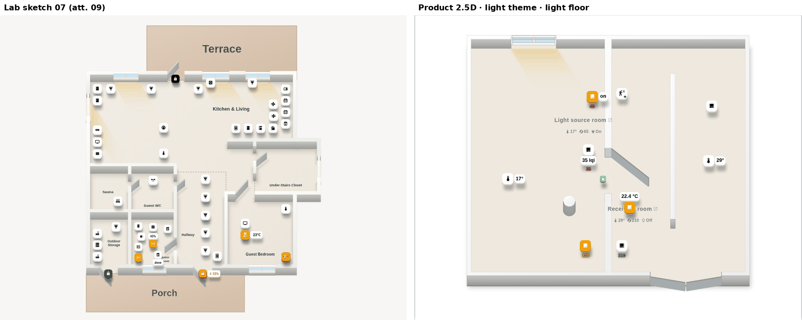
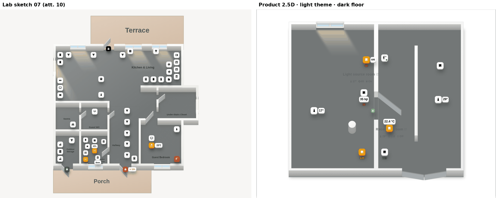
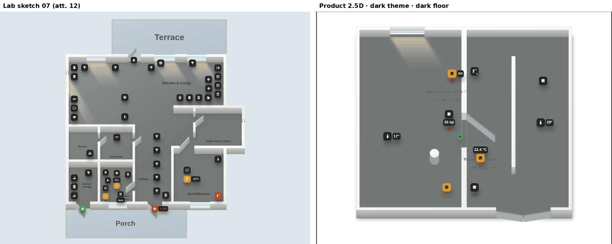
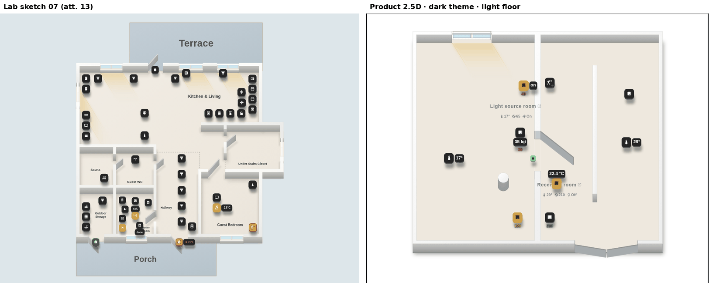
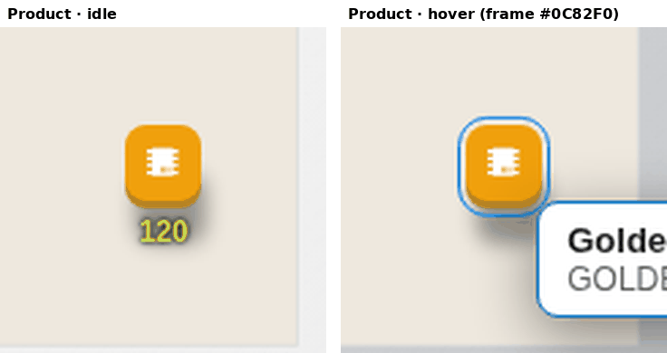
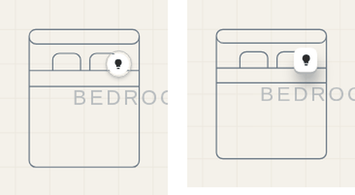
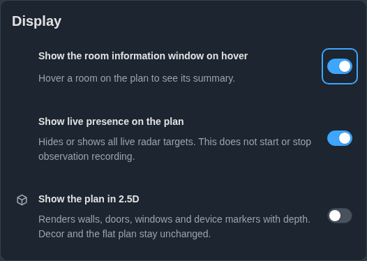

# #649 · 2.5D Stage 6 — acceptance against the designer lab

AC12 of [#649](https://github.com/Matysh/houseplan-card/issues/649): product
frames side by side with the approved lab (sketch 07) in the four theme × floor
combinations, the hover frame, furniture and the General settings row, with
every visible difference named and explained. Normative text: the ТЗ in the
issue body; implementation notes: `docs/ISOMETRIC.md` § Stage 6, `docs/SUN.md`
§ 2.5D.

## How the frames were made

- **Lab** — `first-floor-lab-2026-09-25-sketch07.zip` (SHA-256
  `c33a93f1…436d`) served by its own `serve.mjs`, defaults of sketch 07
  (`iconVolume: square`, `iconShadow: long`, `lightMode: sun`, `sunlight: 72`,
  sun at 10:00), floors `#eee8de` (light) and `#737777` (dark). These are the
  same renders as attachments 09, 10, 12 and 13, re-made at one viewport.
- **Product** — the scenes `isometric-stage6-{light,dark}-{light,dark}floor` and
  `isometric-stage6-hover-light` (`STAGE6_ACCEPTANCE_SCENARIOS` in
  `demo/golden/matrix.mjs`: sun azimuth 150°, elevation 52°, north 180° — the
  lab's 10:00 light; default white wall colour as in the lab), captured with
  `node demo/capture_stage6_acceptance_649.mjs` on a built bundle. The
  furniture and settings frames come from the demo fixture.

These are **diagnostic** frames, not golden baselines. The five scenes join
`GOLDEN_SCENARIOS` together with their baselines captured and accepted on
Linux CI (#455) — a matrix scene without a reviewed baseline turns
`test/golden-wsl-artifact.test.mjs` (#641) red, and a baseline cannot exist
before its scene. PNGs are
reduced to a 256-colour palette; that is enough to compare layout and tone.

The two plans differ (the lab is its own SVG snapshot of a first floor; the
product frame is the golden lighting fixture), so the comparison is of the
visual language — tiles, edges, shadows, light, walls — not of positions.

## Light theme · light floor (attachment 09)

## Light theme · dark floor (attachment 10)

## Dark theme · dark floor (attachment 12)

## Dark theme · light floor (attachment 13)

## Hover (attachment 11)

Reference: [attachment 11](https://github.com/user-attachments/assets/7abd61e7-27ac-46c1-8058-cd04718dce88).

## Furniture: Flat and 2.5D (attachments 14, 15)

References: [14, Flat](https://github.com/user-attachments/assets/7153080a-4952-48fe-b458-84d46936bf85),
[15, 2.5D before the fix](https://github.com/user-attachments/assets/b0caf4b1-81cf-40b1-b0f4-3bf476681d11).

## General settings › Display (attachment 16)

Reference: [attachment 16](https://github.com/user-attachments/assets/aca26476-2ed1-41f1-bc8a-b4513d843d17).

## Element by element

| Element | Reference | Product | Match / difference and why |
|---|---|---|---|
| Tile body | 09–13: rounded square, no ring | Rounded rectangle `min(0.275 D, 0.3·h)`, ring transparent | Match. |
| Tile size | lab `ICON_SCALE 1.12` | 1.12 × Flat core (smoke: 24.30 / 21.69 px) | Match. |
| Edge | 8/80 down, `brightness(.7) saturate(.85)`, dark bodies `#5b5e5a` / `#4a4a4a` | 0.1 D down, same filter evaluated in TS (`#b3b3b3` for white, `rgb(160,113,25)` for `#F0A00C`), same dark colours | Match. |
| Edge on light floor | lighter, `brightness(.82) saturate(.8)` | `#d1d1d1` for white | Match. |
| Lift | 6/80 up, whole marker | 0.075 D, tile, badges, edge, frame | Match. |
| Floor shadow | inset 3, (8, 30), blur 22, `.34/.50`; light floor (8, 34), blur 11, `.30/.42`; dark theme `.40` | the ТЗ table in D, one layer under all markers (smoke checks all four combinations) | Match. Shadows look slightly smaller than in the lab because the product tiles are smaller on screen (D ≈ 24 px vs ≈ 28 px in the lab viewport); proportions are the same. |
| Shadow over neighbour | never (09, Kitchen & Living column) | never: `.iso-tile-shadows` at `z-index: -1` in `.devlayer` (smoke compares the lower tile with and without shadows) | Match. |
| Badges | same tile and edge, gap 6/80 | value pill as a tile, gap 0.075 D | Match. |
| Hover frame | 11: frame hugs tile + edge, lifted; amber | blue `#0C82F0`, same shape and lift | Colour differs on purpose: the lab paints lights' hover amber; the issue and the icon package say `#0C82F0` (ТЗ «Эталон и единицы»). |
| Sun wash | beam from the inner opening corners along the sun, blur, clipped to the room | parallelogram along the sun, same length law, stops and blur | Match. The lab frame shows more beams because its plan has seven exterior windows; the golden fixture has one sunlit window. |
| Streaks | only on light floors, two lines | only on light floors, two lines | Match (see 09 vs 10). |
| Sill | light line on the inner face | same, `#efd493` / `#fff3cf` | Match. |
| Walls | white top, grey sides; same in both themes | the user's wall colour (default white) top, sides × .77/.68/.60; identical in both themes | Match. With a non-default wall colour the prism follows it (smoke `#d9c8b4`). |
| Openings, floor edge | theme-free | theme-free (dark rules removed) | Match. |
| Room labels | dark labels in both themes | the Flat label colour of the current theme | Differs on purpose: ТЗ п.3 — labels keep the colour from the settings, as in Flat. On a dark floor in the light theme they read as in Flat. |
| Terrace, porch | coloured zones in the lab | not present | Out of scope (#649 «Не скоуп»): decor stays flat, no outdoor zones. |
| Lab background | light / blue-grey page | card background of the fixture | Stand artefact, not part of the product. |
| Furniture | 14: thin; 15: thicker in 2.5D (bug) | same stroke in both views (smoke: 1.1818 px = 1.1818 px) | Fixed. |
| Settings row | 16: Display card | third switch «Show the plan in 2.5D», `mdi:cube-outline`, caption | Match. In the demo fixture the other two rows show no icon because the demo icon set lacks them; Home Assistant renders all three. |
