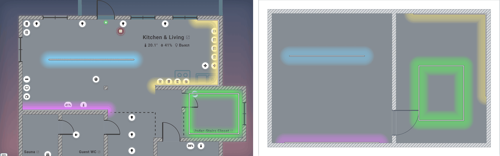
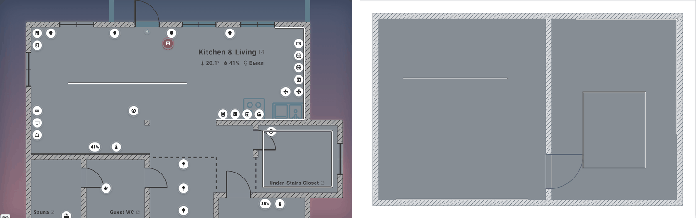

# #780 · LED strips — acceptance against the designer frames

AC8/AC18 of [#780](https://github.com/Matysh/houseplan-card/issues/780). The
product reproduces the designer's four strips — a free straight strip (blue),
a strip on the inner face of the bottom wall (violet), a polyline along the
wall faces around a corner (yellow) and a closed rectangle (green) — on a
synthetic plan with the reference floor `#868D94`. Scene colours
`#80D5FF`, `#E680FF`, `#FFEA80`, `#58FF58` are values of the four sources, not
a product palette.

## How the frames were made

- **Designer** — `source/previews/Led-On.png`, `source/previews/Led-Off.png`
  (2543 × 1572, unchanged).
- **Product** — golden scenes `led-strip-design-reference-on-light` and
  `led-strip-design-reference-off-light` (`demo/golden/matrix.mjs`, fixture
  `makeVisualMatrixFixture({ ledStrips: true })` in
  `demo/fixtures/visual-matrix.mjs`: viewport 1000 × 760, DPR 1, English, light
  theme, `icon_size` 3.4, 20 cm walls, cell 5 cm). Captured with
  `node demo/golden/run.mjs --mode=capture --scenario=<id>` on the built bundle;
  the reviewed baselines are accepted from the Linux CI artifact of the task
  (label `ci:golden`).

The plans differ (the designer frame is a fragment of a real floor with
furniture and icons), so the comparison is of the visual language and the four
behaviours, not of positions.

## On

## Off

## ТЗ §3 — visual contract

| Requirement | Product | Evidence |
|---|---|---|
| `D = icon_size/100 × iconUnit(space)`, not `marker.size`; 2.5D uses the shared scale | `ledFrame` takes `iconPct` from the full card's or the space card's own `icon_size`; `ISO_ICON_SCALE` in 2.5D | golden `iso-led-strip-dark`, reference pair |
| State-invariant thickness 0.12 D; outline `#383838` t, core t/2, round joins and caps | `renderLedStripes` | smoke `smoke_led_strip_glow.mjs`, reference pair |
| Off: white core, no field, both themes | stripe state `off` | smoke `smoke_led_strip_glow.mjs`, `led-strip-off-light` |
| On with Glow: white core + coloured field; without Glow: core in the source colour, no field | `ledStripView` + `resolveGlowAppearance` | smoke `smoke_led_strip_glow.mjs` |
| Glow is the space/room switch, independent of `fill_mode` | `glowFor(room)` | `lighting-led-strip-glow-dark` uses `fill_mode: none` |
| Per-piece offset: t/2 on a thick face into free floor, 0 on free floor and zero walls; continuous transition | `visibleStripPath` | unit `test/led-strip-geometry.test.mjs` (AC8) |
| Field 30 cm by default, own `glow_radius_cm` wins; round free ends; no seams, bands, missing free runs or doubled brightness at corners/closure | `ledFrame`, one continuous path through the filled visibility fans in `led-strip-field` | unit `test/led-strip-runtime.test.mjs`; golden `led-strip-long-zigzag-glow-light`; reference pair |
| Shared `glowAlpha` / `GLOW_FALLOFF` / `GLOW_FADE_MS` | field bands from `falloffAt` | unit `test/led-strip-runtime.test.mjs` |
| Field under icons, badges and labels; icons not tinted | glow layer below the device layer | reference pair (designer tinting deliberately not reproduced) |

## Designer §11 — ten visual criteria

| # | Criterion | Result |
|---|---|---|
| 1 | Same geometry on/off; only colour/field change | Stored points, thickness and the derived offset do not follow the state — smoke and pairs on/off |
| 2 | White core and dark outline keep contrast on grey floor, near hatched walls, over the field | Visible in both pairs; `#383838` outline, opaque core |
| 3 | Straight parts are not a chain of circles | One stroked path per strip; the field is bands of stroked paths, not discs |
| 4 | No hard rectangular cut of light at the ends | Round caps of the field bands (blue strip in the pair) |
| 5 | No dark gaps or bright spots at corners | Round joins; `lighten` blend of pieces (yellow corner, green loop) |
| 6 | A wall strip lights into the room, not behind the wall | Visibility clip from emitters `epsilonGeom` outward (violet, yellow) |
| 7 | A closed rectangle gives a continuous field along the perimeter | Green loop in the On pair |
| 8 | Colour changes with the entity without changing shape/radius/edges | Colour from `resolveGlowAppearance`; the stored points and the radius do not depend on state (four colours of one fixture in the On pair) |
| 9 | When off the field fades smoothly and the thin stripe stays | Shared 500 ms fade; Off pair keeps the stripe |
| 10 | Zoom keeps the proportions of thickness, outline, hit area and 2.5D lift | All sizes in plan units of D; hit radius `max(22 px, t/2)` in screen px (unit AC12) |

## Accepted differences

- Pixel sizes and the mockup blur (22.2–30 px) are not product filters: the
  product uses a state-invariant 0.12 D and the shared falloff, so its stripe is thinner at
  the default `icon_size` and the band edge is the shared Glow edge.
- Icons and labels are not tinted by the field.
- The mockup's "half the shared radius" and "always coloured core" are replaced
  by 30 cm (#784) and the white core under Glow (owner's decision in #780).
