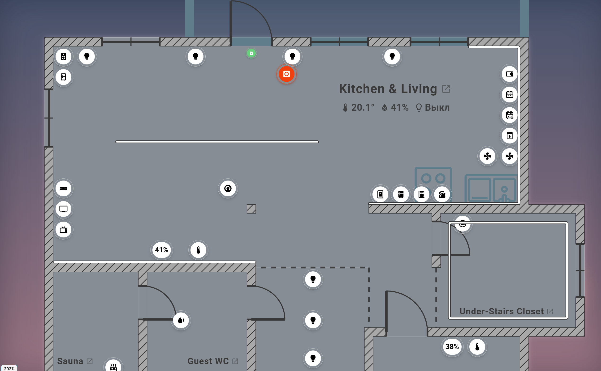
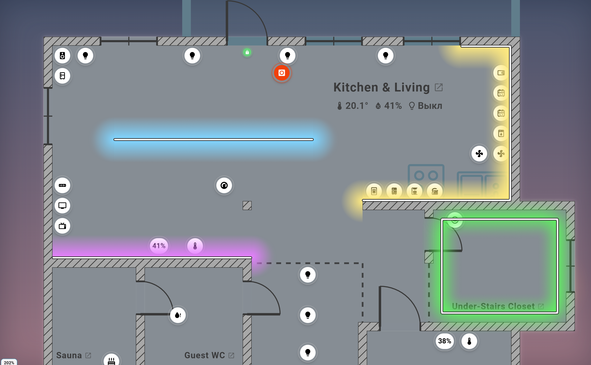

# Техническое задание: LED-ленты на плане

Связанная задача: [Matysh/houseplan-card#662](https://github.com/Matysh/houseplan-card/issues/662)  
Визуальный макет: [Figma — `Led Light`](https://www.figma.com/design/cpGN8MhJGydwVOUzZv8dia/House-plan?node-id=626-34)  
Фреймы: [`Led On`](https://www.figma.com/design/cpGN8MhJGydwVOUzZv8dia/House-plan?node-id=626-35) и [`Led Off`](https://www.figma.com/design/cpGN8MhJGydwVOUzZv8dia/House-plan?node-id=626-53)  
Дата фиксации: 01.10.2026

## 1. Назначение

Добавить в House Plan протяжённое представление устройств `light.*`: LED-лента отображается не точечным значком, а ломаной линией в реальном месте установки. Пользователь должен сразу понимать положение, форму, состояние и цвет ленты, а также включать и выключать её нажатием по любой части линии.

Поведенческий контракт определяется issue #662. Figma определяет визуальное направление, форму выключенной полосы, характер свечения, работу света у стен, в углах и на свободном участке пола. При возможном расхождении логика и размеры в единицах плана берутся из issue, внешний вид — из Figma.

## 2. Визуальные референсы

### 2.1. Выключенное состояние



Во фрейме `Led Off` показаны четыре варианта геометрии и размещения:

1. прямая лента на свободном участке плана;
2. прямая лента вплотную к стене;
3. Г-образная лента с поворотом в углу;
4. замкнутая прямоугольная лента по периметру зоны.

Требования к выключенной ленте:

- световое пятно отсутствует;
- ядро белое `#FFFFFF`;
- внешняя обводка тёмная `#383838`;
- концы и стыки визуально скруглены;
- линия остаётся различимой на светлом и тёмном фоне плана;
- в исходном Figma-фрейме номинальная высота белого ядра — 6 px, внешняя обводка — 3 px, радиус скругления — 5 px;
- в продукте итоговая толщина масштабируется с планом и подчиняется C6 issue: `0,08 D` для выключенного состояния, где `D` — диаметр значка маркера.

### 2.2. Включённое состояние



Во фрейме `Led On` показаны четыре сценария:

1. синяя прямая лента на расстоянии от стены — свет расходится по обе стороны;
2. фиолетовая лента вдоль нижней стены — свет направлен в комнату;
3. жёлтая Г-образная лента вдоль верхней и правой стен — свет корректно продолжается через угол и ограничивается стенами;
4. зелёная лента по периметру помещения — свет соединяется на углах без разрывов и не выходит за стены.

Требования к включённой ленте:

- сама полоса остаётся читаемой поверх свечения;
- цвет свечения поступает от устройства: live RGB/цветовая температура либо `glow_color`;
- показанные в макете синий, фиолетовый, жёлтый и зелёный цвета являются примерами, а не фиксированной палитрой;
- свет распространяется непрерывно вдоль каждого сегмента;
- на свободных концах должен быть мягкий округлый спад без прямоугольного обрыва;
- в точках поворота световые поля сегментов соединяются без тёмного шва и без заметного удвоения яркости;
- свет, направленный к толстой стене, обрезается стеной; лента на грани стены освещает только сторону комнаты;
- в продукте толщина включённой линии — `0,12 D`; свечение не входит в эту толщину;
- появление и исчезновение поля света происходит через существующий `GLOW_FADE_MS`.

## 3. Измеренные параметры макета Figma

Параметры ниже документируют исходник 2543×1572 px и нужны для визуального сравнения. Они не заменяют масштабируемые величины `D` из issue.

| Элемент | Параметр в Figma |
|---|---|
| Ядро выключенной полосы | `#FFFFFF`, высота 6 px |
| Обводка | `#383838`, 3 px, Outside |
| Скругление | 5 px |
| Синий пример | `#80D5FF` → прозрачный |
| Фиолетовый пример | `#E680FF` → прозрачный |
| Жёлтый пример | `#FFEA80` → прозрачный |
| Зелёный пример | `#58FF58`, мягкие внутренние и внешние тени |
| Линейное поле | ориентировочная глубина 86–102 px в исходном фрейме |
| Радиальные окончания | диаметр 188–206 px |
| Blur радиальных окончаний | 22,2 px |
| Blur протяжённого поля | до 30 px в примерах |

В рабочем рендерере мягкость должна строиться градиентами по `GLOW_FALLOFF`; CSS/SVG `filter` не является обязательной частью реализации и не должен ухудшать производительность.

## 4. Модель данных

В каждом пространстве допускается необязательный массив:

```ts
space.led_strips: {
  id: string;
  points: number[][];
  marker: string | null;
}[];
```

- `points` содержит от 2 до 50 точек в канонических координатах пространства;
- не более 50 лент в одном пространстве;
- `id` уникален в пространстве;
- один маркер может быть привязан не более чем к одной ленте во всех пространствах;
- версия модели не меняется, миграция не требуется;
- полный и per-space экспорт/импорт сохраняют геометрию; отсутствующий при импорте маркер превращает ленту в непривязанную.

Якорь ленты — точка на половине суммарной длины ломаной. Он используется для определения комнаты, подписи, бейджа, подсказки и агрегатов.

## 5. Рисование и редактирование

- В редакторе плана после инструмента «Перегородка» появляется кнопка `LED-лента` с иконкой `mdi:led-strip-variant`.
- Лента рисуется цепочкой точек по контракту инструмента стен.
- Клик или тап добавляет вершину; Shift ограничивает направление шагом 45°; Ctrl+Z удаляет последнюю добавленную точку.
- Завершение: Esc, двойной клик по последней точке, смена инструмента или выход из редактора.
- Цепочка короче двух точек отбрасывается.
- Панорамирование, pinch, второй палец и `pointercancel` не добавляют точки.
- Точки прилипают к сетке и к физическим граням стен с порогом магнита мебели.
- В v1 можно перетаскивать вершины и удалить ленту целиком. Вставка и удаление отдельной вершины не входят в задачу.

## 6. Стены и проёмы

- Лента не может пересекать тело стены с толщиной.
- При попытке пересечения новый сегмент останавливается на ближайшей грани тела стены.
- Касание стены и движение точно вдоль её грани допустимы.
- Через `door`, `gate` и `passage` лента проходит по геометрическому проёму независимо от текущего состояния двери.
- Окно остаётся частью тела стены и блокирует ленту.
- Стены нулевой толщины, Solid и Dashed, не являются телом и не блокируют рисование.
- Перетаскивание вершины проверяет оба соседних сегмента по тем же правилам.
- Если стена была утолщена или добавлена позже, геометрия ленты автоматически не исправляется; Optimize сообщает число проблемных лент.

## 7. Привязка устройства

- После завершения ломаной открывается существующий диалог добавления устройства; сущности `light.*` показываются первыми.
- Сохранение создаёт или переиспользует live-маркер и связывает его с лентой атомарно.
- Закрытие или «Позже» сохраняет непривязанную ленту.
- Непривязанная лента отображается серым пунктиром только в редакторах и не видна во View, киоске и space-card.
- После привязки обычный значок маркера исчезает, но его `layout` сохраняется.
- В лотке выбранной ленты доступны: привязать, сменить устройство, отвязать и удалить ленту.
- После отвязки или удаления маркер снова отображается значком на сохранённой позиции либо в авторасстановке.

## 8. Представление и состояния

| Состояние | Представление |
|---|---|
| On | линия `0,12 D`, полный цвет `resolveGlowAppearance`, поле света при активной заливке «Свечение источников света» |
| Off | линия `0,08 D`, белое/приглушённое ядро с тёмной обводкой по визуальному референсу, без поля света |
| Unavailable | серый пунктир, без поля света |
| Hidden | не отображается |
| Unbound | серый пунктир только в редакторах |

- Линия строится SVG `path` со скруглёнными концами и соединениями.
- Подпись и `value_badge` располагаются относительно якоря.
- Hover, long press, контекстное меню и клавиатурный фокус работают как у обычного маркера.
- Enter и Space запускают тот же `_clickDevice()`.
- У ленты нет пульсации и тревожного красного состояния.

## 9. Свечение

- Световой источник линейный: по сегментам строятся капсулы радиуса `glow_radius_cm`, а при отсутствии персонального значения — половины общего радиуса.
- Точки выборки: все вершины плюс промежуточные точки с шагом около 100 см, не более восьми точек на ленту.
- Капсулы одной ленты смешиваются через `lighten` внутри изолированной группы; с остальными пятнами группа смешивается через `screen`.
- Поле пересекается с полом и с объединением полигонов видимости; за стеной свет отсутствует.
- Для ленты на грани толстой стены точки выборки сдвигаются на эпсилон в сторону комнаты.
- Лента на стене нулевой толщины освещает обе стороны.
- Точка выборки внутри тела стены не создаёт веер; если внутри все точки, светового кандидата нет.
- В остальных режимах заливки световое поле не отображается.

## 10. Взаимодействие и 2.5D

- Активная зона проходит по всей ломаной: расстояние до неё не более `max(22 px экрана, половина толщины)`.
- Точка в 20 px от ленты должна попадать в неё, в 30 px — нет.
- При наложении с окрашенной капсулой значка приоритет у значка; между лентами выбирается ближайшая, затем стабильный порядок по `id`.
- В 2.5D лента поднимается на `0,075 D`, получает торец `0,1 D` и тень на полу; само световое поле остаётся на полу.
- `houseplan-space-card` отображает ленту и свет, но остаётся read-only.

## 11. Критерии визуальной приёмки по Figma

1. Во включённом и выключенном состоянии геометрия совпадает: изменяются цвет/толщина и наличие свечения, а не траектория.
2. Белое ядро и тёмная обводка сохраняют контраст на сером полу, возле штрихованных стен и поверх светового поля.
3. Прямые участки не выглядят как цепочка отдельных кругов.
4. На концах нет резкого прямоугольного обрыва света.
5. На углах отсутствуют тёмные разрывы и чрезмерно яркие круглые пятна.
6. Свечение ленты у стены направлено в помещение и не окрашивает пол за стеной.
7. Замкнутая прямоугольная лента даёт непрерывное поле по периметру.
8. Цвет меняется от сущности без изменения формы, радиуса и поведения границ.
9. При выключении поле плавно исчезает, а тонкая полоса остаётся видимой.
10. Масштабирование плана сохраняет пропорции толщины, обводки, активной зоны и 2.5D-подъёма.

## 12. Проверки

Обязательные группы приёмки из issue #662:

- backend: лимиты, уникальность, конечность координат, ссылки на маркеры, экспорт/импорт;
- unit: якорь, рендер состояний, hit-test, линейные кандидаты света, стены, auto-grid, space-card;
- smoke: рисование, привязка/отвязка, свечение и clip-path, 2.5D, упор в стену;
- golden: `lighting-led-strip-glow-dark`, `led-strip-off-light`, `iso-led-strip-dark`;
- i18n: паритет ru/en/de/fr;
- performance: benchmark десяти лент по пять точек.

## 13. Вне скоупа

- эффекты и адресные сегменты WLED;
- вставка или удаление отдельных вершин;
- отдельная высота крепления и дополнительная 3D-модель света от стены;
- кривые Безье и произвольные гирлянды;
- интерактивность в `houseplan-space-card`;
- автоматическая починка лент, оказавшихся внутри стены.

## 14. Комплект поставки

- реализация модели, редактора, представления, света, 2.5D, импорта/экспорта и валидации;
- сущность `light.demo_led_strip` в demo/golden/smoke fixtures;
- четыре словаря i18n;
- unit, backend, smoke, golden и mutant-проверки по issue;
- документация и changelog RU/EN;
- замер производительности в handoff;
- визуальное сравнение с двумя PNG из этого архива.

